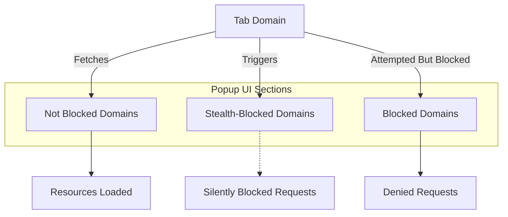

# Maximizing Privacy: Optimization Tips

Optimize your use of uBO Scope alongside content blockers to achieve the right balance between privacy protection and website functionality. This guide focuses on interpreting uBO Scope's insights, making informed adjustments, and troubleshooting common conflicts, empowering you to maximize privacy without compromising legitimate site experiences.

---

## 1. Understanding uBO Scope's Role in Privacy Optimization

uBO Scope complements content blockers by revealing all remote connections initiated by a browser tab, regardless of whether those connections were blocked or allowed. This transparency uncovers hidden third-party domains that may impact privacy.

Use uBO Scope to:
- Verify which third-party domains your browser actually connects to when visiting sites.
- Detect stealth-blocked requests your content blocker intercepted silently.
- Identify potentially risky or unnecessary third parties for further blocking.


## 2. Best Practices for Using uBO Scope with Content Blockers

### Start With a Baseline
1. Open uBO Scope’s popup on a website.
2. Observe the distinct domains listed under **not blocked**, **stealth-blocked**, and **blocked** categories.
3. Review the count of distinct connected domains shown in the summary.

### Analyze Connection Categories
- **Not Blocked:** Domains from which resources were successfully loaded. These could include essential third parties (like CDNs).
- **Stealth-Blocked:** Domains your blocker silently prevented connections to, without altering page behavior.
- **Blocked:** Domains your blocker actively denied requests to, typically with an error outcome.

### Adjust Blocker Settings Thoughtfully
- If important site features break, check the "not blocked" domains to identify legitimate third parties.
- For suspicious or privacy-invasive domains that's not blocked, configure your blocker to include custom rules.
- Use stealth-blocked domains as indicators of domains already handled quietly by your blocker.

### Avoid Overblocking
- Remember, too aggressive blocking might degrade website usability.
- Use uBO Scope’s clear domain lists to distinguish necessary third-party services (e.g., common CDNs) from risky ones.
- Focus on minimizing the count of "not blocked" third-party domains for stronger privacy.


## 3. Interpreting Conflicting Signals Between uBO Scope and Content Blockers

Some confusion arises if uBO Scope shows many allowed domains while your blocker’s block count is high. This is expected:
- uBO Scope’s badge reports distinct third-party domains connected.
- Block counts from content blockers can be inflated by multiple blocked requests from the same domain.
- Some domains may be partially allowed if critical to site function.

Trust uBO Scope’s domain-based insight to evaluate real privacy exposure, rather than block counts alone.


## 4. Step-by-Step: Using uBO Scope to Optimize Privacy Settings

<Steps>
<Step title="Open uBO Scope Popup">
Click the uBO Scope toolbar icon to open the popup for the active tab.
</Step>
<Step title="Review Domain Listings">
Examine the lists under 'not blocked', 'stealth-blocked', and 'blocked'. Take note of domain names and counts.
</Step>
<Step title="Identify Legitimate vs. Risky Domains">
Use known content delivery networks (CDNs) or commonly trusted domains as safe baselines. Mark unfamiliar or suspicious domains for further investigation.
</Step>
<Step title="Adjust Your Content Blocker">
Add custom blocking rules to your content blocker for unwanted domains that appear under 'not blocked'. Avoid modifying rules for domains essential for site operation.
</Step>
<Step title="Reload the Webpage and Re-check">
Refresh the page to see updated domains and counts in the uBO Scope popup.
Verify reductions in allowed domains and improvements in privacy exposure.
</Step>
<Step title="Iterate and Balance">
Repeat the process to fine-tune blocking while maintaining website usability.
</Step>
</Steps>


## 5. Integration Tips with Popular Content Blockers

- Use uBO Scope alongside blockers like uBlock Origin to verify block effectiveness.
- Import domains flagged by uBO Scope into custom filter lists gradually.
- When testing new filters, monitor stealth-blocked domains for silent blocking successes.


## 6. Common Pitfalls and How to Avoid Them

<AccordionGroup title="Pitfall Avoidance">
<Accordion title="Misinterpreting Block Counts vs. Allowed Domains">
Block counts may seem high even if allowed domain counts are low. Focus on the distinct allowed third-party domains in uBO Scope as the primary privacy metric.
</Accordion>
<Accordion title="Blocking Critical Third Parties Causing Site Breakage">
Always validate domain legitimacy before adding blocking rules. Excessive blocking results in broken website features or layouts.
</Accordion>
<Accordion title="Missing Stealth-Blocked Domains">
uBO Scope’s stealth-blocked section highlights silently blocked domains. Ignore these domains when optimizing blocking unless you have specific reasons to unblock them.
</Accordion>
</AccordionGroup>


## 7. Troubleshooting

### Why is the uBO Scope popup empty or showing "NO DATA"?
- Ensure uBO Scope has proper permissions to access the active tab.
- Confirm the webpage has loaded network requests.
- Try refreshing the webpage.

### The domain list seems outdated or not updating
- Reload or restart the browser extension.
- Clear extension session data from extension settings.
- Confirm no conflicts exist with other extensions blocking webRequest API access.

### Discrepancy between badge count and popup domains
- Badge shows the count of distinct allowed third-party domains.
- Popup details include allowed, stealth-blocked, and blocked categories.
- This difference is expected; review the popup for full context.


## 8. Additional Tips for Advanced Users

- Use uBO Scope with debugging tools to investigate complex network activity.
- Export lists of domains for external privacy audits or collaborative filter list maintenance.
- Follow community updates or the GitHub repository for new features and optimization techniques.


## References & Related Documentation

- [Understanding the Toolbar Badge](../guides/getting-started-workflows/understanding-badge-count)
- [Reviewing Third-Party Connections](../guides/getting-started-workflows/reviewing-domain-connections)
- [Interpreting Results: Legitimate vs. Risky Third-Parties](../guides/applied-scenarios-best-practices/interpreting-results-legitimate-vs-risky)
- [Debunking Block Count Myths](../guides/applied-scenarios-best-practices/debunking-block-count-myths)
- [Troubleshooting Common Issues](../getting-started/getting-value-quickstart/troubleshooting-common-issues)

---

## Empower Your Privacy Journey

Combining uBO Scope’s transparent connection reporting with your content blocker’s filtering power creates a comprehensive defense layer. Use the insights here to iteratively optimize settings, ensuring your browsing experience is both private and functional.


---

## Source Repository

Explore advanced usage, report issues, or contribute via the uBO Scope GitHub repository:
<https://github.com/gorhill/uBO-Scope>

---

<Check>
For full onboarding, ensure you have completed installation and activation: see [Installation and Activation](../guides/getting-started-workflows/installation-activation).
</Check>

---

### Appendix: Quick Syntax for Custom Blocking Rules (Example)

```plaintext
||example-tracker.com^  # Block connections to example-tracker.com
@@||cdn.essential-cdn.net^  # Allow essential CDN
```

Customize filter rules in your content blocker to refine your privacy posture progressively.

---

### Visual Summary of uBO Scope Popup Sections



Use this flow to understand distinct domains’ connection outcomes as shown by uBO Scope.

---