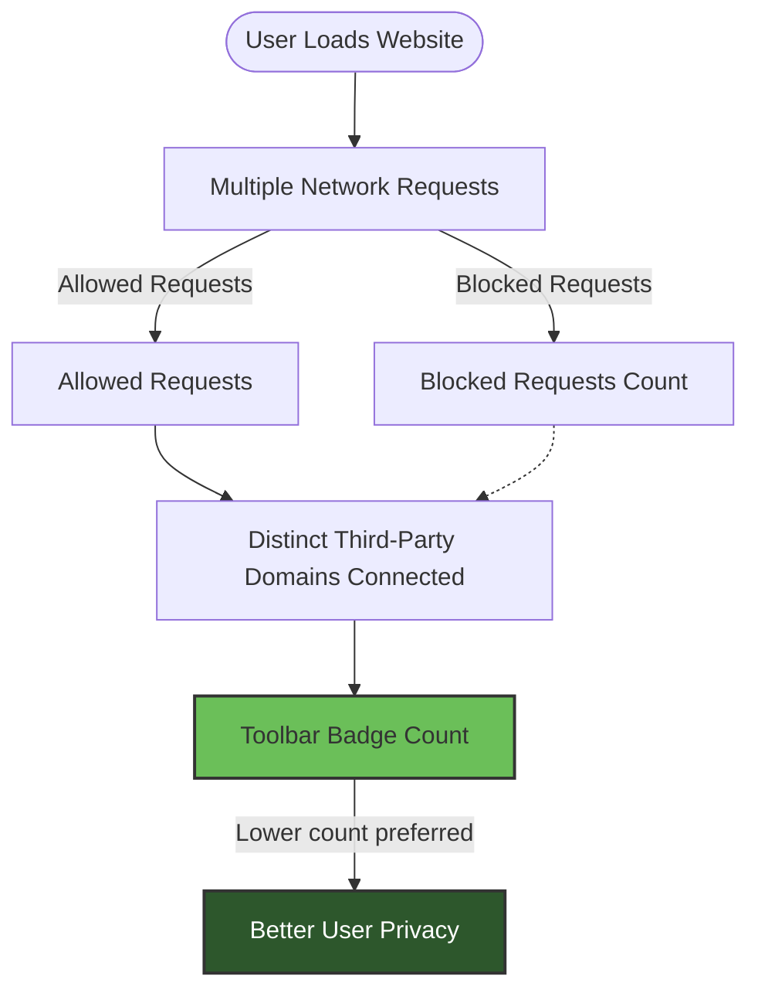

# Mythbusting: Understanding Block Counts and Badges

## Understanding Why Higher Block Counts Aren't Always Better

When using uBO Scope, it’s essential to grasp that a **higher block count does not automatically mean better privacy or more effective blocking**. This guide will walk you through why relying solely on block counts can be misleading and how to accurately interpret the toolbar badge and popup dashboard information for meaningful privacy insights.

---

## What This Guide Helps You Achieve

- **Clarify the meaning behind block counts and badges** in uBO Scope.
- **Understand the difference between domains, hostnames, and connection outcomes**.
- **Learn to interpret allowed, stealth-blocked, and blocked connection data effectively**.
- **Gain practical skills to debunk common myths surrounding content blockers and ad blocker test sites**.

---

## Prerequisites

- uBO Scope installed and running in a supported browser (Chrome, Firefox, or Safari).
- Basic familiarity with the uBO Scope popup dashboard and toolbar badge.
- An active browser tab with some network activity (e.g., visiting websites).

---

## Expected Outcome

By the end of this guide, you will:

- Know why the count shown on uBO Scope’s badge reflects connected third-party domains, not just blocked requests.
- Identify why a high block count might correlate with more remote connections overall, which is counterintuitive.
- Walk away equipped to use uBO Scope to verify content blocker effectiveness beyond misleading tests.

---

## Time Estimate

About 15 minutes

---

## Difficulty Level

Intermediate — Requires understanding of network connections and basic privacy concepts.

---

# Step-by-Step: How to Use uBO Scope to Debunk Block Count Myths

<Steps>
<Step title="Step 1: Observe the Toolbar Badge">
  The badge on the uBO Scope toolbar icon shows the number of distinct **third-party domains** your active tab successfully connected to.

  - A **lower badge number** means fewer third-party remote servers were accessed, which generally indicates better privacy.
  - Importantly, the badge **does not show how many requests were blocked**; it shows how many distinct servers actually responded.

  **Check:** Open a site and note the badge count. Consider that fewer is better.
</Step>

<Step title="Step 2: Open the Popup Dashboard and Review Category Lists">
  Click the uBO Scope icon to open the popup dashboard, which breaks down network activity into:

  - **Allowed:** Domains connected without blocking.
  - **Stealth-Blocked:** Domains where requests were redirected or hidden but connections happened.
  - **Blocked:** Domains where requests were blocked outright.

  Review the domain lists and their request counts (badges).

  **Expected:** You’ll see some domains allowed despite blocking rules, indicating real connections.
</Step>

<Step title="Step 3: Compare Block Counts vs. Distinct Domains">
  Consider these two points:

  - A content blocker with a **higher block count badge might allow more distinct third-party domains** — more connections means more potential privacy risk.
  - Conversely, a **lower badge count means fewer servers connected, even if fewer requests were blocked overall**.

  Use uBO Scope to confirm the actual network activity rather than trusting block counters alone.

  **Tip:** Beware misleading claims that more blocked requests mean better blocking.
</Step>

<Step title="Step 4: Understand Why Ad Blocker Test Pages Mislead">
  Many "ad blocker test" sites simulate unrealistic and fabricated server requests that do not reflect real-world browsing.

  - These sites often report inflated block numbers or false positives.
  - They can't detect stealth blocking techniques used by sophisticated extensions like uBO Scope.

  Use uBO Scope to test real-world sites and observe genuine third-party connections rather than relying on these artificial benchmarks.
</Step>

<Step title="Step 5: Use uBO Scope Regularly to Gauge Effective Privacy">
  Incorporate uBO Scope’s badge and popup insights in your browsing routine:

  - A lower badge and minimal allowed domains indicate stronger privacy.
  - Check stealth-blocked domains to understand requests being doubly masked.
  - Investigate any unexpected allowed domains to ensure no privacy leaks.

  This ongoing usage lets you fine-tune your content blockers and filters effectively.
</Step>
</Steps>

---

## Real-World Example

Suppose you visit a news website with two different content blockers:

| Scenario                         | Block Count Badge | Connected Domains Badge | Interpretation                              |
|---------------------------------|-------------------|------------------------|---------------------------------------------|
| Content Blocker A (Aggressive)  | High (100+)       | 35                     | Many blocked requests, but connects to 35 distinct servers (privacy moderate).
| Content Blocker B (Conservative)| Low (50)          | 10                     | Fewer blocks but connects to only 10 servers (better privacy).

Despite content blocker A showing a higher block count, blocker B actually restricts more third-party server connections, offering stronger privacy.

---

## Common Pitfalls to Avoid

- **Mistaking block count for total network activity:** Block count shows how many requests were blocked, not how many connections were allowed.
- **Trusting ad blocker test pages:** These pages don’t represent realistic network behavior and can falsely make blockers seem ineffective.
- **Ignoring stealth-blocked domains:** These can be hidden requests that still impact your privacy.

---

## Best Practices & Tips

- Always verify privacy effectiveness by checking **how many distinct remote servers your browser connects to**, not just blocked requests.
- Use uBO Scope's **popup dashboard regularly** for detailed insights.
- Combine uBO Scope with your primary content blocker for richer visibility.
- Observe changes in the badge count when visiting different sites to spot new or suspicious third-party connections.

---

## Troubleshooting Common Issues

<AccordionGroup title="Troubleshooting Block Count Interpretation">
<Accordion title="My badge count is higher than expected. Does this mean my blocker is ineffective?">
Not necessarily. A higher badge count means more third-party servers were contacted—but you should also check the popup dashboard to understand which domains were allowed, stealth-blocked, or blocked.
</Accordion>

<Accordion title="Why do some sites show high block counts but still connect to many domains?">
Because some content blockers block numerous requests but allow connections to multiple third-party servers, which results in higher aggregate connections despite blocking attempts.
</Accordion>

<Accordion title="Can ad blocker test websites be trusted to evaluate my protection?">
No. Many use fabricated network requests that do not occur in normal browsing. uBO Scope encourages assessing real-world browsing scenarios instead.
</Accordion>
</AccordionGroup>

---

## Next Steps & Related Resources

- Explore the [Using the Popup: Navigating the Dashboard](/guides/getting-started/popup-navigation-basics) guide to master reading detailed connection data.
- Refer to [Reading and Interpreting uBO Scope Data](/guides/analyzing-network-activity/reading-interpreting-data) for deeper understanding of connection categories.
- Learn about the [Core Concepts and Terminology](/overview/architecture-concepts/core-concepts-terminology) for foundational knowledge.
- Review [Troubleshooting & Advanced Uses](/guides/best-practices-expert-tips/troubleshooting-advanced-uses) for problem solving and expert tips.

---

## Summary
- The uBO Scope toolbar badge counts **distinct third-party server domains successfully connected during browsing**, not simply blocked requests.
- A lower badge count signals better privacy by indicating fewer remote servers accessed.
- Block counts alone are misleading—use the popup dashboard to see allowed, stealth-blocked, and blocked domains for effective privacy assessment.
- Ad blocker test sites can be deceptive; focus on real-world browsing data with uBO Scope.

---

## Appendix: Terminology Quick Reference

| Term             | Meaning                                                      |
|------------------|--------------------------------------------------------------|
| Allowed          | Connections successfully made to third-party domains.        |
| Stealth-Blocked  | Requests that were redirected or masked from detection.      |
| Blocked          | Requests prevented from reaching the third-party domain.     |
| Badge Count      | Number of distinct third-party domains connected to per tab. |

---

## Example: Visualizing Badge vs Block Impact

This diagram illustrates that the toolbar badge count is tied to the distinct domains ultimately connected to (allowed), not simply the requests that were blocked. Effective privacy is reflected by fewer connected domains, highlighted as the main user goal.

---

For source code references and further technical details, see the [uBO Scope GitHub repository](https://github.com/gorhill/uBO-Scope).

---

