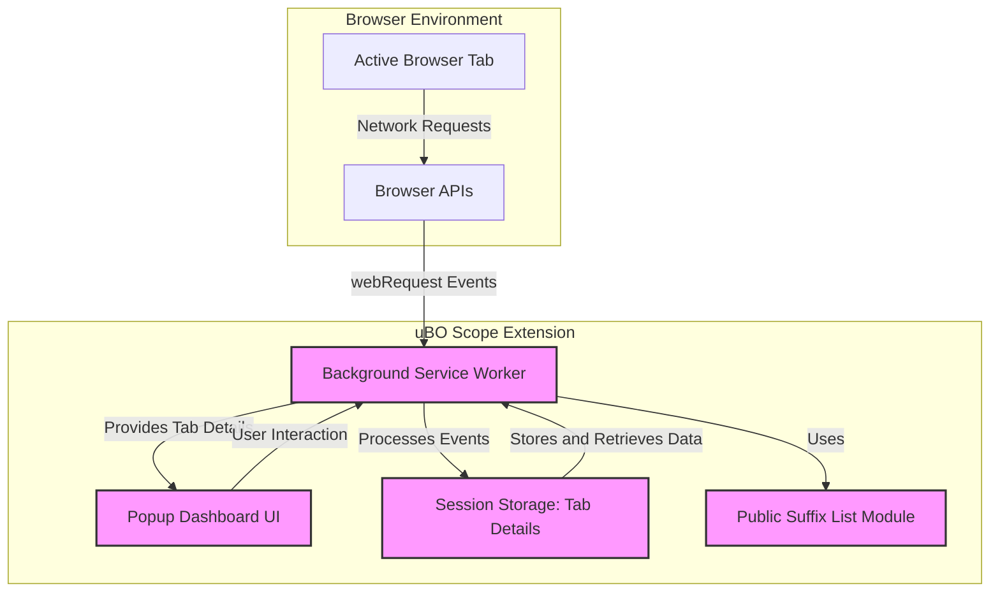

# Troubleshooting & Advanced Uses

This guide equips you to resolve frequent issues, understand ambiguous network results, and leverage advanced features designed especially for filter-list maintainers and power users. It also explains how to work within browser API limitations, clarifies important caveats, and previews upcoming capabilities.

---

## 1. Diagnosing Common Issues

### 1.1 Missing or Incorrect Badge Counts

If the toolbar badge count on uBO Scope's icon does not appear or shows unexpected values:

- **Verify Extension Permissions:** Confirm uBO Scope has *activeTab*, *webRequest*, and *storage* permissions. Without these, network activity monitoring will fail.
  - On Chromium and Firefox, check browser extension details.
  - On Safari, minimum version 18.5 is required as per manifest settings.

- **Reload the Extension:** Sometimes background service workers can be evicted or suspended.
  - Reload the browser or disable/re-enable uBO Scope.

- **Validate Session Data:** The extension maintains session mappings of network requests to tabs; if corrupted, badge updates may halt. Refer to the [Validating a Successful Install](/getting-started/validation-and-troubleshooting/validating-install) guide.

- **Check Browser Compatibility:** Minimum version requirements are strict: Chrome 122, Firefox 128, Safari 18.5+. Older versions lack required APIs.

### 1.2 Popup Dashboard Shows No Data or 'NO DATA'

Common causes and fixes:
- The active tab might not have loaded any network requests yet.
- Network requests may be blocked at a level invisible to the extension's APIs (e.g., system-level blocking).
- Browser restrictions or privacy settings may prevent capturing request details.

Reload the tab or navigate to a different site to refresh data.

### 1.3 Unresponsive Popup UI or Errors

- Service worker message passing failures can cause UI issues.

- Reload the popup by closing and reopening.

- Clear browser cache or reload uBO Scope extension.

- If errors persist, see [Troubleshooting Common Issues](/getting-started/validation-and-troubleshooting/troubleshooting-common-issues).

---

## 2. Understanding Ambiguous or Unclear Results

### 2.1 Stealth-Blocked Versus Blocked Connections

Stealth-blocking occurs during redirects or other referral patterns that the browser reports as network activity but the request's destination may not complete or may be hidden.

Blocked connections are clearly denied by blocking filters or browser APIs.

Always cross-check your primary content blocker’s configuration to contextualize these.

### 2.2 Why Some Requests May Not Appear

- uBO Scope relies on the browser's `webRequest` API, so requests initiated outside of this scope (e.g., certain WebSockets, service workers, or DNS-level blocking) may not be reported.

- Some browsers limit extensions from tracking specific protocols or may block extension's access altogether for privacy.

- Requests to local or intranet domains may behave differently.

### 2.3 Interpreting Badge Counts Accurately

The badge count reflects the number of **distinct third-party domains** that successfully connected for the active tab. This differs from raw block counts or request numbers.

For detailed interpretation, refer to the [Mythbusting Block Counts and Badges](/guides/best-practices-expert-tips/mythbusting-block-counts) guide.

---

## 3. Working Around Browser API Limitations

### 3.1 Dealing with Limited or Missing `webRequest` APIs

Some browsers or browser modes restrict access to `webRequest` APIs:

- On browsers that disable or restrict these APIs, uBO Scope may fail to capture network events.

- This is more common on mobile browsers or privacy-focused variants.

- Use desktop versions or supported minimum versions to ensure full functionality.

### 3.2 Handling API Behavior Differences Across Browsers

- While uBO Scope supports Chromium, Firefox, and Safari, minor differences exist:
  - Safari’s implementation requires minimum version 18.5 and may not capture WebSocket URLs (as only HTTP/HTTPS are declared in host permissions).

- The extension adapts its background service worker or scripts accordingly but keep your browser updated.

### 3.3 Persistence and Session Handling

- Network requests data is stored in session storage.

- Browser restarts or tab closures reset the session.

- Expect badge counts and popup data to refresh accordingly.

---

## 4. Features for Filter List Maintainers and Advanced Users

### 4.1 Inspecting Detailed Network Request Outcomes

Filter list maintainers benefit from uBO Scope's ability to share insight into allowed, stealth-blocked, and blocked connection domains per tab.

- Use the popup dashboard’s categorized domain lists for fast evaluation.

- Analyze the counts per domain to identify potential false positives or overlooked hosts.

### 4.2 Exporting or Extending Capabilities

- The current version does not expose export features but planned updates aim to provide enhanced session details.

- You can view the extension’s source code, especially `background.js`, to understand underlying data capture logic.

### 4.3 Caveats for Advanced Use

- uBO Scope cannot block or affect network traffic; its role is purely observational.

- Integration with other content blockers such as uBlock Origin should be done carefully; uBO Scope detects outcomes despite other blockers.

- For complex cases, consider using uBO Scope alongside browser developer tools for correlation.

---

## 5. Upcoming Features Preview

The extension is in an early stable state focusing on core monitoring. Future updates plan to include:

- More granular data on request types and initiators.

- Enhanced session export for offline analysis.

- Additional insights tailored for filter list development workflows.

---

## 6. Practical Tips & Best Practices

- Always keep uBO Scope updated to support browser API changes.

- Understand that a lower badge count indicates fewer distinct third-party connections—key for privacy.

- Use the popup frequently after navigating new tabs to get fresh data.

- Combine insights with filter list adjustments iteratively.

- Use the [Popup Navigation Basics](/guides/getting-started/popup-navigation-basics) and [Reading and Interpreting uBO Scope Data](/guides/analyzing-network-activity/reading-interpreting-data) guides to maximize your understanding.

---

## 7. Troubleshooting Checklist

<AccordionGroup title="Troubleshooting Checklist">
<Accordion title="Extension Icon Badge Issues">
- Check extension permissions and ensure activeTab, webRequest, storage are granted.
- Reload your browser or extension to reactivate the background worker.
- Confirm browser version compatibility.
- Validate network activity on the current tab.
</Accordion>
<Accordion title="Popup Reports No Data">
- Reload or navigate the active tab to trigger network requests.
- Refresh the popup by closing and reopening.
- Check for browser privacy settings that might block request visibility.
</Accordion>
<Accordion title="Popup UI Unresponsive or Errors">
- Close and reopen the popup.
- Reload uBO Scope or clear browser cache.
- Check for errors via browser developer tools.
</Accordion>
<Accordion title="Unexpected Network Results">
- Understand the difference between stealth-blocked and blocked.
- Check paired content blocker configurations for conflicts.
- Use official guides to interpret badge counts correctly.
</Accordion>
</AccordionGroup>

---

## 8. Diagram: Data Flow & Component Interaction

---

## 9. Where to Go from Here

- For step-by-step analysis workflows, see [Site Analysis Workflow: Uncover Third-Party Requests](/guides/analyzing-network-activity/workflow-site-analysis).
- To deepen your understanding of the popup interface, consult [Using the Popup: Navigating the Dashboard](/guides/getting-started/popup-navigation-basics).
- If you encounter install or permission issues, refer back to [Installing uBO Scope](/getting-started/installation-and-setup/installation) and [Validating a Successful Install](/getting-started/validation-and-troubleshooting/validating-install).

By mastering troubleshooting and advanced usage, you empower yourself to extract full value from uBO Scope’s unique network transparency.

---

_For issues beyond this guide, consider opening an issue on the [uBO Scope GitHub repository](https://github.com/gorhill/uBO-Scope) or seek community assistance._
