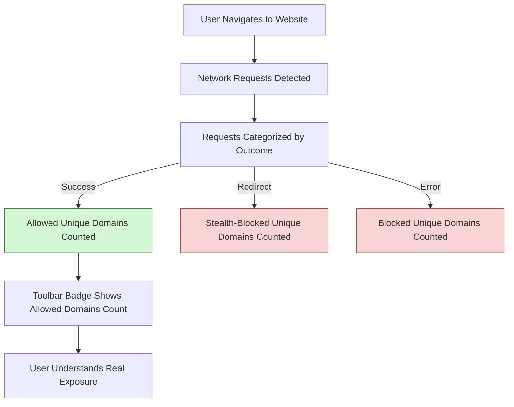

# Avoiding Common Misinterpretations in uBO Scope

Understand why raw block counts can be misleading when evaluating content blocker effectiveness and learn how uBO Scope uses unique third-party domains to provide a clearer, more accurate picture of your web privacy.

---

## 1. Understanding What uBO Scope Measures

uBO Scope is designed to **count distinct third-party remote servers contacted during browsing** — not just how many times requests were blocked or allowed. This approach ensures you see the true breadth of external connections from any given webpage.

### What the Toolbar Badge Represents
- The badge count indicates the **number of unique third-party domains with successful (allowed) network connections**.
- A **lower badge count means fewer distinct third-party servers contacted**, which generally correlates with better privacy.

### Why Raw Block Counts Can Be Misleading
- A higher number of blocked requests does **not** necessarily mean better blocking.
- Sometimes, a content blocker showing more blocks may still allow connections to a **larger number of unique third-party domains**, increasing exposure.
- Counting blocked requests without grouping by unique domain inflates perceived effectiveness.

<Tip>
Always interpret block counts in the context of distinct third-party domains contacted, not merely raw counts.
</Tip>

---

## 2. Why Counting Unique Third-Party Domains Matters

Websites commonly load content from many third-party domains — such as ad networks, analytics services, or CDNs. Blocking individual requests without considering their domain context can create illusions about privacy protection.

### How uBO Scope Evaluates Effectiveness
- uBO Scope uses the [Public Suffix List](https://publicsuffix.org/) to correctly identify and group requests by registered domains, ignoring subdomain variations.
- It distinguishes between:
  - **Allowed domains:** Third-party domains successfully connected to
  - **Stealth-blocked domains:** Requests that were redirected or intercepted stealthily
  - **Blocked domains:** Requests that failed or were explicitly blocked

This enumeration by unique domains provides a stable and reliable metric of real exposure rather than inflated request counts.

---

## 3. Real-World Examples of Misinterpretation

### Scenario 1: Different Extensions
- Extension A shows 500 blocked requests but only 30 unique blocked domains.
- Extension B shows 300 blocked requests but 50 unique blocked domains.

**Interpretation:** Despite fewer blocked requests, Extension B allows connections from more unique third-party domains, potentially exposing you to a larger attack surface.

### Scenario 2: "Ad Blocker Test" Websites
- These test sites create artificial and unrealistic requests to trap content blockers.
- Results from such tests often exaggerate blocking ability and do not reflect real usage.

uBO Scope advises avoiding these benchmarks as they are ineffective for evaluating extension-based blockers.

---

## 4. How to Use uBO Scope Popup to Avoid Misinterpretation

1. **Open the uBO Scope Popup:** Click the extension icon while on your target webpage.
2. **Review the "domains connected" count:** This is the number representing unique third-party domains contacted successfully.
3. **Inspect the three domain lists:**
   - **Not blocked:** Domains with allowed connections
   - **Stealth-blocked:** Domains where requests were intercepted through stealth mechanisms
   - **Blocked:** Domains with failed or blocked requests

The focus should be on the "not blocked" count — the actual set of third-party domains your browser connected to.

---

## 5. Best Practices & Tips

- **Contextualize badge counts:** Remember the badge counts represent unique domains, not total requests.
- **Ignore raw block counts on other tools:** Most content blockers’ raw block numbers do not reflect connection breadth.
- **Use uBO Scope alongside your blocker:** Use its independent view to confirm which domains are truly contacted.
- **Avoid "ad blocker test" sites:** These provide unreliable tests and do not mirror real browsing scenarios.

---

## 6. Troubleshooting Common Misinterpretations

<AccordionGroup title="Troubleshooting uBO Scope Misinterpretations">
<Accordion title="Why is the block count higher but badge count lower?">
Sometimes a blocker with more blocked requests shows fewer unique domains connected. This is because many blocked requests may come from the same domain, inflating block counts but not exposure. Focus on the badge count for unique domains.
</Accordion>
<Accordion title="Why do 'ad blocker test' sites show different outcomes than uBO Scope?">
These test sites simulate artificial scenarios unrepresentative of typical web usage. uBO Scope reports real network activity independent of such synthetic tests.
</Accordion>
<Accordion title="The popup shows 'stealth-blocked' domains. What does that mean?">
Stealth blocking intercepts requests invisibly (e.g., redirection or cancelling before sending) to avoid detection. These domains are recorded but not shown as allowed.
</Accordion>
<Accordion title="Why don't some expected domains appear in the popup?">
uBO Scope reports based on browser `webRequest` API visibility. Requests made at lower network levels or outside this API may not appear.
</Accordion>
</AccordionGroup>

---

## 7. Additional Resources

- [Key Features at a Glance](https://your-docs-link/overview/introduction-core-value/feature-glance)
- [Understanding Badge Counts and Domain Lists](https://your-docs-link/guides/workflows/interpreting-badge-counts)
- [Analyzing Connections Made by Websites](https://your-docs-link/guides/workflows/analyzing-network-connections)
- [Troubleshooting Common Issues](https://your-docs-link/getting-started/troubleshooting/common-issues)
- [Public Suffix List Documentation](https://publicsuffix.org/)

---

## 8. How This Page Fits in the Documentation

This page complements guides on interpreting badge counts and using the popup by clarifying common misunderstandings about block numbers and network exposure measurement.

For a detailed view of system architecture and data flow, refer to [System Architecture](https://your-docs-link/overview/architecture-concepts/system-architecture).

---

<Check>
Following this guide will empower you to correctly interpret uBO Scope results, avoid common pitfalls, and gauge content blocker effectiveness based on meaningful metrics.
</Check>

---

## Source Code Reference

- This guide’s interpretations reflect the way uBO Scope computes unique domain counts and categorizes outcomes as seen in the [background script](https://github.com/gorhill/uBO-Scope/blob/main/js/background.js).
- The popup interface rendering is defined in [popup.js](https://github.com/gorhill/uBO-Scope/blob/main/js/popup.js).

---

## Summary Diagram of uBO Scope Badge Interpretation

This illustrates that the badge count focuses on the **number of unique allowed third-party domains**, which is the crucial indicator of user web privacy exposure.

---