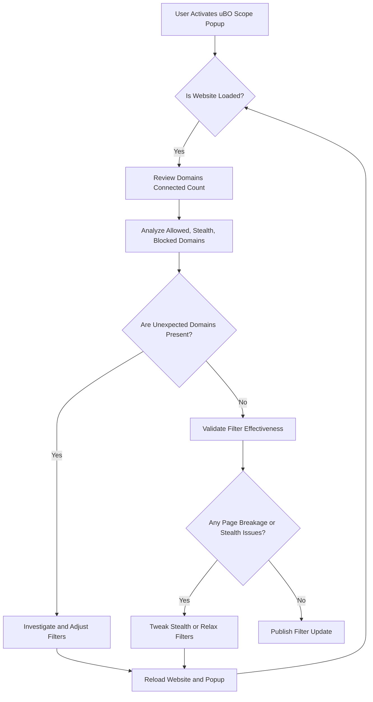

# Guide for Filter List Maintainers

Specialized tips for filter list maintainers on using uBO Scope effectively for diagnostics, interpreting network request outcomes, and validating filter changes—especially useful on platforms with limited developer tooling.

---

## 1. Introduction

As a filter list maintainer, your goal is to ensure your filters block unwanted network requests without unduly breaking websites or allowing trackers to slip through. uBO Scope is designed to empower you by providing transparent visibility into all connections attempted or made by a webpage, regardless of your content blocking setup.

This guide will help you use uBO Scope to:

- Diagnose connection issues
- Interpret the meanings behind allowed, stealth-blocked, and blocked outcomes
- Validate changes in your filters' impact
- Navigate limitations on platforms lacking robust developer tools

## 2. Prerequisites

Before proceeding, ensure:

- uBO Scope is installed and active in your browser ([Installation Guide](https://github.com/gorhill/uBO-Scope))
- You understand the core concepts of network request outcomes ([Core Concepts & Terminology](../../overview/core_concepts_architecture/core_concepts))
- You have basic familiarity with how your filter lists are applied

## 3. Understanding uBO Scope's Diagnostic Approach

### 3.1 What uBO Scope Reports

uBO Scope listens to the browser's native `webRequest` API to capture all network request events, including:

- **Allowed:** Requests permitted to reach the server
- **Stealth-blocked:** Requests internally redirected or canceled stealthily by content blockers
- **Blocked:** Requests explicitly blocked or failed due to errors

All these outcomes are shown in the popup interface grouped by distinct third-party domains.

### 3.2 Why This Matters for Filter Maintainers

Many filter maintainers rely on impression counts or inferred block counts. uBO Scope goes deeper—it reveals true connection attempts and results, helping you spot:

- Filters inadvertently allowing third-party contacts
- Stealth blocking that might cause page breakage or unexpected behavior
- Legitimate third parties mistakenly blocked

## 4. Using uBO Scope for Diagnostics and Validation

Follow this practical flow to gain insights from uBO Scope:

### Step 1: Open uBO Scope Popup while testing a site

- Navigate to the site where you want to test your filters.
- Click the uBO Scope extension icon to open the popup.
- Review the **domains connected** count at the top to understand how many distinct third-party servers are contacted.

### Step 2: Examine Domain Categories

- **Not blocked:** Contains domains where network requests successfully connected.
- **Stealth-blocked:** Domains where requests were silently intercepted or redirected.
- **Blocked:** Explicitly blocked domains or requests that failed.

Focus analysis on these lists to verify whether your filter list behaves as expected.

### Step 3: Interpret Domain Counts

Each domain displays the number of requests made during the current tab session.

- A high count in **Allowed** may indicate unnecessary or missing filters.
- Requests in **Stealth-blocked** signal filters or content blockers stealthily cancel connections—important when subtle page breakage is suspected.
- Domains in **Blocked** confirm explicit request blocking.

### Step 4: Diagnose Unexpected Domains

If unfamiliar or suspicious domains appear in **Not blocked**, investigate these using your filter editing tools.

- Consider adding rules to cover missed domains.
- Conversely, verify if any legitimate service is unnecessarily blocked.

### Step 5: Validate After Filter Changes

- Reload the tab after updating filters.
- Open uBO Scope again and observe the updated domain lists and counts.
- Confirm unwanted domains moved from **Allowed** to **Blocked** or **Stealth-blocked**.
- Check that no essential domains are accidentally blocked, which could impair site functionality.

### Step 6: Use on Devices with Limited Developer Tools

uBO Scope’s independence from browser developer consoles makes it a unique resource on locked-down platforms like mobile browsers or restricted enterprise environments.

- Use the popup to audit network connections without full devtools.
- Share screenshots or data dumps from uBO Scope with other maintainers for collaboration.

## 5. Best Practices for Filter Maintainers

- **Test on Real Websites:** Always verify filters using actual websites instead of synthetic "ad blocker test" pages, which can mislead.
- **Focus on Third-Party Domains:** Prioritize identifying and controlling distinct external domains contacted.
- **Consider Stealth Blocking:** Use stealth-blocked requests as a diagnostic clue for subtle or indirect blocking.
- **Iterative Validation:** After each filter update, systematically review uBO Scope readings before publishing.
- **Leverage Domain Counts:** Use request counts per domain to identify heavy third parties or those with frequent requests.
- **Handle Internationalized Domains:** uBO Scope converts IDNs to Unicode—understand the displays when reviewing domains.

## 6. Common Pitfalls & Troubleshooting

### Problem: Unexpected Allowed Domains

- **Cause:** Missing or malformed filter rules.
- **Solution:** Inspect these domains for patterns; refine your filters.

### Problem: High Stealth-Blocked Counts Leading to Page Breakage

- **Cause:** Overly aggressive stealth blocking.
- **Solution:** Identify stealth-blocked domains causing functionality issues, relax filters as needed.

### Problem: Empty or No Domain Data in Popup

- **Cause:** Extension permissions or data load issues.
- **Solution:** Verify installation and permissions; see [Troubleshooting Common Setup Issues](../../getting-started/configuration-and-validation/setup-troubleshooting).

### Problem: Badge Count Does Not Update

- **Cause:** Browser limitation or stale session data.
- **Solution:** Refresh the page, restart the browser, consider reinstalling uBO Scope.

## 7. Example Workflow

To demonstrate, assume you maintain a privacy-oriented filter list.

1. Activate uBO Scope and load <https://example.com>.
2. Notice 12 distinct external domains in **Not blocked**.
3. Your filters aim to block some ad networks but miss ads.example.net.
4. Add a blocking rule for `||ads.example.net^` to your filter list.
5. Reload uBO Scope popup; ads.example.net shifts to **Blocked**.
6. Confirm site content loads correctly with no new stealth blocking issues.
7. Publish the filter update with confidence.

## 8. Advanced Tips

- **Session Tracking:** Understand that uBO Scope tracks connections per tab session. Close tabs to clear tracked data.
- **Filter List Integration:** While not a filter editor, correlate uBO Scope reports with your filter management workflow.
- **Use in Conjunction:** Combine uBO Scope with the main [uBlock Origin filter logger](https://github.com/gorhill/uBlock/wiki/Logger) for deeper, real-time filter hits visibility.

## 9. Additional Resources

- [uBO Scope GitHub Repository](https://github.com/gorhill/uBO-Scope)
- [Understanding Stealth and Blocked Connections Guide](../best-practices/interpreting-stealth.md)
- [Popup Interface Usage Guide](../analyzing-connections/using-popup.md)
- [Core Concepts and Terminology](../../overview/core_concepts_architecture/core_concepts.md)

---

## Appendix: Relevant uBO Scope UI Elements for Maintainers

The popup UI shows three outcome sections:

- **Allowed** (Green): Domains from which resources loaded successfully.
- **Stealth-blocked** (Red background): Domains with requests canceled or redirected silently.
- **Blocked** (Red background): Domains with explicitly blocked requests or errors.

Each domain shows the count of requests seen in the tab session.

Use these visual cues as your primary data points during diagnostics and validation.

---

This guide equips you with actionable steps to leverage uBO Scope as your diagnostic companion, enabling precise, confident filter maintenance and improvement even on restrictive or limited platforms.

---

# Mermaid Diagram: Basic uBO Scope Diagnostic Workflow

---

# Troubleshooting Checklist for Filter Maintainers

<AccordionGroup title="Troubleshooting Checklist">
<Accordion title="Popup Shows No Data or No Domains">
- Confirm uBO Scope extension is installed and enabled.
- Verify required permissions are granted (activeTab, storage, webRequest).
- Reload the browser tab and re-open popup.
- Clear session data by closing and reopening the tab.
- Check browser console for any extension errors.
</Accordion>
<Accordion title="Badge Count Does Not Reflect Expected Values">
- Confirm tab is active and network requests were made.
- Ensure your filters are loaded and applied correctly.
- Restart browser if badge remains inaccurate.
- Look for known browser limitations or conflicts.
</Accordion>
<Accordion title="Stealth-Blocked Domains Cause Page Issues">
- Identify stealth-blocked domains with high counts.
- Temporarily disable stealth blocking for identified domains.
- Adjust rule specificity to avoid overblocking.
</Accordion>
</AccordionGroup>

---

# Final Recommendations

Always use uBO Scope _as a complement_ to your existing filter editing and testing workflows. It provides critical transparency to network activities and filtering results but does not replace routine manual testing on diverse websites.

Maintain an iteration cycle:

1. Monitor connections with uBO Scope
2. Adjust filters based on findings
3. Test website usability and privacy impact
4. Publish cautiously after confirming improvements

Keep abreast of updates in uBO Scope's features targeted for filter maintainers to gain more diagnostic power over time.

---

# Links

- [uBO Scope Installation Guide](../../guides/getting-started/installing-extension.md)
- [Interpreting Stealth and Blocked Connections](../best-practices/interpreting-stealth.md)
- [Using the Popup Interface](../analyzing-connections/using-popup.md)
- [Core Concepts](../../overview/core_concepts_architecture/core_concepts.md)
- Official repository: <https://github.com/gorhill/uBO-Scope>

