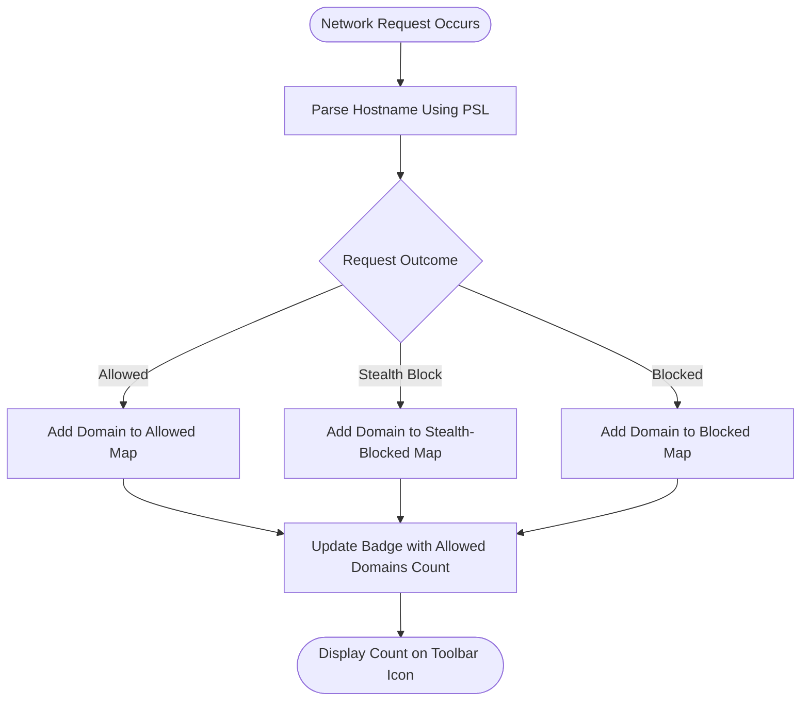

# Debunking Badge Count and Block-Count Myths

## Overview

This guide explains why the badge counts and block counts shown by uBO Scope and similar content blockers are often misunderstood or misused. You will learn how uBO Scope measures third-party exposure more accurately, and why simplistic metrics can be misleading. This is essential both for general users evaluating privacy protections and for filter list maintainers who need reliable insights.

---

## Why Badge and Block Counts Can Be Misleading

Most users expect a lower badge count (the number displayed on the extension icon) to mean stronger privacy protection, and a higher block count to imply better blocking performance. However, these assumptions often fail under closer inspection.

### Common Myths

- **Myth 1: "A higher block count means a better content blocker"**
  - Reality: Block count indicates the number of blocked network requests, not how many unique third-party connections were prevented. An extension that blocks many requests but allows connections to many distinct third-party servers may ultimately expose you to more third-party tracking.

- **Myth 2: "Ad blocker test websites provide reliable accuracy results"**
  - Reality: These specialized test pages do not reflect realistic scenarios faced by real websites. They often use contrived network requests and cannot detect stealthy blocking behaviors typical of many modern blockers.

### Why These Myths Matter

Relying on badge or block counts alone can mislead you into thinking you're better protected when you might actually be exposed to more third-party connections. For filter list maintainers, incorrect assumptions may cause misunderstandings about a filter's true effectiveness or stealthiness.

---

## How uBO Scope Measures Connections Differently

uBO Scope focuses on **distinct third-party remote servers** contacted by your browser as a better indicator of privacy exposure:

- It counts **unique third-party domains** where connections succeeded (allowed), were stealth-blocked, or were outright blocked.
- The badge count reflects the total number of distinct allowed third-party domains from the active tab, highlighting true ongoing exposure.
- It categorizes outcomes as follows:
  - **Not Blocked (Allowed)**: Domains with successful network connections.
  - **Stealth-Blocked**: Domains where blocking was stealthy, not easily detectable by webpages.
  - **Blocked**: Domains where requests were blocked outright by your filters.

This approach is more accurate than counting individual requests or relying solely on block metrics because it reveals the scope of third-party exposure directly.

---

## Practical Implications for Users

Follow these points to use uBO Scope effectively and avoid common pitfalls:

1. **Interpret Badge Counts as Exposure, Not Blocking Power**
   - A lower badge count means fewer unique third parties your browser contacted, hence stronger privacy.
   - Don't assume a blocker with higher block count is better; it may still allow many distinct third-party connections.

2. **Use the Popup Data for Deeper Insights**
   - Review separate domain lists in the popup UI (allowed, stealth-blocked, blocked).
   - Understand that some third parties (usually CDNs or essential services) are routinely allowed.

3. **Avoid Relying on Ad-Blocker Test Pages**
   - They often do not match real-world browsing behavior.
   - uBO Scope detects real network connections and their actual outcomes, making it a trustworthy measurement.

4. **Leverage uBO Scope for Objective Comparisons**
   - When comparing blockers, focus on unique third-party domains rather than sheer number of blocked requests.
   - Use domain counts and categorizations to assess overall exposure.

---

## Benefits for Filter List Maintainers

Filter list creators can use uBO Scope as a diagnostic tool to:

- Validate how filters impact **distinct third-party connections** on real-world pages.
- Detect if stealth blocking is occurring and which domains are affected.
- Confirm that filters are not inadvertently allowing exposure to undesirable third parties.

These benefits make uBO Scope a valuable complement to limited browser developer tools or environments where classic debugging is difficult.

---

## Step-by-Step: Using uBO Scope to Understand Your Exposure

<Steps>
<Step title="Open the uBO Scope Popup">
Open the extension popup by clicking the uBO Scope icon in your browser toolbar.

The popup immediately displays details about the current active tab’s network connections.
</Step>
<Step title="Review Badge Number on Toolbar Icon">
Look at the badge number on the extension icon. This represents the count of **unique allowed third-party domains** the active webpage connected to.

Lower numbers indicate fewer third parties communicating successfully, implying better privacy.
</Step>
<Step title="Inspect Domain Lists in Popup">
Observe the three categorized sections:

- **Not Blocked**: Domains that your browser connected to successfully.
- **Stealth-Blocked**: Domains that were blocked subtly without the webpage detecting it.
- **Blocked**: Domains where network requests were explicitly blocked.

Each domain includes a count of how many connections were made to it.
</Step>
<Step title="Interpret the Data">
Use this information to judge your real exposure:

- Check which third-party domains are allowed versus blocked.
- Remember some allowed domains are typically benign CDNs or essential services.
- Be cautious if the blocked count is high but the allowed badge count is also high, as you might still be exposed to many third parties.
</Step>
<Step title="Evaluate Blocking Effectiveness">
Use uBO Scope’s insights to decide whether your content blocker configuration or filter lists are effective.

Consider adjusting filters if too many unique third-party domains appear allowed.
</Step>
</Steps>

---

## Common Pitfalls & Troubleshooting

<AccordionGroup title="Common Issues with Badge and Block Counts">
<Accordion title="The Badge Count is High Despite Using a Blocker">
- This likely means your blocker is allowing connections to many distinct third parties.
- Review the popup domain lists to identify which domains remain allowed.
- Consider adjusting your filter lists or blocker settings to reduce exposure.
</Accordion>
<Accordion title="Block Count Shows Better Performance but Badge Count is Also High">
- A high block count alone isn’t enough to imply better blocking.
- A blocker may block many requests but still allow connections to more unique third-party domains.
- Focus on reducing the badge count for genuine privacy improvements.
</Accordion>
<Accordion title="Ad Blocker Test Pages Show Different Results Than uBO Scope">
- These test pages usually create artificial scenarios.
- They cannot detect stealthy blocking or real-world third-party connections.
- Trust uBO Scope’s real-time network data for accurate assessment.
</Accordion>
</AccordionGroup>

<Tip>
For best results, regularly check uBO Scope while browsing real websites to monitor actual third-party exposure rather than relying on synthetic tests or blocker badges alone.
</Tip>

---

## Summary

uBO Scope provides an authoritative measurement of third-party network exposure by tracking distinct remote servers contacted by your browser, categorized by blocked and allowed outcomes. This guide teaching how to interpret badge and block counts debunks prevalent myths and equips users and filter maintainers with the knowledge to make well-informed privacy decisions.

---

## Additional Resources

- [What is uBO Scope?](https://example.com/overview/product-introduction-core-concepts/what-is-ubo-scope) — Product introduction and core concepts.
- [Interpreting Badge Numbers and Domain Lists](https://example.com/guides/workflows-usage/interpreting-badge) — Understanding badge data in detail.
- [Monitoring Remote Connections on Any Webpage](https://example.com/guides/workflows-usage/monitoring-requests) — Practical monitoring guide.
- [Advanced Use Cases for Filter List Maintainers](https://example.com/guides/best-practices/integration-use-cases) — Leveraging uBO Scope for filter development.

Visit the [GitHub repository](https://github.com/gorhill/uBO-Scope) for source code, issues, and updates.

---

## Appendix: Understanding Third-Party Exposure Measurement

The core of uBO Scope’s accuracy stems from these principles:

- It aggregates network request outcomes per browser tab.
- Utilizes the Public Suffix List to determine the effective domain for each hostname.
- Counts unique domains per outcome category to provide a net exposure metric.

This method prevents misleading inflation of counts caused by multiple connections to the same domain or subdomains, focusing on truly unique third parties.

---

## Visual Aid: Simplified Flow of Badge Count Calculation

This flow illustrates how each network request is analyzed and tallied to update the visible badge, emphasizing the focus on unique domain counts.
