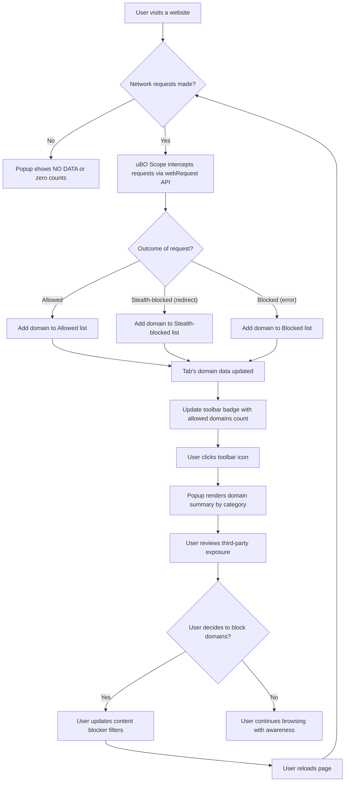

# Analyzing Third-Party Connections and Minimizing Exposure

## Workflow Overview

### Task Description
This guide helps you identify and understand the third-party remote servers your browser connects to when visiting any website, using uBO Scope's real-time monitoring. You'll learn how to interpret the toolbar badge count that reflects distinct third-party connections, recognize the significance of domain categorization in the popup panel, and apply practical strategies to reduce your exposure to unwanted third parties, thereby enhancing your browsing privacy.

### Prerequisites
- uBO Scope extension must be installed and enabled in your supported browser (Chrome, Firefox, or Safari).
- Basic familiarity with browsing the web and using browser extensions.
- The extension's permissions granted to observe web requests.

### Expected Outcome
After completing this guide, you will:
- Understand what the badge count on the uBO Scope toolbar icon represents.
- Be able to interpret allowed, stealth-blocked, and blocked domains reported per tab.
- Have actionable insights to minimize your exposure to unnecessary third-party connections.

### Time Estimate
Approximately 10-15 minutes, depending on your familiarity with browser extensions and privacy concepts.

### Difficulty Level
Beginner to Intermediate

---

## Step-by-Step Instructions

### 1. Viewing the Toolbar Badge Count

- **Action**: Locate the uBO Scope icon near your browser's address bar (toolbar area).
- **Outcome**: Observe the numeric badge displayed on the icon.
- **Interpretation**: This number represents the count of *distinct third-party remote servers* your current active tab is connecting to.

> A lower badge count is good—it means fewer third-party connections and reduced exposure.

### 2. Opening the uBO Scope Popup Panel

- **Action**: Click the uBO Scope toolbar icon to open its popup panel.
- **Outcome**: The popup shows categorized lists of domains associated with the active tab, split into "not blocked", "stealth-blocked", and "blocked" sections.

### 3. Understanding Domain Categories

- **Allowed (Not Blocked)**: Domains from which network requests were successfully allowed.
- **Stealth-Blocked**: Domains that redirected certain requests invisibly, meaning blocking was applied stealthily to avoid detection or breakage.
- **Blocked**: Domains for which network requests were actively blocked (failed connections).

### 4. Analyzing Third-Party Connections

- **Action**: Review the domains under each category in the popup.
- **Outcome**: Get an immediate sense of which third parties your active tab interacts with and their allowed or blocked status.

> Tip: Use the domain counts to prioritize investigation and risk assessment.

### 5. Interpreting Hostname and Domain Distinctions

- The toolbar and popup report counts by domain, aggregating multiple hostnames under a single effective domain (e.g., `cdn.example.com` and `img.example.com` count as one).
- The popup's header shows both the full hostname and the base domain for clarity.

### 6. Minimizing Your Third-Party Exposure

- **Inspect High Exposure Tabs**: When the badge number is higher than expected, review the popup to identify unusual or excessive third-party domains.
- **Consider Blocking**: For domains you consider unnecessary or privacy-invasive, explore your browser’s content blocking or custom filter list capabilities to block those domains.
- **Reload and Reassess**: After adjusting filters or blocker settings, reload the tab and check uBO Scope again to verify a reduced badge count and third-party connections.

### 7. Regular Monitoring and Awareness

- Make reviewing uBO Scope’s reports a routine to maintain awareness of your browsing exposure.
- Use the data as evidence to debunk common misconceptions about content blockers and network requests.

---

## Examples & Real Scenarios

### Example 1: Typical News Website

1. Open a popular news website.
2. Click the uBO Scope icon.
3. Observe a badge count of 5, indicating connections to 5 distinct third-party domains.
4. In the popup:
   - Allowed domains might include major content delivery networks (CDNs).
   - Stealth-blocked domains could be tracking services stealthily blocked by your content blocker.
   - Blocked domains may show ad servers actively blocked.

> Insight: This helps you identify which services are silently filtered and which are allowed, giving you control over your privacy surface.

### Example 2: High Exposure E-commerce Site

1. Visit an e-commerce website.
2. The badge shows 20, much higher than your usual browsing activity.
3. The popup reveals multiple allowed domains from marketing and analytics providers.
4. You choose to add a filter rule against some of these domains at your content blocker.
5. Reload the page; uBO Scope's badge reduces accordingly.

> Benefit: You actively reduce your exposure to third parties without breaking site functionality.

---

## Troubleshooting & Tips

### Common Issues
- **No Data in Popup**: If the popup shows "NO DATA" or a question mark:
  - Ensure you have an active tab selected.
  - Refresh the tab or browser.
  - Confirm uBO Scope's permissions are allowed.
- **Badge Not Updating**:
  - Try closing and reopening the popup.
  - Restart your browser.
- **Unexpected High Badge Count**:
  - Some websites use many legitimate third parties (e.g., CDNs, cloud providers).
  - Confirm whether these domains are essential or require blocking.

### Best Practices
- Use uBO Scope alongside a content blocker for best privacy results.
- Regularly check the popup to stay informed about new or changed third-party connections.
- Use the domain information to tailor your filtering lists thoughtfully rather than blanket blocking.

### Avoiding Pitfalls
- Do not rely solely on block counts from content blockers; focus on distinct connected domains.
- Beware of stealth blocking: some connections might be hidden but still occur.
- Not all third parties are bad; some (like CDNs) improve performance and reliability.

---

## Next Steps & Related Content

- After familiarizing yourself with basic domain analysis, explore the following guides for deeper insights:
  - [Navigating the Popup: Understanding Your Domain Summary](https://example.com/guides/getting-started/tour-popup-interface) — for detailed popup UI explanations.
  - [Debunking Block Count and Content Blocker Myths](https://example.com/guides/core-scenarios/debunking-blocking-myths) — to understand content blocker effectiveness beyond block counts.
  - [Interpreting Stealth-Blocked and Allowed Domains in Practice](https://example.com/guides/core-scenarios/using-stealth-data) — for understanding stealth blocking nuances.
- Consult the [System Requirements](https://example.com/getting-started/setup-introduction-and-installation/system-requirements) page to ensure your environment supports all functionalities.
- Use the [Troubleshooting Common Issues](https://example.com/getting-started/quick-start-usage-validation/basic-troubleshooting) guide if you encounter setup or data issues.

---

## Additional Resources

- uBO Scope GitHub Repository: [https://github.com/gorhill/uBO-Scope](https://github.com/gorhill/uBO-Scope)
- Public Suffix List Reference (used by uBO Scope for domain aggregation): [https://publicsuffix.org/](https://publicsuffix.org/)

---

## Summary

Understanding your web browsing's third-party connections is crucial for informed privacy decisions. uBO Scope equips you with a transparent, categorized view of all network interactions per tab, emphasizing distinct remote servers over raw block counts. By learning to interpret the badge and popup domain classifications, you gain practical insights to minimize unnecessary exposure and leverage content blocking more effectively.

---

<AccordionGroup title="FAQ and Tips">
<Accordion title="What does the badge count represent exactly?">
The badge displays the count of unique third-party domains contacted from the current tab that had successful connections not blocked by any content blockers.
</Accordion>
<Accordion title="Can I trust a low badge count means no tracking?">
Not entirely. Some trackers may be stealth-blocked or disguised. Combined usage of uBO Scope with trusted content blockers offers better insight.
</Accordion>
<Accordion title="Why do some domains appear in multiple categories?">
Domains are categorized by outcome of their network connections. A domain can have some requests blocked and others allowed; uBO Scope counts requests accordingly.
</Accordion>
</AccordionGroup>

---

## Visual Workflow Diagram

---