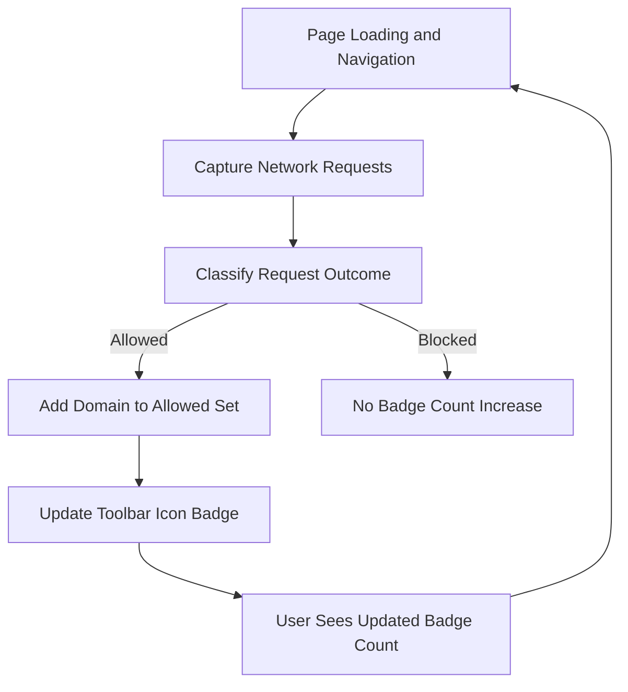

# Interpreting the Icon Badge Count

Understanding the badge number on uBO Scope’s toolbar icon is crucial to accurately assessing your browser's privacy exposure and the effectiveness of your content blockers. This guide unpacks what the badge count represents, why fewer distinct third-party connections matter, and how to use this metric to make informed privacy decisions.

---

## 1. What the Icon Badge Count Represents

The icon badge on uBO Scope reflects the **number of distinct third-party domains for which your browser has established network connections during your current browsing session** (or on the active tab).

- Each number corresponds to a unique third-party remote server domain contacted.
- This count only includes **allowed connections**, i.e., servers from which your browser successfully fetched resources.
- A higher badge number means more distinct third-party servers were contacted.


### Why This Matters
Third-party connections can expose your browsing pattern, introduce tracking, or impact performance. By quantifying these connections, uBO Scope gives you a clear, tangible metric for monitoring your network exposure in real time.

<Info>
The badge count excludes blocked or stealth-blocked domains to focus on actual connections your browser completed.
</Info>

---

## 2. Why Fewer Distinct Third-Party Connections Is Better

Less third-party network activity means reduced exposure to trackers, fewer unnecessary data exchanges, and improved privacy.

- **Privacy Perspective:** Fewer third parties reduce your fingerprint and tracking surface.
- **Performance Perspective:** Loading from fewer distinct servers often improves page loading time.
- **Security Perspective:** Fewer third parties mean fewer external attack vectors.

### What’s Considered Third-Party?

uBO Scope distinguishes main site domains from third-party domains by leveraging the Public Suffix List. Third parties are domains **external to the site you are visiting**.

<Note>
Not all third parties are malicious or harmful; common ones include content delivery networks (CDNs), analytics providers, and social media widgets.
</Note>

---

## 3. How uBO Scope Calculates and Updates the Badge

### Under the Hood (User's Perspective)

- As you browse, uBO Scope tracks network requests your browser initiates.
- Connected domains classified as "allowed" are added to the current tab’s tally.
- The badge count updates **live** to show the distinct count of these domains.

### Important Behavior

- **Reset on Navigation:** Navigating to a new page resets count tracking for that tab—the extension tracks connections per active page.
- **Only Counts Distinct Domains:** Multiple connections to the same domain increase the count only once.


---

## 4. Using the Badge Count to Assess Content Blocker Effectiveness

### Understanding Limitations of Block Counts

- The badge count is based on **allowed third-party domains**, not on total blocked requests.
- Having a low badge count indicates that your content blocker or privacy settings successfully minimize exposure.

### Comparing Content Blockers

- A blocker that claims a high block count but lets many third-party connections through might be less privacy-effective.
- uBO Scope’s badge gives a **more meaningful privacy metric** than raw block counts.

<Tip>
Use the badge count alongside the popup's detailed report for a full picture of what domains you are connecting to.
</Tip>

---

## 5. Practical Guidance for Users

### Interpreting Badge Count Scenarios

| Badge Count | Interpretation                              | User Action                         |
|-------------|--------------------------------------------|-----------------------------------|
| 0           | No third-party domains contacted           | Excellent privacy scenario         |
| 1 to 5      | Low number of third-party connections      | Typical for most websites, good    |
| 6 to 15     | Moderate third-party connections            | Check popup for legitimacy         |
| 16+         | High number of third-party connections      | Consider tightening privacy settings or blocking rules |

### What to Do if You See High Badge Counts

1. Open the popup to view detailed per-domain counts.
2. Identify if there are any suspicious or unknown third parties.
3. Adjust content blocker filter lists or settings accordingly.
4. Revisit and monitor the badge count for improvement.

<Warning>
Some web applications may legitimately require multiple third-party connections. Before blocking, verify whether the connection is necessary.
</Warning>

---

## 6. Troubleshooting Badge Count Issues

### Badge Does Not Update or Shows Empty

- Ensure uBO Scope is active and not disabled in your browser.
- Confirm your browser supports the webRequest API fully (see Supported Browsers).
- Refresh the page or open a new tab and observe if the badge updates.

### Badge Count Seems Higher than Expected

- Check the popup for domains listed under "allowed".
- Inspect whether some content, like ads or trackers, are present.
- If using multiple content blockers, conflicts might cause unexpected behavior.

### Badge Count Stuck on a Number

- Sometimes session data might persist incorrectly; restarting the browser resets counts.
- Verify extension updates or reinstall if persistent issues occur.

<Check>
If problems persist, review the Troubleshooting Common Issues guide or file an issue with detailed info.
</Check>

---

## 7. Summary and Next Steps

You now have a clear understanding of the uBO Scope badge count:

- It measures the number of distinct third-party remote servers your browser connects to per active tab.
- A lower badge number signals better privacy and less third-party tracking.
- Use the badge alongside the popup details to monitor and adjust your blocking strategy.

### Next Steps

- Consult the **Monitoring Network Connections on Any Page** guide to explore the popup data more deeply.
- Read the **Debunking Block Count Myths** for understanding the limits of traditional ad blocker metrics.
- Review the **Supported Browsers & Requirements** page to ensure your environment is optimal.

---

## Appendix: Badge Display Example

Below is an example of what the badge might look like in the browser toolbar:

```text
[ uBO ]  4
```

This indicates 4 distinct third-party domains with allowed network connections for the current tab.

---

## Diagram: Flow of Badge Count Update



---

## References

- [uBO Scope Overview: What is uBO Scope?](../../overview/introduction-core-value/what-is-ubo-scope)
- [Core Concepts & Terminology](../../overview/how-it-works-architecture/core-concepts-terminology)
- [Monitoring Network Connections on Any Page](../core-usage/monitoring-network-connections)
- [Debunking Block Count Myths](../advanced-insights/debunking-common-myths)
- [Troubleshooting Common Issues](../../getting-started/getting-aware/troubleshooting)


---

## Author Notes
This documentation focuses exclusively on helping users understand the toolbar icon badge count, ensuring actionable and context-rich guidance. For a comprehensive exploration of network requests and the popup interface, please refer to related guides.