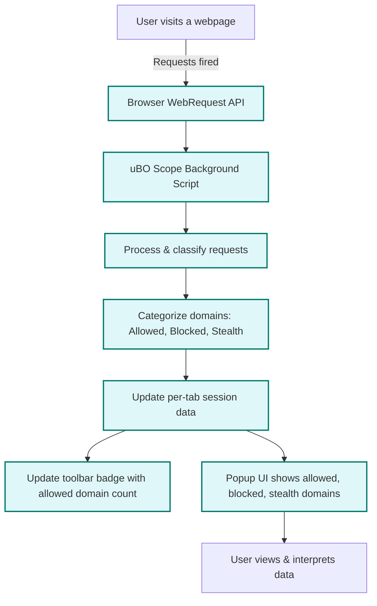

# Debunking Block Count Myths: What Really Matters?

## Understanding the True Privacy Impact Beyond Block Counts

When it comes to content blockers and privacy tools, users often rely on the **block count**—the number displayed on browser extension badges or reports—as a measure of effectiveness. It's a natural assumption that a higher block count means better protection. However, this guide will walk you through why this is a misleading metric and how **uBO Scope** provides a grounded, factual perspective by focusing on what truly matters: the count of unique third-party remote servers actually allowed to connect.

---

### 1. What This Guide Helps You Achieve
- Gain clarity on why block counts can be deceptive indicators of privacy protection
- Learn how to interpret uBO Scope’s reporting to understand your real exposure
- Empower yourself to make better decisions about content blockers based on domain connections, not just numbers

### 2. Prerequisites
- uBO Scope installed and active in your browser
- Basic familiarity with uBO Scope’s popup interface and toolbar badge (see the [First Connection Analysis Tour](./first-analysis-tour))
- Understanding of concepts like “allowed,” “blocked,” and “stealth-blocked” network requests (see [Core Concepts & Terminology](../../overview/core-concepts-architecture/core-concepts-terminology))

### 3. Expected Outcome
After following this guide, you will:
- Understand why a high block count does not necessarily mean stronger protection
- Be able to interpret the distinct domains reported by uBO Scope and relate them to actual privacy impact
- Avoid common pitfalls when comparing content blockers solely by block counts

### 4. Time Estimate
Reading and applying this guide will take approximately 10-15 minutes.

### 5. Difficulty Level
Intermediate: builds on existing familiarity with uBO Scope and browser privacy tools.

---

## Step-by-Step Guidance

### Step 1: Recognize the Nature of Block Counts

- The number shown on a content blocker’s badge typically represents how many network requests were blocked.
- However, **this metric alone does not reveal which third-party servers remain connected or how many unique third parties were reached.**
- A blocker with a higher block count may ironically allow more domains to connect, weakening privacy.

<Tip>
Always consider the **number of distinct third-party domains actually allowed** versus just the number of blocked requests.
</Tip>

### Step 2: Use uBO Scope Badge Count to Measure Unique Allowed Remote Servers

- uBO Scope's badge reports the **number of distinct third-party domains from which your browser has successfully fetched content**, reflecting real network connections.
- The lower this number, the fewer third-party servers are involved in your browsing session, indicating a stronger privacy stance.

<Check>
Look at uBO Scope’s badge while browsing: a smaller count means fewer third parties connected to the active tab.
</Check>

### Step 3: Interpret the Popup Interface—Distinct Classifications Matter

- Open uBO Scope’s popup for the active tab.
- You will see three categories:
  - **Not Blocked (Allowed)**: Domains with successful connections
  - **Stealth-Blocked**: Domains where requests were redirected or blocked in a stealthy way
  - **Blocked**: Domains whose connection attempts were explicitly blocked

- The **allowed domains represent your actual exposure** in terms of third-party connections.

### Step 4: Avoid Misusing Block Counts from Other Content Blockers

- Many browser content blockers report only the number of blocked requests, including multiple requests to the same domain.
- These counts can be inflated by aggressive but ineffective blocking, or lowered by stealth and subtle blocking mechanisms.
- Assessing privacy purely by these counts can lead to false conclusions.

### Step 5: Focus On Third-Party Domains, Not Request Volume

- What truly matters is how many **unique third-party remote servers** are contacted — not how many requests are blocked or allowed.
- A content blocker that blocks redundant requests, but allows connections to many distinct servers, may offer weaker privacy than one that blocks connections to more domains but fewer requests overall.

### Step 6: Understand uBO Scope's Reporting Philosophy

- uBO Scope uses your browser’s standard `webRequest` API to monitor and count **unique remote servers contacted per tab**.
- It reports outcomes regardless of which content blocker is used.
- This ensures you get an **unbiased view** of your real network privacy footprint.

<Note>
uBO Scope’s count reflects the **actual network impact on privacy**, not just raw counts of blocked or allowed requests.
</Note>

### Step 7: Apply This Insight When Evaluating Content Blockers

- Use uBO Scope to compare content blockers by how they affect the number of third-party domains connected.
- Ignore sidebar claims based solely on block counts.
- Remember, **lower allowed domain counts with good stealth blocking typically mean better privacy**.

<Tip>
For extensive evaluation, combine uBO Scope’s insights with the [Mapping Allowed and Blocked Third-Party Domains](./tracking-blocked-allowed) guide.
</Tip>

---

## Real-World Scenario

Imagine browsing a news website with multiple content blockers:

- **Blocker A** shows a block count of 500 but 120 distinct domains are allowed.
- **Blocker B** shows a block count of 200 but only 85 distinct domains are allowed.

While Blocker A appears more aggressive (higher block count), it actually allows connections to **more third-party servers**, making Blocker B the superior choice for privacy.

uBO Scope helps you see this clearly by presenting unique connected domains rather than just block numbers.

---

## Troubleshooting & Tips

### Common Misunderstandings
- **Mistake:** Equating a higher block count to better privacy.
  - **Fix:** Focus instead on allowed domains count in uBO Scope.

- **Mistake:** Trusting ad blocker test sites as accurate benchmarks.
  - **Fix:** Ad blocker test pages often do not reflect real-world browsing or stealth blocking. Use uBO Scope data instead.

### Best Practices
- Regularly check uBO Scope’s popup and badge when trying new filters or blockers.
- Use the **stealth-blocked** category to understand hidden redirects or soft-blocking in effect.
- Combine this data with your content blocker’s controls for fine-tuning.

### Performance Considerations
- uBO Scope is lightweight and relies on standard browser APIs.
- No extra configuration needed; simply review the data as you browse.

---

## Next Steps & Related Guides

- Familiarize yourself further with uBO Scope’s UI and data meanings in the [First Connection Analysis Tour](./first-analysis-tour).
- Learn to visualize allowed vs. blocked traffic in [Mapping Allowed and Blocked Third-Party Domains](./tracking-blocked-allowed).
- For advanced stealth and hidden request detection, see [Spotting Stealth Domains and Hidden Requests](../advanced-tips/stealth-detection).
- Need help with setup or troubleshooting? Refer to [Installation Guide](../../getting-started/setup-installation/installation) and [Troubleshooting Common Issues](../../getting-started/validation-troubleshooting/troubleshooting).

---

## Summary
The block count on content blockers creates an illusion of protection that can mislead users. With uBO Scope, focus on **unique third-party servers actually connected**, giving you a factual, clear view of your browsing privacy. This enables informed decisions and highlights the importance of understanding outcomes beyond raw block metrics.

---

## References
- [First Connection Analysis Tour](./first-analysis-tour)
- [Core Concepts & Terminology](../../overview/core-concepts-architecture/core-concepts-terminology)
- [Mapping Allowed and Blocked Third-Party Domains](./tracking-blocked-allowed)
- [Stealth Detection Guide](../advanced-tips/stealth-detection)
- [Installation Guide](../../getting-started/setup-installation/installation)
- [Troubleshooting Common Issues](../../getting-started/validation-troubleshooting/troubleshooting)

---

## Resources
- uBO Scope GitHub Repository: [https://github.com/gorhill/uBO-Scope](https://github.com/gorhill/uBO-Scope)
- Public Suffix List (used for domain parsing in uBO Scope): [https://publicsuffix.org/](https://publicsuffix.org/)

---

## Appendix: Visual Flow of uBO Scope Domain Reporting

Use this flow to visualize how uBO Scope captures network requests and delivers actionable information on distinct third-party connections per tab.

---