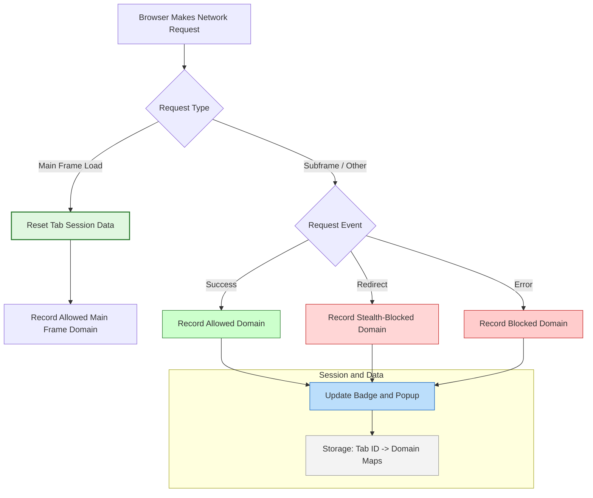

# Analyzing Network Request Outcomes

## Workflow Overview

### Task Description
This guide helps you track and analyze the various remote servers your browser connects to during web browsing. It focuses on understanding which requests were allowed, stealth-blocked, or blocked, leveraging uBO Scope's detailed domain categorizations.

### Prerequisites
- uBO Scope installed in your Chromium, Firefox, or Safari browser.
- Access to the popup panel for the active browser tab.
- Basic familiarity with domain and hostname concepts.

### Expected Outcome
By following this guide, you will confidently interpret network connection outcomes in uBO Scope. You will distinguish real network activity from stealth blocking and blocked requests, gaining clear insight into your browser’s third-party connections.

### Time Estimate
5-10 minutes for initial understanding and practice.

### Difficulty Level
Beginner to Intermediate

---

## Step-by-Step Instructions

### Step 1: Open uBO Scope Popup for the Active Tab
1. Click the uBO Scope icon in your browser toolbar.
2. The popup panel displays the current tab's network connection summary, categorized by outcome.

**Expected result:** The popup shows the hostname, domain, and separate lists for allowed, stealth-blocked, and blocked domains.

### Step 2: Review Allowed Domains
- The 'not blocked' section lists all third-party domains from which network requests succeeded.
- Each domain is accompanied by a count showing how many times it was contacted.

**Tip:** A lower count of allowed distinct domains generally means better privacy.

### Step 3: Understand Stealth-Blocked Domains
- The 'stealth-blocked' section reveals domains for which requests were intercepted and blocked silently (stealth mode).
- These requests are not visible to webpages and help avoid breakage or detection.

**Note:** Stealth blocking differs from outright blocking; it prevents detection by websites while stopping network traffic.

### Step 4: Analyze Blocked Domains
- The 'blocked' section lists domains where explicit blocking errors occurred.
- This is where network requests were denied and succeeded no connection.

**Use case:** Identify domains blocked by other content blockers or rules that led to errors.

### Step 5: Compare Domain Lists and Counts
- Observe discrepancies between allowed, stealth, and blocked lists.
- Check if legitimate third-party domains are unnecessarily blocked.
- Use counts to identify domains frequently contacted.

### Step 6: Interpret the Summary Count
- The summary at the top shows the total unique domains connected (allowed only).
- This count is reflected on the toolbar badge.

**Check:** If the badge number is high, investigate which domains are allowed.

### Step 7: Understand Top-Level Domain (TLD) and Public Suffix List Usage
- uBO Scope uses the Public Suffix List (PSL) to accurately classify domains.
- Domains are resolved to their effective registered domain for meaningful aggregation.

**Best practice:** Trust the displayed domains as true distinct third-party entities.

### Step 8: Refreshing and Session Handling
- Close and re-open the popup to refresh data.
- uBO Scope tracks requests per tab session; closing a tab clears its data.

---

## Examples & Real-World Scenarios

### Scenario 1: Identifying Legitimate CDN Connections
You visit an e-commerce site. uBO Scope shows 'cdn.example.net' under allowed with a high count, and some 'ads.tracker.com' under blocked.

**Action:** This confirms legitimate CDN usage while unwanted tracking domains are blocked.

### Scenario 2: Diagnosing Unexpected Allowed Domains
You notice a suspicious domain 'unknown-analytics.io' in allowed list.

**Action:** Check stealth and blocked lists for this domain; verify if this connection should be blocked or confirmed safe.

### Scenario 3: Distinguishing Stealth Mode Effect
A domain 'tracker.hidden.com' appears in stealth-blocked but not in blocked.

**Insight:** This indicates the request was blocked quietly to prevent page breakage or detection by the website.

---

## Troubleshooting & Tips

### Common Issues
- **Popup shows 'NO DATA' or empty sections:**
  - Make sure you opened the popup on an active tab with web activity.
  - Check that permissions for network monitoring are granted to uBO Scope.
  - Reload the tab to refresh data.

- **Badge count not updating:**
  - Ensure the extension is enabled and has required permissions.
  - Refresh the tab or restart the browser to reset session data.

- **Domain counts seem inaccurate:**
  - Domain resolution relies on the Public Suffix List. If a domain is wrongly aggregated, try visiting the site again.

### Best Practices
- Regularly review the allowed list to keep track of third-party connections.
- Use the stealth and blocked lists to understand blocking behavior and fine-tune blockers if necessary.
- Combine insights with other uBO Scope guides on popup UI and core concepts for full mastery.

### Performance Considerations
- uBO Scope batches network request processing every second for efficiency.
- Large numbers of network requests might cause slight delays in UI updates.

---

## Next Steps & Related Documentation

- **Using the Popup Panel:** To get familiar with the live UI and domain categories.
- **Reading the Popup UI and Badge Counts:** For deeper understanding of the badge count definitions.
- **Debunking Content Blocking Myths with uBO Scope:** To clarify how blocking stats should be interpreted.
- **Filter List Maintainer Essentials:** Tips on optimizing content blocking using uBO Scope insights.

Explore these guides to augment your ability to monitor and control your browser's network connections effectively.

---

## Diagram: Network Request Outcome Categorization Flow

