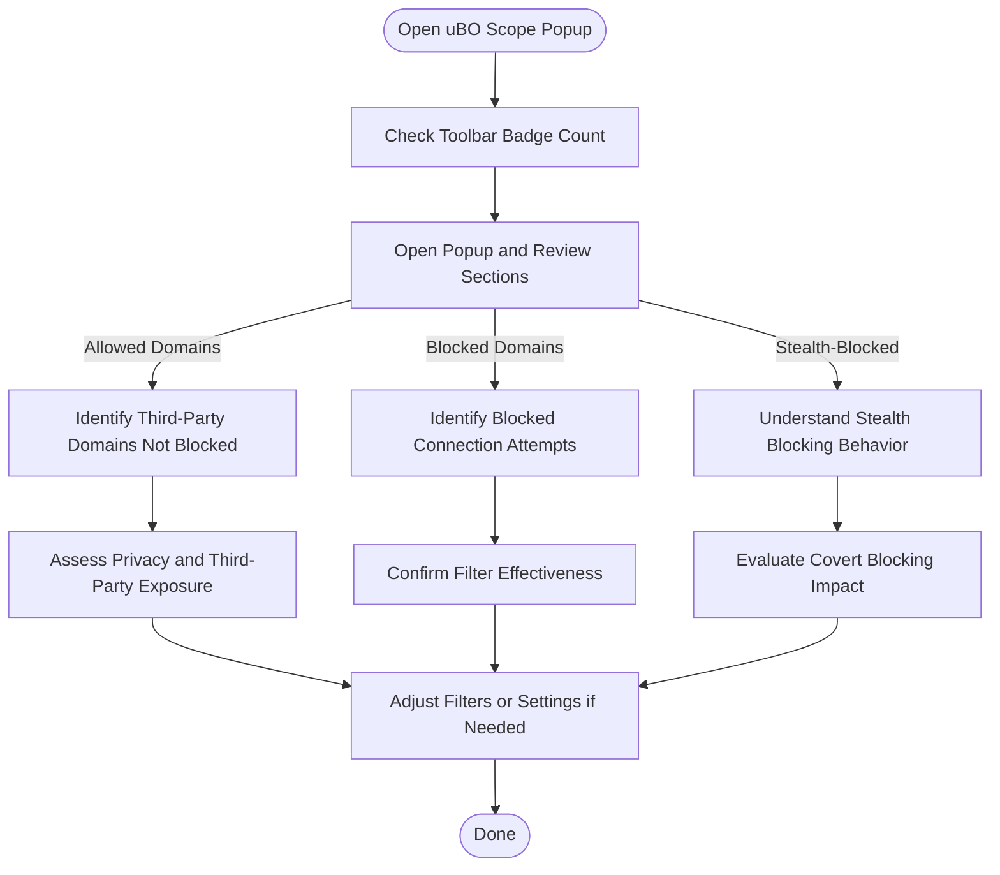

# Analyzing Request Outcomes: Allowed, Blocked, and Stealth

## Overview
This guide helps you understand how uBO Scope categorizes network request outcomes it observes in real time. You'll learn how to interpret the three main categories — **Allowed**, **Blocked**, and **Stealth-Blocked** — and how to use this information to evaluate your browsing privacy, troubleshoot filtering setups, or improve content-blocking configurations.

uBO Scope reveals the distinct third-party domains your browser connects to, grouping them based on whether connections are allowed, blocked outright, or stealth-blocked (e.g., redirected or hidden by filters).

---

## What You Will Achieve
- Understand the meaning behind **Allowed**, **Blocked**, and **Stealth-Blocked** outcomes
- Be able to identify which third-party domains are truly contacted during browsing
- Learn practical steps to interpret these results for troubleshooting and privacy enhancement

**Estimated time:** 5–10 minutes to become proficient at reading and using uBO Scope outcomes

**Difficulty:** Beginner to Intermediate

---

## Understanding Outcome Categories

uBO Scope’s popup UI and badge present domains grouped into the following categories:

### 1. Allowed
Domains from which your browser successfully fetched resources.

- These connections were not blocked by any content blocker or filtering mechanism.
- A low count here indicates fewer third-party connections, often implying better privacy.

### 2. Blocked
Domains where network requests failed or were intentionally blocked.

- Indicates direct blocking by your content blocker or DNS.
- These domains represent connections your browser attempted but did not complete successfully.

### 3. Stealth-Blocked
Domains associated with requests that were intercepted, redirected, or otherwise hidden.

- Often caused by filters that rewrite or silently block requests to avoid webpage breakage or detection.
- These connections did not resolve openly but are still detected due to browser network events.

<Tip>
The stealth category helps expose blocking that is covert or indirect, giving you insight beyond simple allowed/blocked counts.
</Tip>

---

## How to Interpret Results in Real Scenarios

1. **Monitoring a typical webpage:**
   - The number in the toolbar badge shows how many distinct third-party domains were contacted successfully (Allowed).
   - In the popup, review the detailed domain lists to see where requests were blocked or stealth-blocked.
   
2. **Identifying undesired trackers:**
   - Blocked or stealth-blocked domains associated with ads or trackers suggest your filters are working.
   - Allowed domains that look suspicious could mean some trackers slip through.

3. **Troubleshooting filtering issues:**
   - If domains you expect to be blocked appear as Allowed, your filtering rules might need adjustment.
   - Stealth-blocked domains indicate silent interference, which can be desirable to prevent page breakage.

---

## Step-by-Step Guide to Analyze Outcomes

### Step 1: Open uBO Scope Popup
- Click the uBO Scope toolbar icon on the active tab.
- The popup loads showing the current tab's hostname and summary count.

### Step 2: Review the Summary Count
- Check the "domains connected" count at the top — this is the number of distinct third-party domains your browser connected to successfully.
- A higher count indicates more third-party connections.

### Step 3: Explore Domain Categories
- Scroll through the **not blocked** section to see domains with allowed connections.
- Look through **stealth-blocked** to find domains whose requests were redirected or intercepted silently.
- Review **blocked** to understand which connections were outright prevented.

### Step 4: Understand Domain Labels and Counts
- Each row shows the domain name and the count of requests made to it.
- Domains are presented in Unicode form for readability.

### Step 5: Cross-Reference with Your Content Blocker
- Compare blocked domains here with your other blocklists or extensions to verify consistency.
- Use stealth-blocked domains to spot filters working covertly.

---

## Practical Tips & Best Practices

- **Keep an eye on the badge count:** It reflects allowed (successful) third-party connections, which is the best indicator of actual privacy insofar as third parties are concerned.
- **Use stealth-blocked information for fine-tuning:** If too many domains appear here, you might have aggressive filtering causing potential breaking issues.
- **Interpret blocked domains as your filters’ successes:** Frequent blocked domains can indicate many blocked trackers.
- **Make distinctions between `allowed` and `stealth` carefully:** Some stealth blocking may be by design to avoid webpage errors.

---

## Common Pitfalls and Troubleshooting

### Popup shows no data or stale data
- Refresh the tab or close and reopen the popup.
- Ensure you have proper permissions granted (e.g., `webRequest`).
- Verify the extension is enabled and not disabled by the browser.

### Badge count doesn’t update
- Reload the active tab and check.
- Restart the browser if needed.
- Make sure other blockers or privacy settings don’t interfere with uBO Scope’s data collection.

### Unexplained Allowed domains
- Some third-party services like CDNs or analytics will be allowed if not blocked explicitly.
- Review your blocker lists if you want to reduce allowed domains.

### Stealth-block entries unexpected
- This may be caused by filters using redirection or silent blocking.
- This can be normal; only adjust rules if you experience site breakage.

---

## Example Scenario

Imagine visiting a news website:
- The toolbar badge shows '12', meaning you connected to 12 unique third-party domains successfully.
- In the popup:
  - The **allowed** section lists `cdn.example.com` and `analytics.example.net`.
  - The **stealth-blocked** section shows `tracker.adsnet.com`.
  - The **blocked** section lists `ads.doubleclick.net`.

You understand that your blocker successfully prevented connections to `ads.doubleclick.net` and stealthily blocked `tracker.adsnet.com` to avoid detection, while essential resource CDNs and analytics domains remain accessible.

---

## Next Steps

- Explore the [Getting Started: Monitoring Connections guide](https://your-documentation-domain/guides/core-workflows/getting-started-monitoring) to learn how to use uBO Scope from the beginning.
- Visit [Understanding Connection and Domain Counts](https://your-documentation-domain/guides/core-workflows/understanding-domain-counts) to deepen your understanding of badge metrics.
- For troubleshooting badge and popup issues, consult the [Badge and Popup Troubleshooting](https://your-documentation-domain/getting-started/troubleshooting/ui-troubleshooting) guide.

---

## Additional Resources
- [What is uBO Scope?](https://your-documentation-domain/overview/product-introduction/what-is-ubo-scope)
- [Key Features at a Glance](https://your-documentation-domain/overview/feature-overview/main-features)
- [Core Concepts & Terminology](https://your-documentation-domain/overview/architecture-and-concepts/core-concepts-terminology)

---

## Summary Diagram: User Flow for Outcome Interpretation

This flowchart outlines how users progress from viewing connection counts to interpreting detailed domain outcomes, enabling practical decisions.

---
