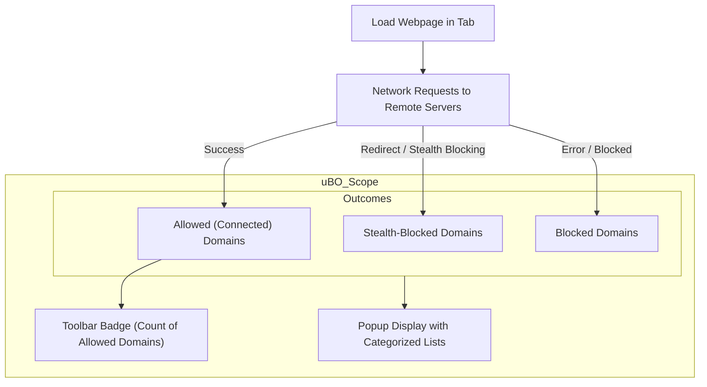

# Analyzing Third-Party Domains and Connections

## Overview

This guide walks you through using uBO Scope’s core interface to investigate third-party domains that a webpage connects to. It helps you understand what these connections imply for your privacy and how effective your content blockers are. You will also learn to identify common misconceptions, especially those stemming from so-called 'ad blocker test' pages.

By examining the categorized lists in uBO Scope’s popup, you gain clear insight into the interactions between your browser, the visited site, and external servers.

---

## Prerequisites

- Ensure uBO Scope is installed and active in your browser.
- Make sure you are viewing an active tab with website content loaded.
- Familiarity with basic web browsing concepts and domains.
- Recommended: Review the [Using the Extension](https://example.com/guides/getting-started/usage-and-troubleshooting/using-the-extension) guide for foundational knowledge on the popup and badge.

---

## What You Will Achieve

By following this guide, you will be able to:

- Identify and interpret lists of third-party domains connecting to a webpage.
- Understand the differentiation between allowed, stealth-blocked, and blocked domains.
- Judge third-party connection numbers in the context of privacy and filter list effectiveness.
- Recognize why some ad-blocker test sites provide misleading information.

---

## Estimated Time

**5–10 minutes** to review and practice on a site of your choice.

---

## Difficulty Level

**Intermediate** – Basic concepts covered, but some experience with privacy and blocking concepts is helpful.

---

# How to Analyze Third-Party Domains and Connections

uBO Scope’s popup interface displays third-party server connections into three categories, each revealing a different aspect of your browser’s network activity on the active tab.

## Step 1: Open uBO Scope Popup

- Click the uBO Scope icon in your browser’s toolbar.
- The popup will appear showing real-time data for the active tab.

**Expected Result:**
• Title at top shows the base hostname of the active tab.
• Summary section displays the number of distinct third-party domains connected.
• Three categorized sections list domains:
  - Not blocked
  - Stealth-blocked
  - Blocked

## Step 2: Understand the Domain Lists

Each section lists third-party domains your browser interacted with, grouped by their connection outcome.

### Not Blocked

- These are third-party domains with successful connections detected.
- They represent actual data fetched by the web page.
- Often includes content delivery networks (CDNs) and analytics providers.

### Stealth-Blocked

- Domains that triggered a redirect or manipulation stealthily blocked by content blockers.
- Network requests originated but were redirected invisibly to avoid page breakage or detection.

### Blocked

- Domains where connection attempts failed due to blocking (e.g., by a content blocker or network-level filter).
- These failed requests indicate explicit blocking activity.

## Step 3: Interpret Counts and Privacy Implications

- The badge count on the toolbar icon corresponds to the number of distinct allowed third-party domains.
- A lower number means fewer third-party connections and generally better privacy.
- Not all third parties are harmful; some are essential infrastructure (e.g., cloud services).
- Domains in stealth-blocked and blocked categories indicate how many requests are filtered or blocked.

## Step 4: Analyze Common Misconceptions

### Myth: Higher Block Count Means Better Blocking

- uBO Scope shows that a higher block count doesn't always mean better blocking.
- Blocking many requests may coincide with allowing more third parties, as some blockers report request failures differently.
- What matters is the distinct number of third-party remote servers you actually connect to.

### Myth: Ad Blocker Test Pages are Reliable

- These test pages craft artificial request scenarios not representative of real-world usage.
- Many extensions use stealth blocking and tricks not detectable by such test sites.
- Use uBO Scope’s connection reports for real, verifiable network insight instead.

## Step 5: Apply Insights in Real-World Use

- Check your regular browsing sites to see typical third-party connections.
- Identify any unexpected domains that could leak privacy.
- Use domain connection data to fine-tune or verify filter lists if managing content blockers.

---

# Practical Tips

- Refresh the page and re-open the uBO Scope popup to get up-to-date connection data.
- Use the domain counts as a lightweight privacy metric to monitor sites.
- Remember domain names may appear punycoded—uBO Scope displays them decoded for clarity.
- Observe stealth-blocked domains to understand how content blockers avoid detection.

---

# Common Pitfalls to Avoid

- Do not over-interpret a single domain's presence—some third parties are necessary.
- Avoid relying solely on ad blocker test page results.
- Understand that blocking mechanisms have varying reporting styles; use uBO Scope to get unbiased connection data.
- Remember uBO Scope cannot report network requests made outside browser APIs (e.g., some VPNs or DNS-level blocks).

---

# Quick Reference Example

Imagine visiting 'example.com' where uBO Scope shows:

- Not Blocked: `cdn.example-cdn.net` (15 requests)
- Stealth-Blocked: `tracker.hidden-blocker.org` (4 requests)
- Blocked: `ads.blocked-ads.com` (7 requests)

**Interpretation:**
- The site loads assets from a trusted CDN.
- Some requests were stealthily blocked (no visual impact on the page).
- Other requests were outright blocked.
- Total distinct allowed third-party servers contribute to the badge count.

---

# Troubleshooting

<AccordionGroup title="Troubleshooting Common Issues">
<Accordion title="Popup Shows 'NO DATA' or Empty">
- Ensure you have an active tab with a loaded webpage.
- Reload the tab to stimulate network activity.
- Confirm uBO Scope is enabled and has necessary permissions.
- Check for conflicting extensions that may interfere.
</Accordion>
<Accordion title="Badge Count Does Not Update">
- Switch to another tab and back.
- Reload the page to trigger new requests.
- Clear session data by restarting the browser or reinstalling.
</Accordion>
<Accordion title="Third-Party Domains Appearing Incorrect or Punycode">
- uBO Scope automatically decodes punycoded domains.
- If names appear encoded, try refreshing popup or browser.
</Accordion>
</AccordionGroup>

---

# Next Steps & Related Reading

- Explore the [Interpreting the Badge and Popup](https://example.com/guides/getting-started/understanding-the-badge-and-popup) guide for deeper badge and UI insight.
- Learn how to monitor network connections continuously in [Monitoring Network Connections on Any Site](https://example.com/guides/core-workflows/monitoring-network-connections).
- Understand installation and permissions: [System & Browser Requirements](https://example.com/getting-started/installation-and-setup/system-requirements), [Installing uBO Scope](https://example.com/getting-started/installation-and-setup/installing-ubo-scope).
- Check the core concepts in [Core Concepts & Terminology](https://example.com/overview/intro-key-concepts/core-concepts-terminology) for foundational knowledge.

---

# Summary Diagram: Third-Party Domain Connection Flow

This flowchart explains how uBO Scope categorizes network outcomes observed per tab, feeding both the badge count and the popup display.

---

## Additional Resources

- Public Suffix List: uBO Scope uses the [Mozilla Public Suffix List](https://publicsuffix.org/) to accurately extract domains from hostnames.
- FAQ and Troubleshooting: [Troubleshooting Installation & Setup Issues](https://example.com/getting-started/usage-and-troubleshooting/troubleshooting)
- For developers or filter list maintainers, see advanced [Filter List Validation](https://example.com/guides/core-workflows/filter-list-validation).

---

This guide equips you with the knowledge and practical steps to confidently investigate third-party domains and network connections in uBO Scope, empowering you to make informed decisions about your web privacy and content blocking strategy.

---