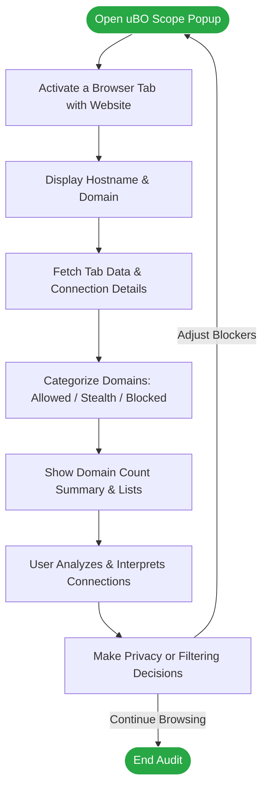

# Audit Third-Party Network Connections

Unlock transparency into your web browsing by auditing every attempted and successful connection your browser makes to remote servers on any website. This guide walks you through using uBO Scope's popup interface to categorize, analyze, and interpret third-party network activity, empowering you to make privacy-conscious and informed decisions.

---

## 1. What This Guide Will Help You Achieve

- **Task Description:** Learn how to use uBO Scope’s popup to reveal all remote server connections made by the active browser tab, separated by outcome (allowed, stealth-blocked, blocked).
- **Prerequisites:**
  - uBO Scope installed and activated in your supported browser (Chromium 122+, Firefox 128+, or Safari 18.5+).
  - Browser toolbar icon visible for easy access.
  - Active browsing session with websites loaded.
- **Expected Outcome:** Understand and identify all distinct third-party domains your visited webpage connects to, enabling you to differentiate legitimate content delivery networks from potentially unwanted or stealth-blocked connections.
- **Time Estimate:** 5–10 minutes to review the popup interface on a few sites and grasp connection classifications.
- **Difficulty Level:** Beginner to Intermediate

---

## 2. Step-by-Step Instructions to Audit Third-Party Connections

<Steps>
<Step title="Locate and Open the uBO Scope Toolbar Icon">
Find the uBO Scope icon in your browser toolbar. It resembles the extension’s logo as shown during installation. Click the icon to open the popup interface, which dynamically shows network connection data for the active browser tab.
</Step>

<Step title="Understand the Hostname and Domain Display">
At the top of the popup, observe the hostname and domain of the current webpage. This contextualizes the origin of the connections you will audit.
</Step>

<Step title="Review the Summary Count">
Below the hostname, note the “domains connected” count. This number represents the distinct third-party domains connected to by the active tab.

- A lower count often indicates fewer external connections, usually better for privacy.
- Remember not all third-party domains are harmful; many are common CDNs.
</Step>

<Step title="Analyze the Three Outcome Categories">
The popup divides third-party domains into three categories:

- **Not Blocked (Allowed):** Domains your browser successfully connected to and resource loading was permitted.
- **Stealth-Blocked:** Domains where network requests had redirect events indicative of stealth blocking, often invisible to the webpage.
- **Blocked:** Domains where network requests were blocked or failed.

For each category, a list of domains is shown along with the count of connections made.
</Step>

<Step title="Use Domain Counts to Prioritize Investigation">
Focus on domains with high connection counts to assess their role in page load.

- High count on allowed domains often points to legitimate services.
- Unexpected or unknown domains, especially in stealth-blocked or blocked lists, may suggest tracking or unwanted content.
</Step>

<Step title="Make Privacy-Informed Decisions Based on Audit">
Utilize the visibility into third-party connections to:

- Identify unnecessary or suspicious connections.
- Adjust content blocker settings or filters accordingly.
- Validate how effective your blockers are at preventing unwanted remote connections.
</Step>
</Steps>

---

## 3. Practical Example

Imagine visiting a news website. Opening uBO Scope’s popup, you see:

- **Hostname:** `www.example-news.com`
- **Domains Connected:** 7
- **Allowed:** 
  - `cdn.example-news.com` (4 connections)
  - `images.cdnprovider.net` (2 connections)
- **Stealth-Blocked:**
  - `tracker.ads.com` (3 attempted connections)
- **Blocked:**
  - `ads.example.com` (5 attempted connections)

You conclude that your content blocker successfully prevented multiple ad network connections while allowing essential media content from CDNs.

---

## 4. Best Practices & Tips

- **Consistently Monitor Domains:** Regularly check the popup after browsing new sites to stay informed about third-party activity.
- **Lower Badge Count Indicates Better Blocking:** Aim for fewer allowed third-party domains where possible.
- **Be Wary of Stealth-Blocked Domains:** These are silently redirected and might indicate tricky tracking; consider tightening your filters.
- **Use the Domain Counts to Detect Anomalies:** Unexpected domain spikes may signal backdoors or resource abuse.
- **Remember Browser Limitations:** uBO Scope can only report network requests observed by the browser’s webRequest API; connections outside this API scope are not tracked.

---

## 5. Troubleshooting Common Scenarios

<AccordionGroup title="Troubleshooting Audit Issues">
<Accordion title="Popup Shows No Data or 'NO DATA'">
Ensure the active browser tab has fully loaded a webpage making remote network requests. Connections may not appear on pages with no network activity or internal browser pages.
</Accordion>

<Accordion title="Toolbar Badge Count Is Always Zero">
Verify that uBO Scope is properly installed and active. Check browser permissions to confirm webRequest access is allowed. Reload the browser or the affected tab to reset data.
</Accordion>

<Accordion title="Suspicious Domains Aren't Showing Up">
Remember that uBO Scope reports what the browser’s API can see. Some resource loads or background processes may occur outside detection (e.g., DNS-based blocking). Also, stealth-blocked domains might appear in the stealth section instead of allowed or blocked.
</Accordion>
</AccordionGroup>

---

## 6. Going Further: Next Steps & Related Content

- Learn how to interpret the **badge count** and what the numbers reveal about your network exposure: [Interpreting the Badge Count](/guides/core-workflows/badge-count-explained)
- Validate and compare your content blockers’ effectiveness using uBO Scope: [Validate Content Blockers with uBO Scope](/guides/core-workflows/validate-blockers)
- Understand stealth-blocking mechanisms and their detection: [Understanding and Detecting Stealth-Blocked Requests](/guides/advanced-usage/understanding-stealth-blocking)
- Troubleshoot installation and operational issues: [Troubleshooting Installation Issues](/getting-started/first-run-and-validation/troubleshooting-installation-issues)

Refer to the [Popup Interface Guide](/getting-started/first-run-and-validation/understanding-the-popup) for more detail on reading and using the popup efficiently.

---

## 7. Summary Diagram: User Flow for Auditing Third-Party Network Connections

---

# Callouts

<Tip>
uBO Scope's badge count reflects the number of *distinct* third-party domains allowed, not total requests or blocks.
</Tip>

<Note>
Stealth-blocked connections involve redirects invisible to the webpage, making them important to detect for privacy reasons.
</Note>

<Warning>
Not all third-party connections are unsafe; look carefully before blocking domains critical for site functionality.
</Warning>

---

For source and updates, visit the [official uBO Scope GitHub repository](https://github.com/gorhill/uBO-Scope).

---

# End of Guide
