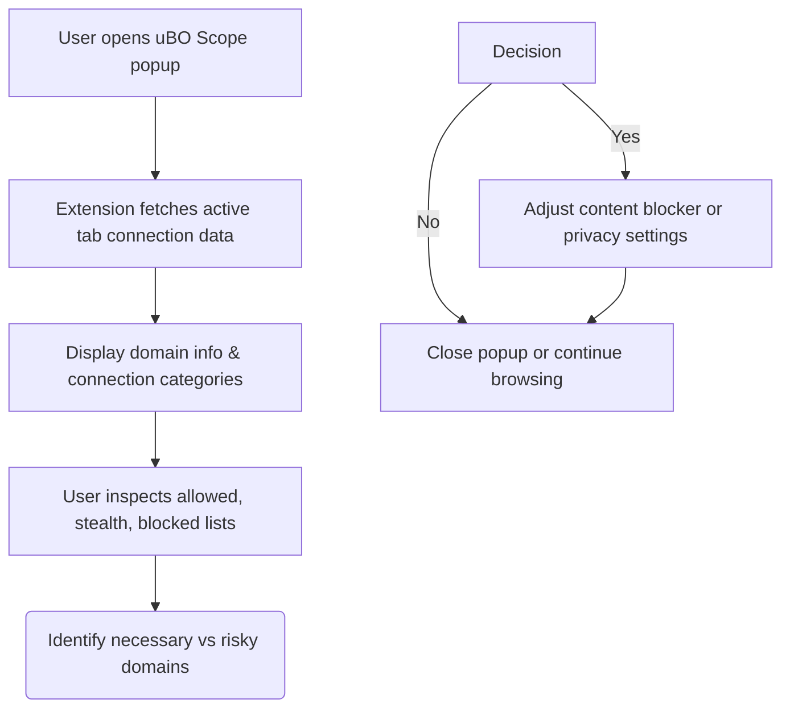

# Auditing Third-Party Network Requests on Any Page

## Overview

This guide walks you through using uBO Scope to reveal all remote server connections a website attempts or successfully makes. It enables you to identify and distinguish between essential and non-essential third-party connections, helping you recognize potential privacy concerns and unintended data leaks.

By following this step-by-step process, you will gain clear visibility into how a webpage interacts with external domains, equipping you with actionable insights to improve your browsing privacy.

---

## Prerequisites

- You have uBO Scope installed and enabled in your browser.
- You have at least one active browser tab with a website loaded.
- Your browser supports the `webRequest` API (chromium-based browsers, Firefox 128+, Safari 18.5+).

<u>Note:</u> uBO Scope does not require additional configuration and functions out-of-the-box to gather connection data.

---

## Expected Outcome

By the end of this guide you will be able to:

- View a summary of all third-party remote domains contacted by the active webpage.
- Distinguish between allowed, blocked, and stealth-blocked connections.
- Evaluate which third-parties are necessary or potentially posing privacy risks.
- Understand the badge count on the toolbar icon as the number of distinct allowed third-party domains.

---

## Time Estimate

Approximately 5 minutes to complete initial inspection and get familiar with the connections detail.

---

## Difficulty Level

Beginner to Intermediate user familiar with browser extensions and basic privacy concepts.

---

## Step-by-Step Instructions

### 1. Open uBO Scope Popup

- Click the uBO Scope icon located in your browser's toolbar.
- This action opens the popup UI showing connection data related to the active tab.

<Check>
If the icon does not appear, ensure the extension is enabled and your browser meets requirements per the [Prerequisites & System Requirements](https://example.com/getting-started/quick-setup/prerequisites-system-requirements) documentation.
</Check>

### 2. Interpret the Hostname Header

- At the top of the popup, observe the hostname and domain of the active webpage.
- The full hostname and its root domain are displayed to give context for connections listed.

### 3. Review Summary of Connected Domains

- Under the summary section, see the total count of distinct third-party domains the webpage connected to.
- This count reflects the number of domains not blocked by any content blocker and represents potential privacy exposure.

### 4. Explore Connection Categories

The popup separates domains into three distinct sections:

#### Allowed
- Domains that the webpage successfully connected to.
- These are resources fetched and utilized in the webpage.

#### Stealth-Blocked
- Domains for which connection attempts were redirected or stealthily blocked.
- Useful to understand invisible blocking actions by your content blocker or browser.

#### Blocked
- Domains outright blocked (connection errors). These requests did not complete.

### 5. Identify Frequent Connections

- Each section lists domains with a count showing how many times the domain appeared in requests.
- Sort by domain name or connection count to prioritize investigation.

### 6. Differentiate Necessary and Unnecessary Third-Parties

- Use your knowledge about the website to assess which allowed domains are necessary (e.g., well-known CDN providers).
- Identify suspicious or unexpected domains that may represent tracking or privacy leaks.

<Tip>
Common legitimate third-parties often include major CDNs (e.g., cloudfront.net, akamai.net).
 Unexpected domains from advertising or analytics companies might warrant blocking or further scrutiny.
</Tip>

### 7. Use the Badge Count as a Quick Indicator

- The toolbar badge shows the number of distinct allowed third-party domains for the active tab.
- A lower number indicates a cleaner network profile.

<Note>
The badge does not count blocked or stealth-blocked domains.
</Note>

### 8. Repeat the Audit on Multiple Pages

- Navigate to other pages or sites and open uBO Scope's popup to observe changing domain connections.
- Look for differences in third-party load to understand privacy implications site-by-site.

---

## Examples

Imagine you visit a news website that loads the following:

- Allowed domains:
  - cdn.examplecdn.com (Content delivery)
  - analytics.tracker.com (Analytics service)
  - ads.adnetwork.com (Advertising network)

- Stealth-blocked domains:
  - social.media.com (Redirected or stealth-blocked to hide presence)

- Blocked domains:
  - malicious.badsite.com (Blocked for security reasons)

Using uBO Scope, you can see these domains and decide to block or allow based on your privacy preferences.

---

## Troubleshooting & Tips

- **No Data in Popup**: Ensure you have an active tab with a loaded webpage. Reload the page if necessary.
- **Badge Count is Zero But Network Activity is Expected**: Some resource types or requests might not be tracked depending on browser and API limitations.
- **Third-Party Domains Seem Unexpected**: Use domain lookup tools to verify domain legitimacy before blocking.
- **High Domain Counts**: Consider blocking known tracking or ad domains if privacy is a concern but beware that some third parties are essential for site functionality.

<Tip>
Pair uBO Scope with your content blocker’s settings to fine-tune allowed and blocked lists based on observed connections.
</Tip>

---

## Next Steps & Related Content

- Learn more about the popup UI and badge in [Understanding the Popup UI and Badge](https://example.com/guides/getting-started/understanding-the-popup).
- Explore deeper interpretation of data in [Making Sense of Allowed, Blocked, and Stealth Connections](https://example.com/guides/advanced-tips/interpreting-request-details).
- Use uBO Scope to benchmark your content blocker via [Comparing Content Blockers with uBO Scope](https://example.com/guides/core-workflows/compare-content-blockers).
- Review installation instructions if needed at [Installing and Setting Up uBO Scope](https://example.com/guides/getting-started/install-and-setup).

---

## Summary

This page equips you with the practical knowledge to audit all third-party network requests on any webpage using uBO Scope. You'll be able to distinguish the nature of all remote domain connections and thus manage your privacy exposure effectively.

---

## Appendix: Understanding Domain Determination

uBO Scope determines a domain by extracting the main registered domain using the Public Suffix List (PSL). This ensures that domains from subdomains or various regional levels are unified properly for clearer reporting.

For example, connections to `assets.cdn.example.com` and `api.example.com` both count towards `example.com` as the primary domain.

---

## Visual Overview of Workflow

---