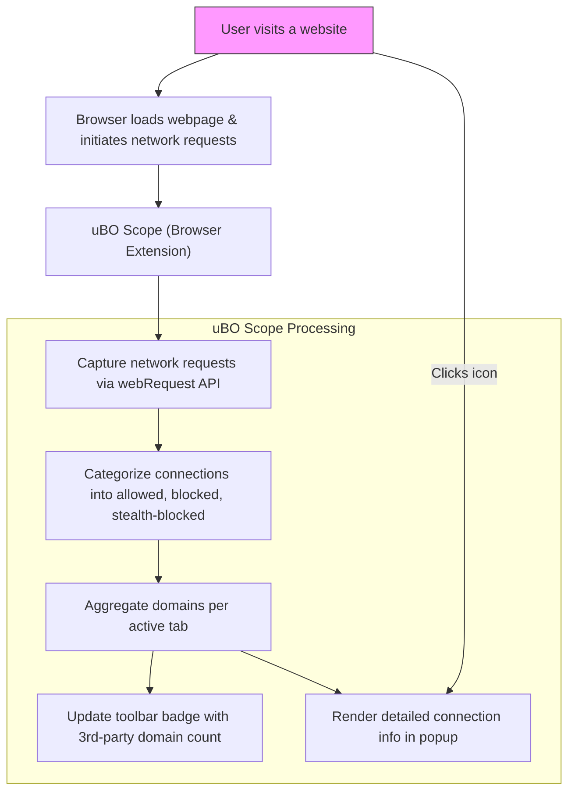

# Monitoring Connections on Any Site

Discover how to use the uBO Scope toolbar popup and badge to monitor all network connections initiated by any webpage you visit. This guide empowers you to understand which remote servers your browser tries to connect to—whether those connections are allowed, blocked, or stealth-blocked—and how to interpret this information effectively for privacy insight.

---

## 1. What This Guide Helps You Achieve

uBO Scope is designed to report all remote connections attempted by your browser, providing transparency on network activity initiated by any site. This guide helps you:

- Use the toolbar popup interface to observe connection outcomes in real time
- Understand and differentiate between **allowed**, **blocked**, and **stealth-blocked** domain connections
- Interpret the badge count on the extension's toolbar icon for quick insights
- Identify third-party domains involved in your browsing sessions

By following this guide, you gain immediate visibility into your web traffic and can evaluate how many third-party servers your browser communicates with.

### Prerequisites

- uBO Scope extension installed and active in your supported browser (Chromium 122+, Firefox 128+, Safari 18.5+).
- Basic familiarity with browser extensions and toolbar icons.
- Access to the browser toolbar where the uBO Scope icon resides.

### Expected Outcome

After completing this guide, you will:

- Confidently open and navigate the uBO Scope popup
- Understand the meaning behind the badge count and popup categories
- Recognize third-party domain connections, their status, and implications

### Time Estimate

Approximately 5 to 10 minutes

### Difficulty Level

Beginner

---

## 2. Step-by-Step Instructions

<Steps>
<Step title="Locate the uBO Scope Toolbar Icon">
Find the uBO Scope icon on your browser's toolbar. It usually appears as a colored badge with a number indicating the count of distinct third-party domains connected during the current tab session.

**Expected Result:** You see the uBO Scope icon with a number badge or no badge if no connections are recorded.
</Step>

<Step title="Open the uBO Scope Popup Interface">
Click on the uBO Scope toolbar icon. This action opens the popup window that displays detailed statistics about the network connections initiated by the active tab.

**Expected Result:** The popup window loads, showing the connected domain counts and categorized connection lists.
</Step>

<Step title="Understand the Summary Section">
At the top of the popup, locate the summary that displays the total count of distinct third-party domains connected.

- This number represents all remote servers your browser has connected to successfully or attempted connections with.

**Expected Result:** You see a numeric count reflecting connected domains.
</Step>

<Step title="Review the Connection Outcome Categories">
The popup divides domains into three sections:

- **Not Blocked (Allowed):** Domains your browser connected to without interruption.
- **Stealth-Blocked:** Domains where connection attempts were hidden or redirected stealthily (often for tracking avoidance).
- **Blocked:** Domains blocked by content blockers or network filters.

Each section lists domains with a count of the number of connection attempts.

**Decision Point:** Are most domains allowed, blocked, or stealth-blocked? This reflects how many third parties your browser actually talked to versus those prevented.

**Expected Result:** You see domain lists sorted by category with counts.
</Step>

<Step title="Explore Third-Party Domain Details">
Click (if applicable) or visually inspect the domain names to identify whether they are first-party or third-party relative to the site you are visiting.

- Domains different from your current site’s main domain represent third-party connections.
- The badge count tracks the number of unique third-party domains connected.

**Best Practice:** Pay attention to third-party CDN domains (content delivery networks) which are often necessary and legitimate.

**Expected Result:** You recognize third-party domains that are part of your browsing.
</Step>

<Step title="Close the Popup and Observe the Badge in Real Time">
Close the popup and continue browsing. Notice the toolbar badge updating in real time as the page makes new connection attempts.

**Expected Result:** Badge counts update dynamically as new third-party connections occur or disappear.
</Step>
</Steps>

---

## 3. Real-World Example

Suppose you visit a news website. After the page loads:

- Click the uBO Scope icon.
- You see the badge shows "5" indicating five distinct third-party domains connected.
- In the popup, under **Not Blocked**, domains such as "cdn.news.com" or "fonts.provider.net" appear with counts of 2, meaning two connections each.
- Under **Blocked**, you might see tracking domains that were prevented.
- Under **Stealth-Blocked**, domains redirected invisibly to avoid detection.

This concrete detail offers a clear picture of your web activity, showing exactly who your browser talks to.

---

## 4. Troubleshooting & Tips

<AccordionGroup title="Common Issues When Monitoring Connections">
<Accordion title="Popup Shows No Data or ‘NO DATA’">
Check if you have active tabs loaded with web content. uBO Scope only reports network requests for active tabs. Reload the tab or open a new tab with a live website.

Verify that the extension has appropriate permissions (webRequest, storage).

Refer to the troubleshooting guide: [Troubleshooting: No Connections Being Reported]( /getting-started/troubleshooting-common-issues/nothing-being-reported ).
</Accordion>

<Accordion title="Badge Does Not Update">
Sometimes the badge may not update immediately:

- Allow a few seconds for the extension to process network events.
- Refresh the page if the badge remains static.
- Make sure no browser privacy setting or conflicting extensions block webRequest API.
</Accordion>

<Accordion title="Distinguishing Legitimate Third-Parties from Trackers">
Remember that some third-party domains like CDNs or fonts providers are generally harmless and often essential.

Use the domain names and counts to identify domains that are unexpected or suspicious.

Consult your content blocking filter lists or network inspector tools for further investigation.
</Accordion>
</AccordionGroup>

<Tip>
The badge count reflects distinct third-party domains your browser connected to — a lower number indicates better privacy. Use the popup to explore exact details behind the scenes.
</Tip>

<Tip>
Stealth-blocked domains represent connections diverted or hidden to avoid detection — understanding these helps debunk misconceptions about blocker effectiveness.
</Tip>

---

## 5. Next Steps & Related Documentation

- After mastering connection monitoring, deepen your understanding of how to interpret results and badges in  
[Interpreting uBO Scope Results and Badges](/guides/core-workflows/interpreting-results).

- If you are new, check the  
[Activating and Accessing uBO Scope](/getting-started/getting-up-and-running/initial-launch-activation)  guide for activation and access basics.

- For installation troubleshooting, see  
[Solving Installation Problems](/getting-started/troubleshooting-common-issues/common-installation-issues).

- Learn about myths around block counts in  
[Debunking Block Count and Ad Blocker Myths](/guides/advanced-usage-scenarios/debunking-myths).

- Explore the source code and get the latest updates on the official GitHub repository:  
[https://github.com/gorhill/uBO-Scope](https://github.com/gorhill/uBO-Scope).

---

## Appendix: Understanding the Popup Interface Layout

The popup shown by clicking the uBO Scope toolbar icon contains:

- **Current Tab Hostname and Domain:** Displayed prominently at the top.
- **Summary:** Total count of connected (allowed) distinct domains.
- **Allowed Section:** Domains successfully connected to without blocking.
- **Stealth-Blocked Section:** Domains with connection attempts stealthily blocked or redirected.
- **Blocked Section:** Domains where connection attempts were actively blocked.
- **Domain Counts:** For each domain, the count of connection attempts is displayed next to the domain name.

This interface allows fast identification of all network activity induced by browsing.

---

## Visual Diagram: Workflow of Monitoring Connections

This workflow encapsulates how uBO Scope listens, processes, categorizes, and presents network connections seamlessly.

---

For any additional questions or support, please refer to the official documentation index or the GitHub repository.

---

# End of Guide
