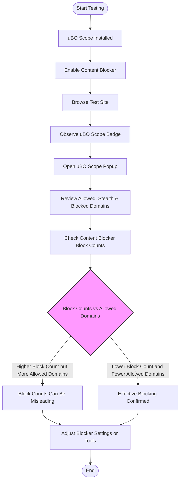

# Comparing Content Blockers with uBO Scope

## Overview

This guide helps you objectively compare the effectiveness of different content blockers using uBO Scope. While many users rely on block counts reported by blockers, this guide shows you how to use uBO Scope to measure actual network requests and connections your browser makes, regardless of the blocking tool in place or DNS filtering used.

Modern content blockers and DNS-based filters operate differently, and their reported block counts can be misleading. uBO Scope offers a transparent, accurate way to audit all remote server connections attempted by your browser.

By following this guide, you will be able to determine which connections are truly blocked or allowed, understand the limitations of block counts, and make informed decisions about your privacy setup.

---

## Prerequisites

- You must have uBO Scope installed and active in your browser.
- At least one content blocker or DNS filtering tool must be enabled in your browsing environment.
- Basic understanding of the uBO Scope popup UI and its badge count. If you need a refresher, see [Understanding the Popup UI and Badge](./understanding-the-popup).
- Familiarity with your browser's extension management and settings.

---

## What You Will Achieve

- Learn how to use uBO Scope alongside other blockers to audit real network connections.
- Identify when block counts reported by blockers do not reflect actual connection blocking.
- Recognize stealth blocking and allowed connections that traditional block counts miss.
- Gain practical insight into interpreting uBO Scope's allowed, blocked, and stealth-blocked domain lists.

---

## Time Estimate

About 10–15 minutes to perform initial audit and interpretation.

---

## Step-by-Step Instructions

### 1. Prepare Your Environment

- Ensure your main content blocker or DNS filtering solution is enabled and functioning.
- Verify uBO Scope is running and has permission to monitor network requests.
- Open a typical website or webpage you want to audit.

### 2. Observe the Toolbar Badge

- Look at the uBO Scope badge icon near the address bar.
- Note the number displayed, representing distinct third-party remote servers that your browser connected to (or attempted connections).

### 3. Open the uBO Scope Popup

- Click the uBO Scope icon to open the popup UI.
- Review the domain lists under these three categories:
  - **Not Blocked (Allowed)**
  - **Stealth-Blocked** (requests redirected or blocked invisibly)
  - **Blocked** (requests that failed or were explicitly blocked)

### 4. Compare With Your Content Blocker’s Block Counts

- Open the management UI of your content blocker.
- Locate its block count or network request summary.
- Compare the block count and domains to what uBO Scope shows.

### 5. Analyze Differences

- Recognize that a higher block count in your blocker does not necessarily mean fewer connections.
- Use uBO Scope’s **Allowed** section as the definitive list of third-party servers your browser actually connected to.
- Check if any domains in **Stealth-Blocked** or **Blocked** match those reported by your content blocker.

### 6. Check Across Multiple Pages

- Repeat the comparison on several websites to see consistent patterns.

### 7. Identify Misleading Indicators

- Note if your blocker shows many blocks but uBO Scope’s allowed domains are large (meaning many connections go through).
- Conversely, a blocker with fewer blocks but fewer allowed domains is effectively stricter.

### 8. Make Informed Privacy Decisions

- Adjust content blocker settings or switch solutions based on real connection data.
- Be cautious of assessing blockers solely on block counts.

### 9. Optional: Document Findings

- Take screenshots or export domain lists from uBO Scope for further analysis.

---

## Real-World Example

Imagine you have two content blockers:

- **Blocker A** shows 50 blocked network requests on a popular news site.
- **Blocker B** shows 30 blocked requests on the same site.

Without uBO Scope, you might conclude Blocker A is more effective.

Using uBO Scope:
- Blocker A corresponds to 20 allowed third-party domains.
- Blocker B corresponds to 10 allowed third-party domains.

This reveals that Blocker B actually blocks more distinct third-party connections despite fewer logged blocks.

This insight challenges the assumption that higher block counts mean better blocking, which is often not true.

---

## Troubleshooting Common Issues

<AccordionGroup title="Troubleshooting uBO Scope and Content Blocker Comparisons">
<Accordion title="No Data in uBO Scope Popup">
- Check that uBO Scope is enabled and permissions are granted.
- Refresh the tab or switch to a new tab to trigger data collection.
- Verify your browser supports the WebRequest API required for uBO Scope.
</Accordion>
<Accordion title="Badge Count Stays Empty or Zero">
- Confirm uBO Scope is running without errors.
- Visit websites with external connections to see if badge updates.
- Disable conflicting extensions that might block uBO Scope’s access.
</Accordion>
<Accordion title="Mismatch Between Block Counts and uBO Scope Results">
- Remember that block counts report events internal to blockers, which may not fully represent actual network connections.
- Stealth blocking or DNS filtering may not reflect in simple block counts but show in uBO Scope.
- Use uBO Scope’s domain lists as ground truth for connections.
</Accordion>
</AccordionGroup>

---

## Best Practices

- Always use uBO Scope in combination with your blockers, not as a standalone blocker.
- Consider the badge count from uBO Scope as a privacy metric: fewer distinct third-party connections means fewer tracking surfaces.
- Use real browsing sessions with websites you trust to audit blockers.
- Recognize the difference between a network request being blocked and a connection being prevented from occurring.

---

## Diagram: Workflow for Comparing Content Blockers with uBO Scope

---

## Next Steps & Related Content

- To deepen your understanding of uBO Scope’s UI, see [Understanding the Popup UI and Badge](./understanding-the-popup).
- Learn how to audit all network requests on any page with [Auditing Third-Party Network Requests](../core-workflows/audit-third-party-requests).
- Discover the core concepts behind connection outcomes in [Making Sense of Allowed, Blocked, and Stealth Connections](../advanced-tips/interpreting-request-details).
- For troubleshooting installation or usage issues, refer to [Troubleshooting Common Installation Issues](../../getting-started/setup-and-validation/troubleshooting-common-issues).

---

<Tip>
When comparing content blockers, never rely solely on reported block counts. Use uBO Scope’s actual network connection data to make informed privacy decisions and optimize your browsing security.
</Tip>