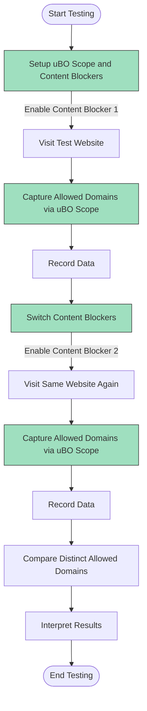

# Comparing Content Blockers with uBO Scope

## Overview

This guide helps you accurately compare the real-world effectiveness of different content blockers by analyzing which third-party network connections occur with each enabled. Using uBO Scope to observe the *actual* third-party servers contacted by webpages, you will learn how to avoid common misconceptions such as relying on block counts or advertising test sites, which fail to reflect blocking quality.

---

## Prerequisites

- uBO Scope extension installed and enabled in your browser (see [Installing uBO Scope](../getting-started/setup-overview/installing) for instructions).
- Basic familiarity with uBO Scope’s badge and popup UI (consult [Popup UI Quick Tour](../overview/feature-overview/popup-ui-quicklook) and [Getting Started: Reveal All Remote Server Connections](../guides/core-workflows/getting-started-analysis)).
- At least two content blockers installed and enabled separately for comparison.
- Supported browser: Chromium 122+, Firefox 128+, or Safari 18.5+.

---

## What You Will Achieve

- Perform side-by-side evaluation of content blockers in use by comparing distinct third-party connections.
- Understand why block counts and ad blocker test pages can mislead.
- Develop a reliable method to quantify content blocker effectiveness based on actual network traffic.

## Estimated Time

~15 minutes for setting up, collecting, and interpreting comparison data.

## Difficulty Level

Intermediate – requires some knowledge of browser extensions and network activity concepts.

---

## Step-by-Step Instructions

### 1. Prepare Your Browsing Environment

- Disable all content blockers except the one you plan to test first.
- Ensure uBO Scope is active and monitoring network requests.
- Open uBO Scope’s popup UI for the tab you will analyze by clicking its toolbar icon.

### 2. Browse the Target Website

- Visit the website or web app whose third-party connections you want to inspect.
- Allow the page to fully load to capture all network requests.

### 3. Observe uBO Scope Data

- In the uBO Scope popup, observe the reported third-party domains under the **not blocked** section; these indicate allowed connections.
- Also note domains under **stealth-blocked** and **blocked** categories if any.
- Record the number of distinct allowed domains (shown in the summary).

### 4. Repeat with Other Content Blockers

- Disable the first content blocker.
- Enable the second content blocker (or any other you want to compare).
- Repeat browsing the same site and checking uBO Scope’s popup data.

### 5. Compare Results

- Compare the count of distinct third-party domains allowed for each content blocker.
- Review the specific domain lists; differences pinpoint which third parties are uniquely allowed or blocked.

### 6. Interpret Findings Correctly

- Use the *count of distinct allowed third-party domains* as the key metric: fewer distinct allowed domains means stronger blocking coverage.
- Ignore the block count badges provided by content blockers themselves; they are unreliable for true blocking accuracy.
- Do not trust ad blocker test websites as their scenarios are artificial and do not reflect real-world blocking.

---

## Best Practices and Tips

- **Always use real-world websites:** Testing content blockers on popular and representative websites provides meaningful insights.
- **Refresh uBO Scope popup after page navigation:** This ensures you see the latest requests for the active tab.
- **Record domain snapshots:** Manually copy or screenshot domain lists for comparison, especially when switching blockers.
- **Consider stealth blocking:** The **stealth-blocked** category in uBO Scope indicates prevented or redirected requests not visible to the webpage.
- **Be patient:** Some network requests load asynchronously after initial page load.

---

## Common Pitfalls to Avoid

- **Relying on content blocker block counts:** These can be misleading due to stealth behaviors or counting multiple blocked requests from the same server.
- **Using ad blocker test sites:** Such sites generate fabricated requests rarely found in real usage, which skews evaluations.
- **Ignoring DNS-based blockers:** uBO Scope tracks network requests regardless of DNS or extension-based blocking, providing a unified view.

---

## Example Real-World Scenario

Suppose you want to compare uBlock Origin versus AdGuard on example.com:

- Install both blockers but test one at a time.
- Open example.com with uBlock Origin enabled, open uBO Scope popup, observe 8 allowed third-party domains.
- Switch off uBlock Origin, enable AdGuard, reload example.com, check uBO Scope popup, note 12 allowed third-party domains.
- Conclusion: even though AdGuard may show a higher block count, uBO Scope shows it allows more third-party connections, implying weaker blocking in this scenario.

---

## Troubleshooting

<AccordionGroup title="Troubleshooting Content Blocker Comparison Issues">
<Accordion title="No Data in uBO Scope Popup">
- Confirm uBO Scope is installed and enabled.
- Ensure uBO Scope has necessary permissions (see [Basic Configuration and Settings](../getting-started/configuration-and-validation/basic-configuration)).
- Reload the webpage and reopen the popup.
</Accordion>
<Accordion title="Inconsistent Data Between Tests">
- Make sure to fully disable one content blocker before enabling another.
- Avoid browsing in private/incognito mode unless all blockers and uBO Scope are enabled for that mode.
- Clear session data or restart the browser if stale data persists.
</Accordion>
<Accordion title="Blocked Domains Not Matching Expectations">
- Understand stealth blocking may cause some requests to be prevented silently.
- Check the [Network Visibility Model](../overview/core-concepts-architecture/network-visibility-model) for details on request classification.
</Accordion>
</AccordionGroup>

---

## Next Steps & Related Documentation

- Explore [Getting Started: Reveal All Remote Server Connections](../guides/core-workflows/getting-started-analysis) for a foundational understanding.
- Use [Interpreting the Badge Count and Popup Panel](../guides/core-workflows/interpreting-badge-popup) to deepen your knowledge of the UI.
- Consult [Works With Any Content Blocker](../overview/feature-overview/content-blocker-independence) to learn about uBO Scope’s independent monitoring capabilities.
- Consider advanced auditing techniques in [Privacy Audits: Identifying Stealth and Unexpected Requests](../guides/advanced-usage-patterns/privacy-audits).

---

## Understanding Why Block Counts and Ad Test Pages Fail

<u>Block Counts Are Misleading</u>

Content blockers show block counts which tally blocked network requests, but these do not equate to the number or severity of third-party connections prevented.
- A blocker with a high block count does not guarantee fewer third-party connections.
- Some blockers allow more distinct third-party domains despite blocking many requests.

<u>Ad Blocker Test Websites Are Unreliable</u>

These sites often make artificial, unrealistic network requests designed to detect blockers rather than simulate real browsing:
- They do not reflect the diverse third-party domains used by real sites.
- They cannot detect stealth blocked or silently allowed requests correctly.
- Using real user traffic and uBO Scope’s live monitoring provides valid evidence of blocking effectiveness.

---

## Summary

This page empowers you to compare content blockers effectively using uBO Scope’s comprehensive network visibility. By focusing on actual allowed third-party domains rather than block counts or test page outcomes, you achieve a reliable, practical understanding of blocking real-world connections.

---

## Additional Resources

- [uBO Scope GitHub Repository](https://github.com/gorhill/uBO-Scope)
- [Popup UI Quick Tour](../overview/feature-overview/popup-ui-quicklook)
- [Network Visibility Model](../overview/core-concepts-architecture/network-visibility-model)
- [Basic Configuration and Settings](../getting-started/configuration-and-validation/basic-configuration)

---

<Info>
For a visual summary of how uBO Scope captures and classifies network requests independently of content blockers, see the [System Architecture and Data Flow](../overview/core-concepts-architecture/system-architecture) documentation.
</Info>

---

### Workflow visualized with Mermaid

This workflow highlights the practical, user-focused steps necessary to objectively assess content blocker effectiveness with uBO Scope.
