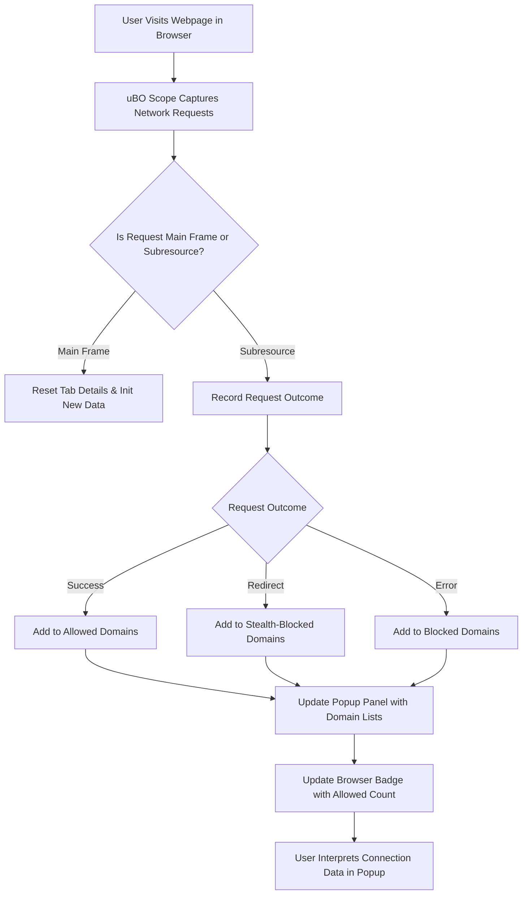

# Analyzing Third-Party Connections on Any Webpage

## Overview

This guide helps you understand how to use uBO Scope to analyze third-party server connections initiated by any webpage you visit. It walks you through interpreting the information presented in the extension's popup interface, explains how to assess the badge counts, and guides you in distinguishing legitimate third-party activity from excessive or suspicious attempts.

By following this guide, you will gain practical skills to evaluate the network footprint of webpages, helping you improve your awareness of privacy and tracking, and enabling better decisions about blocking or allowing connections.

---

## Prerequisites

- Ensure uBO Scope is installed on a supported browser (Chromium, Firefox, Safari) with the necessary permissions granted during installation.
- Confirm the extension is active and visible in your browser toolbar.
- Have a webpage loaded in your active browser tab for which to analyze third-party connections.

If you have not yet installed or activated uBO Scope, refer to the [Installing and Setting Up uBO Scope](https://github.com/gorhill/uBO-Scope) and [Extension Activation & Initial Launch](https://docs.uBO-Scope/installation-basics/extension-activation-initial-launch) guides first.

---

## Expected Outcome

You will be able to:

- Open the uBO Scope popup panel for the active tab.
- Interpret connection counts including allowed, stealth-blocked, and blocked domains.
- Identify third-party domains contacted by the current webpage.
- Understand how badge counts correlate with network activity.
- Distinguish between benign third-party connections (e.g., trusted CDNs) and potentially excessive or tracking-related domains.

---

## Time Estimate

Completing this overview and the initial analysis should take about 10–15 minutes.

---

## Difficulty Level

Beginner to Intermediate: No advanced technical knowledge required, but familiarity with browser extensions and basic networking concepts will help.

---

## Step-by-Step Instructions

### 1. Opening the Popup Panel

- Click the uBO Scope extension icon in your browser toolbar.
- The popup will open, displaying information about the active tab's network connections.

**Expected Result:**

The popup displays three main categories: *not blocked*, *stealth-blocked*, and *blocked*, each listing domains contacted by the active webpage.

### 2. Understanding the Connection Summary

- At the top of the popup, observe the total count next to 'domains connected'. This number represents all unique third-party domains contacted by the webpage in the active tab.
- The toolbar icon badge also shows a count representing distinct allowed third-party domains.

### 3. Exploring the Domain Categories

- **Not Blocked:** Domains for which network requests succeeded and were allowed.
- **Stealth-Blocked:** Domains where requests were stealthily blocked, meaning the content blocker prevented them without obvious failures.
- **Blocked:** Domains where network requests explicitly failed or were blocked.

Inspect each section to see domains and the number of requests made.

### 4. Interpreting Domain Details

- Each listed domain includes a numerical badge showing how many requests involved that domain.
- Domains are displayed using Unicode formatting to clarify internationalized domain names.
- Hovering or clicking domains (browser tooltips or browser features) can provide additional context for deeper inspection.

### 5. Relating Badge Count to Privacy Impact

- A lower badge count is better, indicating fewer distinct third-party domains contacted.
- Higher counts may imply tracking or excessive third-party resource loading.
- Recognize that some legitimate domains (e.g., CDNs like `cloudflare.net` or `akamai.net`) are necessary for website functionality.

### 6. Practical Tips for Users

- **Regularly check the popup after visiting new or unfamiliar websites** to assess their network connections.
- **Use the badge number as a quick privacy health indicator** but always verify detailed domains in the popup.
- **Be cautious about domains repeatedly appearing in the blocked or stealth-blocked sections**, as they may indicate potential trackers or unwanted third parties.

---

## Examples

Imagine visiting a news website:

- You open the uBO Scope popup and see 5 domains under *Not Blocked* (e.g., `cdn.example.com`, `analytics.example.net`).
- The *Stealth-Blocked* section lists 2 domains, possibly trackers snooped silently.
- The *Blocked* section lists 3 more domains representing known ad servers or trackers.

You conclude that although some tracking attempts were blocked, the site still connects to several analytics services. You can decide whether to adjust filter settings or accept this level of connection.

---

## Troubleshooting & Tips

### Common Issues

- ***Popup shows NO DATA or domains connected: ?***
  - Ensure the active browser tab is fully loaded.
  - Verify the extension has required permissions (activeTab, webRequest).
  - Try refreshing the page.

- ***Badge count is zero but you suspect connections were made***
  - Sometimes, connections may be made outside browser visibility (e.g., WebSockets restricted by API).
  - Confirm no conflicting extensions block uBO Scope’s observation.

### Best Practices

- Frequent updates to the Public Suffix List ensure accurate domain parsing. The extension auto-updates it during use.
- Use uBO Scope in conjunction with content blockers to understand what is allowed or blocked, rather than assuming block counts alone define blocker strength.

### Performance Considerations

- uBO Scope efficiently processes network requests in real-time with minimal browser impact.
- Avoid opening multiple popups or running multiple analysis tools simultaneously to prevent overhead.

### Alternative Approaches

- For detailed network request inspection, complement uBO Scope with built-in browser developer tools.
- Use uBO Scope's data to refine custom filter lists by identifying unwanted third-party domains.

---

## Next Steps & Related Content

- Proceed to [Interpreting Blocked, Stealth, and Allowed Outcomes](https://docs.uBO-Scope/guides/core-workflows/interpreting-blocked-stealth-allowed) to deepen understanding of each category.
- Explore [Understanding the Extension Badge](https://docs.uBO-Scope/getting-started/first-steps-validation/understanding-the-extension-badge) for insights on badge counts.
- For troubleshooting, see [Quick Troubleshooting Scenarios](https://docs.uBO-Scope/getting-started/first-steps-validation/quick-troubleshooting).
- Learn about [Using uBO Scope as a Tool for Filter List Maintenance](https://docs.uBO-Scope/guides/core-workflows/filter-list-use-cases) to leverage domain data effectively.

---

## Additional Resources

- [Official uBO Scope GitHub Repository](https://github.com/gorhill/uBO-Scope)
- Public Suffix List, used internally to correctly identify domains: https://publicsuffix.org/

---

## Visual Summary

This diagram illustrates the flow from page load to network request capture, categorization into allowed, stealth, or blocked, updating the popup interface, and displaying a concise badge count for quick user reference.

---