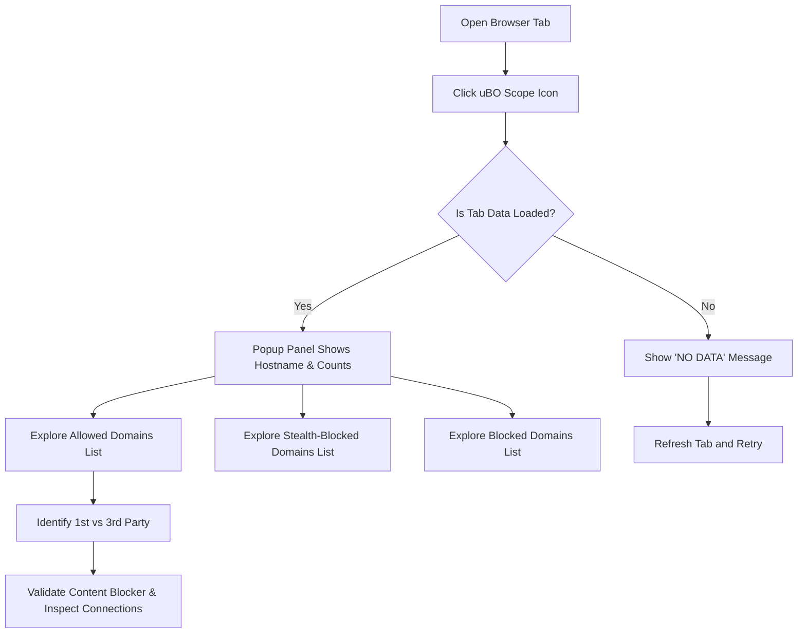

# Exploring Domain Connection Details

Discover which domains a website connects to, understand how uBO Scope categorizes these connections, and learn how to analyze connection histories using the popup interface. This guide empowers you to validate content blockers, identify unexpected third-party requests, and gain transparent insight into your browsing activity.

---

## 1. Overview

uBO Scope's popup panel presents a clear, categorized snapshot of network connections initiated by the active browser tab. These connections are grouped by their outcome:

- **Allowed:** Connections permitted successfully.
- **Stealth-Blocked:** Requests that were redirected or modified stealthily.
- **Blocked:** Requests explicitly blocked by content blockers or due to errors.

By exploring these categories, you can identify which first-party and third-party domains your browser communicates with.

### Prerequisites

- uBO Scope extension installed and enabled in your browser.
- Active browsing tab with network activity.

### Expected Outcome

- Clear understanding of domains contacted by the active website.
- Ability to distinguish first-party vs third-party connections.
- Practical skills to explore detailed domain connection counts.

### Time Estimate

Approximately 5 minutes to learn and explore a site’s connection details using uBO Scope.

### Difficulty Level

Beginner | Requires no technical expertise beyond using a browser extension popup.

---

## 2. Step-by-Step Instructions

### Step 1: Open the uBO Scope Popup Panel

1. Click the uBO Scope toolbar icon next to the browser address bar.
2. The popup panel displays with a header showing the current tab’s hostname and domain.
3. The summary section shows the count of distinct domains connected during the session.

##### Outcome

You should see the page hostname and the total number of connected domains immediately.

---

### Step 2: Understand the Three Connection Categories

The popup organizes domains into three sections, each with a heading and a domain list:

- **Not Blocked (Allowed):** Domains your browser successfully connected to.
- **Stealth-Blocked:** Domains involved in redirects or stealth blocking mechanisms.
- **Blocked:** Domains completely blocked or where errors occurred.

Each domain entry shows the domain name and a badge with the count of related requests.

##### Tip

The badge counts represent how many times the browser attempted connections to each domain,
helping you spot the prominence or frequency of resource requests.

---

### Step 3: Navigate and Interpret Domain Lists

1. Review the domain lists under each category.
2. Recognize domains using their human-readable names, including those with internationalized domain names (IDN) properly converted via Punycode.
3. Compare domains in **Allowed** versus **Blocked** to assess content blocker effectiveness.

##### Decision Points

- If you spot unexpected third-party domains in the Allowed list, consider whether these are necessary or potentially privacy-invasive.
- Stealth-blocked domains may indicate hidden redirects; moderate concern depending on the domain reputation.

---

### Step 4: Analyze First-Party vs Third-Party Connections

- The hostname shown at the top is your **first-party** domain.
- Domains listed that differ from the first-party domain are **third-party** connections.

Use this to identify external services or trackers the site contacts.

---

### Step 5: Refresh and Track Session Data

- The popup data updates as you navigate or reload the active tab.
- Opening uBO Scope repeatedly during a browsing session provides an up-to-date snapshot of connections.

##### Verification

Ensure that the summary domain count and domain lists change logically as you explore different websites.

---

## 3. Practical Example

Suppose you are visiting `example.com`. Open uBO Scope:

- The header shows `example.com` as the hostname.
- The summary reports, e.g., "domains connected: 15".
- In **Allowed**, you see domains like `cdn.example.com` and `fonts.gstatic.com`.
- In **Blocked**, domains such as `ads.service.com` may appear.
- **Stealth-Blocked** may list `tracker.redirect.net`.

This snapshot tells you that while the site’s CDN and fonts were loaded, ad-related domains were blocked, and some trackers redirected stealthily.

You can use this insight to decide if your content blocker settings are sufficient or need tweaking.

---

## 4. Troubleshooting & Tips

<AccordionGroup title="Common Issues and Tips">
<Accordion title="Popup Shows 'NO DATA' or Question Marks">
This occurs if the active tab has no network activity or data is not available yet.

- Try refreshing the tab.
- Ensure you open uBO Scope after the page finishes loading.
- Confirm that uBO Scope has the necessary permissions.
</Accordion>
<Accordion title="Unexpectedly High Allowed Domains Count">
Not all third-party domains are malicious; many are legitimate services like CDNs or APIs.

- Review domain reputations if concerned.
- Use allowed domains count in conjunction with other privacy tools.
</Accordion>
<Accordion title="No Update After Navigation">
- uBO Scope updates data for the current active tab; make sure you switch to the tab before opening the popup.
- If persistent, try disabling and re-enabling the extension.
</Accordion>
</AccordionGroup>

<Tip>
For best results, open the popup panel after fully loading pages to capture all connection attempts.
</Tip>

<Tip>
Hover or inspect third-party domains in the popup to research their relevance or potential risks.
</Tip>

---

## 5. Next Steps & Related Documentation

- **Interpreting the Toolbar Badge and Popup Panel:** Deep dive into understanding how the badge counts correlate with popup data.
- **Best Practices for Accurate Network Measurement:** Learn techniques to maximize the accuracy of connection reporting.
- **Debunking Common Myths in Content Blocking:** Understand common misconceptions and how to interpret uBO Scope data correctly.
- **Launching uBO Scope After Installation:** Get started with opening and using the extension after setup.

Explore these guides to expand your mastery of uBO Scope and leverage it fully for privacy and connection transparency.

---

## 6. Additional Notes

- uBO Scope leverages the browser’s `webRequest` API to capture network activity.
- Domain names in the popup respect international domain name conversion for clarity.
- The extension distinguishes domains by official public suffixes, ensuring accurate grouping.

For implementation details or source code, visit the [uBO Scope GitHub repository](https://github.com/gorhill/uBO-Scope).

---

_Last updated: main branch_

---

# Quick Reference
- **Open popup:** Toolbar icon → click
- **View hostname:** Top header showing current tab hostname/domain
- **Connection categories:** Allowed, Stealth-blocked, Blocked
- **View domain entries:** Lists with domain and request counts

For more usage tips and deep dives, follow links in the Next Steps section.

---

# Visual Summary of User Flow

