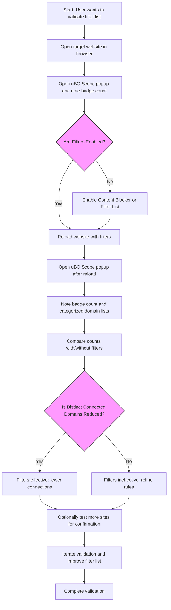

# Validating Block Lists and Content Blockers Using uBO Scope

## Overview
This guide is designed for filter list maintainers and advanced users who want to accurately measure whether their filter lists are effectively reducing outgoing third-party remote server connections. Unlike superficial block counts shown by content blockers, uBO Scope provides a real-time, independent view of actual network connections attempted or blocked by the browser. Through this workflow, users will learn how to validate the real-world effectiveness of their filtering strategies and avoid common misconceptions about blocking metrics.

### Prerequisites
- uBO Scope extension installed and active in your browser.
- Familiarity with basic browser extension usage and navigation of the uBO Scope popup interface.
- Your filter list or content blocker enabled and operational.

### Expected Outcome
- Ability to verify if your filters actually reduce the number of distinct third-party connections.
- Understanding the difference between block counts and distinct host connections.
- Practical insights into how redirects, stealth blocks, and outright blocks are reported.

### Time Estimate
10-20 minutes, depending on page complexity and network activity.

### Difficulty Level
Intermediate to Advanced — assumes knowledge of content blocking concepts.

---

## Step-by-Step Validation Workflow

### 1. Prepare Your Environment
- Ensure uBO Scope is installed and the toolbar icon is visible.
- Open the browser tab where you want to validate filtering behavior.
- Enable your filter list or content blocker that you want to test.

### 2. Monitor Network Connections on Your Target Webpage
- Navigate to the desired website or test page.
- Click the uBO Scope toolbar icon to open the popup.
- Observe the badge count on the toolbar icon; this number represents the *distinct* third-party domains *with allowed connections* on this tab.

<Tip>
A lower badge count means fewer third-party domains are successfully connected to, indicating potentially stronger blocking effectiveness. However, count alone is not sufficient without context.
</Tip>

### 3. Interpret The Categorized Lists in the Popup
The popup presents three categorized lists:

- **Not Blocked**: Domains from which network connections were successfully made.
- **Stealth-Blocked**: Domains where requests appeared but were redirected or suppressed stealthily.
- **Blocked**: Domains where requests were explicitly blocked (e.g., errors).

Use these categories to understand the *actual observed network outcomes* regardless of block count badges shown by your content blocker.

### 4. Compare Baselines
- Load your target page with no filter enabled and record the badge count and popup data.
- Enable the filter list or content blocker and reload the page.
- Compare the number of distinct domains and the categorized lists between both states.

Significant reduction in the **Not Blocked** count after enabling filters indicates effective connection blocking.

### 5. Analyze Redirects and Stealth Blocking
- Review entries under **Stealth-Blocked** to find domains that are suppressed via redirect or other stealth methods by your blocker.
- Understanding these reveals how your filters interact with network behavior beyond outright blocking.

### 6. Validate Against Real-World Scenarios
- Avoid relying on synthetic 'ad blocker test' pages as they generate artificial or fabricated network requests.
- Use real-world sites or curated pages representing typical traffic scenarios.

### 7. Document Findings and Tune Filters
- Based on what uBO Scope reveals, refine your filter rules for more effective management.
- Watch if modifications reduce allowed domain connections further without breaking sites.

---

## Example: Validating a Filter List for an E-commerce Website

1. Open the e-commerce site with uBO Scope installed but no filter enabled.
2. Observe the badge count, e.g., 18 distinct domains connected.
3. Enable your filter list targeting trackers and ads.
4. Reload the site and open uBO Scope popup again.
5. Observe the badge count drops to 5, with several domains moved to Blocked and Stealth-Blocked.
6. Confirm that critical resources are unaffected by further testing.

This workflow confirms filters are reducing network exposure effectively.

---

## Troubleshooting & Best Practices

<AccordionGroup title="Troubleshooting and Tips">
<Accordion title="Low or Empty Badge Count After Installation">
Ensure uBO Scope has the appropriate permissions and is compatible with your browser version (see [System & Browser Requirements](../../getting-started/installation-and-setup/system-requirements)). Reload the page and let network activity accumulate before checking the badge.
</Accordion>
<Accordion title="Discrepancies Between Block Counts and Connection Counts">
Understand that block counts shown by content blockers do NOT necessarily correlate to less network connection. uBO Scope’s badge counts unique third-party domains with actual connections, an independent metric crucial for filter list validation.
</Accordion>
<Accordion title="Stealth Blocking Not Showing Expected Domains">
Some blockers redirect or modify requests stealthily, which uBO Scope reports separately. This can cause misunderstandings if users expect these to appear as blocked outright. Review the Stealth-Blocked category carefully.
</Accordion>
</AccordionGroup>

### Best Practices
- Use uBO Scope to validate filters on a diversity of real sites, not just test pages.
- Keep the Public Suffix List updated to ensure domain aggregation is accurate.
- Regularly verify that allowed connections correspond to acceptable third-party services (e.g., reputable CDNs).

---

## Next Steps & Further Learning

- Explore the [Monitoring Network Connections on Any Site](../core-workflows/monitoring-network-connections) guide to deepen your understanding of popup analysis.
- Review [Analyzing Third-Party Domains and Connections](../core-workflows/analyzing-third-party-domains) for privacy-focused insights.
- Consult [Interpreting the Badge and Popup](../getting-started/understanding-the-badge-and-popup) to master UI interpretation.

---

## Additional Resources
- [uBO Scope GitHub Repository](https://github.com/gorhill/uBO-Scope)
- [Public Suffix List](https://publicsuffix.org/list/)

---

## uBO Scope Workflow Mermaid Diagram

---

## Summary
Validating filter lists with uBO Scope provides an authoritative, network-level measurement of blocking effectiveness independent of any filter count metrics. By observing the extension’s distinct third-party domain counts and the categorized view of allowed, stealth-blocked, and blocked connections, filter list maintainers gain precise, actionable insights to tune their filters for real-world browsing environments.

---

## Document History
- v1.0 Initial release

---

*This guide assumes users have already installed and configured uBO Scope as per the [Installation and Setup](../../guides/getting-started/installation-and-setup) documentation.*

---

## Frequently Asked Questions

**Q: Why is the badge count different from the content blocker's badge?**

A: uBO Scope counts distinct third-party remote servers with established connections, while some blockers count number of blocking operations or filters triggered, which might not translate to fewer connections.

**Q: Can I use uBO Scope to validate DNS or system level blocking?**

A: As long as the browser's `webRequest` API reports the requests, uBO Scope tracks them regardless of the blocker type. However, requests made truly outside the API scope cannot be tracked.

**Q: How often should I update the Public Suffix List inside uBO Scope?**

A: The Public Suffix List is updated and cached automatically per session, ensuring correct grouping of domains. This is crucial for accurate domain-level reporting.

---