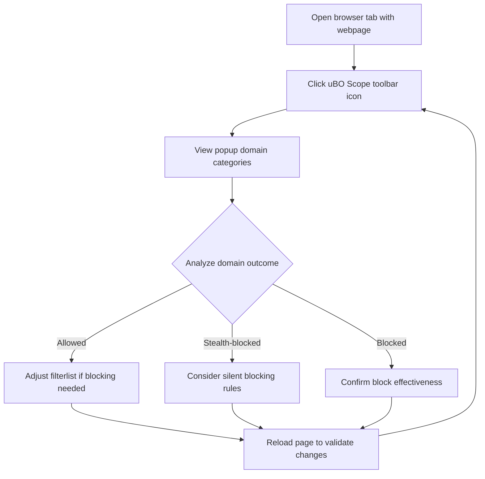

# Verifying Filterlist Efficacy Without Developer Tools

This guide demonstrates how to use uBO Scope to verify the performance of filter lists by inspecting domain connection outcomes directly from the extension's popup interface. This is especially valuable for filter list maintainers and testers working in environments where browser developer tools are limited, unavailable, or inconvenient to use.

---

## 1. Overview

### Purpose
This guide shows you how to leverage the uBO Scope popup to validate whether filter lists are effectively blocking or allowing third-party domains when you cannot use browser developer tools to inspect network requests.

### Who Should Use This Guide
- Filter list maintainers wanting quick, reliable feedback on filter rules without developer tools
- Testers validating content blockers on limited or constrained devices
- Anyone needing an accessible way to verify which third-party domains are loaded or blocked on webpages

### Expected Outcome
By the end of this guide, you will confidently use the uBO Scope popup interface to identify:
- Domains not blocked (allowed)
- Domains stealth-blocked
- Domains fully blocked

This lets you verify that your filter list performs as intended by observing actual domain connections.

### Prerequisites
- uBO Scope installed and enabled in a supported browser (Chromium 122+, Firefox 128+, Safari 18.5+)
- Basic understanding of browser extensions
- Having a target webpage loaded in the active browser tab for monitoring

---

## 2. Using the Popup to Verify Filterlist Performance

The core of verifying filter efficacy without developer tools is the uBO Scope popup (accessed via the toolbar icon). This popup summarizes third-party domains with their connection outcomes categorized into three sections.

### Step-by-Step Instructions

<Steps>
<Step title="Open the uBO Scope Popup">
Click the uBO Scope icon in your browser toolbar to open the popup. This displays real-time data for the active tab.
</Step>
<Step title="Observe the Domain Summary">
At the top, see the &quot;domains connected&quot; count showing the number of distinct third-party domains successfully contacted.
</Step>
<Step title="Review Domains Categorized by Outcome">
The popup divides domains into three sections:
- **Not blocked:** Domains from which network requests were allowed successfully.
- **Stealth-blocked:** Domains for which connections were redirected or otherwise stealthily blocked.
- **Blocked:** Domains where network requests failed or were explicitly blocked.
Each section lists domains along with counts of connections.
</Step>
<Step title="Interpret Domain Lists">
Use these domain groupings to evaluate your filter list:
- Domains in **Not blocked** indicate resources loaded despite filtering.
- Domains in **Stealth-blocked** may be silently blocked to avoid breaking sites.
- Domains in **Blocked** show outright failures or block events.
</Step>
<Step title="Identify Unexpected Outcomes">
Look for any third-party domains allowed that should be blocked according to your filter list, or blocked domains that should be allowed to avoid breaking functionality.
</Step>
<Step title="Refresh Page and Reopen Popup as Needed">
Reload the target webpage after filter list changes to capture updated connection outcomes, then reopen uBO Scope popup to validate impact.
</Step>
</Steps>

### Tips for Effective Use
- Closely monitor the **domain count** at the top to measure distinct connections.
- Pay attention to domain counts beside each domain name to understand connection frequency.
- Use Unicode domain display (via punycode decoding) to correctly read internationalized domains.
- Compare popup data before and after filter list updates to confirm efficacy.

---

## 3. Real-World Scenario

**Scenario:** You maintain a filter list targeting ad tracking domains but want to verify its effectiveness on a complex news site.

**Workflow:**
1. Load the news site in your browser with the filter list enabled.
2. Open uBO Scope popup and review the domains listed under "not blocked".
3. Identify any domains that should be blocked but appear under "not blocked" and adjust your filter list accordingly.
4. Reload the page, reopen the popup, and confirm these domains move to "blocked" or "stealth-blocked."

This iterative approach helps ensure your filter list precisely controls unwanted domains without breaking site functionality.

---

## 4. Common Pitfalls & Troubleshooting

<AccordionGroup title="Common Issues When Verifying Filterlist Effectiveness">
<Accordion title='Popup Shows "NO DATA" or No Domains'>
This indicates uBO Scope has no data for the current tab.

**Fixes:**
- Ensure uBO Scope is installed and enabled.
- Reload the target webpage to trigger new data collection.
- Verify browser permissions are correctly granted.
- Check if another content blocker or privacy extension interferes.
</Accordion>
<Accordion title="Badge Count Does Not Change After Filterlist Update">
uBO Scope relies on browser network events. If the badge count stays static:

**Fixes:**
- Reload the webpage to refresh network requests.
- Clear cache or disable conflicting extensions.
- Verify your filter list changes are effectively enabled.
</Accordion>
<Accordion title="Unexpected Allowance of Third-Party Domains">
Some domains may appear as allowed when you expect them blocked.

**Considerations:**
- Domains may be stealth-blocked instead of fully blocked.
- Some legitimate third-party domains are necessary.
- Rule syntax or ordering in your filter list may cause misses.
- Check filter list priority and specificity.
</Accordion>
<Accordion title="Unicode or Punycode Domain Display Confusion">
Domains containing international characters are displayed in Unicode for clarity.

**Tip:**
- Review domains carefully; punycode domains may appear differently.
- Confirm domain identity using domain registrar tools if uncertain.
</Accordion>
</AccordionGroup>

---

## 5. Next Steps

- Dive deeper into analyzing third-party server connections with the [Analyzing Third-Party Connections Guide](/guides/core-workflows/analyzing-third-party-connections).
- Learn to compare multiple content blockers effectively using the [Content Blocker Comparative Evaluation Guide](/guides/core-workflows/comparative-content-blocker-evaluation).
- Review installation and configuration steps in the Getting Started section if you have setup issues.

---

## 6. Additional Resources

- Official uBO Scope GitHub Repository: [https://github.com/gorhill/uBO-Scope](https://github.com/gorhill/uBO-Scope)
- About uBO Scope: [Product Overview](../../overview/intro-core-value/product-overview)
- Prerequisites & System Requirements: [Prerequisites & Requirements](../../getting-started/intro-installation/prerequisites-requirements)
- Troubleshooting Setup Issues: [Troubleshooting Setup](../../getting-started/first-run-validation/troubleshooting-setup)

---

## Appendix: Understanding the Popup Layout

The popup.html provides a straightforward interface with:
- **Hostname Display:** Shows the active tab's hostname and base domain.
- **Domains Connected Count:** Total distinct domains allowing network connections.
- **Three Outcome Sections:** 
  - **Not Blocked:** Domains with successful network requests.
  - **Stealth-Blocked:** Domains blocked transparently (via redirects or silent failure).
  - **Blocked:** Domains fully blocked with visible failure.

Use this classification to quickly assess your filter list's impact on live network activity without needing detailed developer tools.

---

# Summary
This guide empowers you to validate how well your filter lists block or allow third-party domains solely using the uBO Scope popup interface, avoiding the need for browser developer tools. Step through inspecting domain groups, understanding outcomes, interpreting counts, and troubleshooting common roadblocks.

---

# FAQ

### Can I use this method on mobile browsers or devices with limited tooling?
Yes, as long as the browser supports uBO Scope and you can open the extension popup, you can verify filterlist performance.

### What if a domain moves between 'Stealth-Blocked' and 'Allowed'?
Stealth blocking tries to silently block connections to avoid site breakage or detection. Analyze the domain's role carefully in your filter list.

### How frequently does uBO Scope update the data?
uBO Scope refreshes network data in near real-time for the active tab and updates upon reload or tab switch.

---

# Visual Aid

---