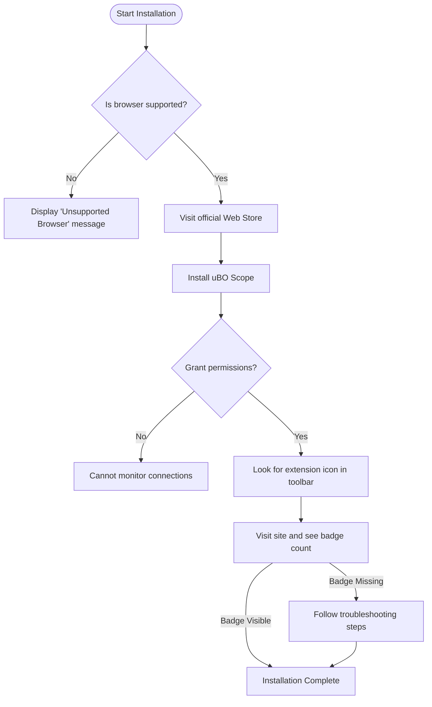

# Installing and Setting Up uBO Scope

## Overview
This guide walks you through the straightforward process of installing uBO Scope on Chromium-based browsers and Firefox, ensuring the extension is correctly configured and ready for immediate use. You'll learn how to verify your installation and understand the basic setup so you can start monitoring third-party remote server connections on any webpage without delay.

---

## Prerequisites
- **Supported Browsers**: Chromium-based browsers (like Chrome 122+) or Firefox (version 128+).
- **Permissions**: The extension requires permissions for `activeTab`, `storage`, and `webRequest`. These are requested upon installation.
- **Internet Connection**: Required for installing from official web stores and fetching the Public Suffix List data.

---

## Expected Outcome
By completing this setup, uBO Scope will be actively monitoring network connections on all open tabs, tracking distinct third-party servers your browser communicates with, and displaying real-time counts on the toolbar icon badge.

---

## Step-by-Step Instructions

### 1. Install uBO Scope Extension

#### a. Chromium Browsers
1. Open the Chrome Web Store link: [uBO Scope on Chrome Web Store](https://chromewebstore.google.com/detail/ubo-scope/bbdpgcaljkaaigfcomhidmneffjjjfgp).
2. Click **Add to Chrome**.
3. Review the permissions prompt and accept to install.

#### b. Firefox
1. Visit Firefox Add-ons: [uBO Scope on Firefox Add-ons](https://addons.mozilla.org/firefox/addon/ubo-scope/).
2. Click **Add to Firefox**.
3. Confirm permissions and installation.

---

### 2. Verify Installation

1. Look for the uBO Scope icon in your browser toolbar. It should appear immediately after installation.
2. Visit any website.
3. Observe the badge count on the toolbar icon. This number represents the number of distinct third-party remote servers successfully connected by that page.

<Tip>
If the badge does not appear or shows `0` for all sites, ensure you have granted the necessary permissions and that your browser version meets the requirements.
</Tip>

---

### 3. Open and Explore the Popup Interface

1. Click the uBO Scope browser icon.
2. The popup will display:
   - The domain of the active tab.
   - A summary count of connected third-party domains.
   - Lists of domains categorized as **not blocked**, **stealth-blocked**, and **blocked**.

3. Confirm you can see data populating as you browse different websites.

---

### 4. Background Data Loading

- On installation and first run, uBO Scope automatically loads the latest Public Suffix List (PSL) which helps in identifying domain boundaries.
- This enables accurate classification of third-party domains.

<Info>
This data is stored in your browser's session storage and updated as needed without user intervention.
</Info>

---

### 5. Verifying Proper Monitoring

- Open multiple tabs and visit websites with known third-party content (e.g., news sites, social media).
- Click on the extension icon to verify that the domain lists update accordingly.
- The badge count should dynamically reflect the number of distinct third-party domains your browser connected to.

---

## Practical Tips
- **Use in private/incognito browsing:** uBO Scope can run in private modes, but you must explicitly enable it via your browser’s extension settings.
- **Browser update:** Keep your browser up to date to ensure compatibility and security.
- **Troubleshoot missing badge:** Reload the tab, or restart your browser if you don’t see expected activity.

---

## Common Pitfalls
- Not granting `webRequest` permission: Without it, uBO Scope cannot observe network traffic.
- Browsers or versions below the minimum specified: The extension relies on modern APIs only available in recent versions.
- Private browsing mode without extension enabled: The extension must be explicitly enabled in private windows.

---

## Troubleshooting

<AccordionGroup title="Installation Troubleshooting">
<Accordion title="uBO Scope icon does not appear">
- Ensure the extension is enabled in your browser's extensions manager.
- Confirm there are no errors in your browser’s console related to uBO Scope.
- Restart the browser if necessary.
</Accordion>
<Accordion title="Badge count is always zero or missing">
- Check if the browser version meets minimum requirements.
- Verify that the extension has permission to access `webRequest` API.
- Confirm that you have navigated to sites that load third-party content.
- Try reloading the tab or opening a new tab after installation.
</Accordion>
<Accordion title="Popup shows ‘NO DATA’ or empty lists">
- This may indicate delays in loading session data.
- Wait a few moments and refresh the popup by closing and reopening it.
- If problem persists, restart the browser.
</Accordion>
</AccordionGroup>

---

## Next Steps and Further Learning

- Explore [Understanding the Popup: Reading Connection Insights](https://docs.uBO-Scope/guides/core-workflows/understanding-the-popup) to dive deeper into interpreting the data shown.
- Learn about [Making Sense of the Toolbar Badge Count](https://docs.uBO-Scope/guides/core-workflows/toolbar-badge-guide) to maximize your privacy awareness.
- For troubleshooting post-installation issues, visit the [Troubleshooting Installation & First Use](https://docs.uBO-Scope/getting-started/core-usage-and-setup/troubleshooting-installation) guide.

---

## References
- Official GitHub: [https://github.com/gorhill/uBO-Scope](https://github.com/gorhill/uBO-Scope)
- Browser Web Request API documentation

---

## Summary Diagram of Installation Workflow

---