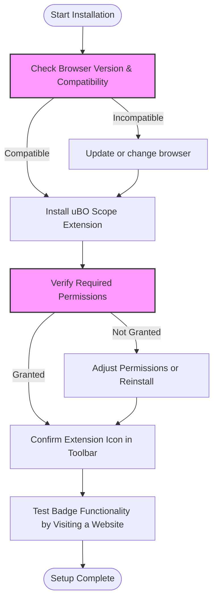

# Installation and First-Time Setup

Get started with uBO Scope by installing the extension on your preferred browser—Chromium, Firefox, or Safari. This guide walks you through each step: from installation to configuring permissions, confirming a successful setup, and understanding your browser toolbar badge.

---

## 1. Installation Overview

### What You Will Accomplish
- Install uBO Scope extension on Chromium, Firefox, or Safari.
- Configure necessary browser permissions.
- Verify the extension is active and ready to monitor network connections.
- Interpret the toolbar badge that indicates network activity.

### Prerequisites
- Compatible browser versions:
  - Chromium 122 or later
  - Firefox 128 or later
  - Safari 18.5 or later
- Internet connection to download the extension.
- Familiarity with browser extension installation procedures.

### Expected Outcome
- uBO Scope installed and visible in your browser toolbar.
- Toolbar badge showing zero or more distinct third-party connections.
- Extension ready to track and report all network connection attempts.

### Time Estimate
About 5-10 minutes, depending on your browser and system.

### Difficulty Level
Beginner-friendly; no advanced configuration required.

---

## 2. Step-by-Step Installation and Setup Instructions

### Step 1: Confirm Browser Compatibility and System Readiness
1. Open your browser.
2. Check your browser version:
   - Chromium: Go to `chrome://settings/help`.
   - Firefox: Go to `about:support`.
   - Safari: Use "About Safari" from the Safari menu.
3. Ensure browser meets the minimum version stated above.
4. Update your browser if necessary.

<Tip>
Always install uBO Scope on the latest supported browser version to ensure full functionality and security.
</Tip>

---

### Step 2: Install uBO Scope Extension

Choose your browser below:

#### For Chromium Browsers (Google Chrome, Microsoft Edge, etc.)
1. Open the Chrome Web Store link for uBO Scope: [Chrome Web Store - uBO Scope](https://chromewebstore.google.com/detail/ubo-scope/bbdpgcaljkaaigfcomhidmneffjjjfgp)
2. Click **Add to Chrome**.
3. Confirm the installation when prompted.
4. After installation, the uBO Scope icon appears in the toolbar.

#### For Mozilla Firefox
1. Visit the Firefox Add-ons page: [Firefox Add-ons - uBO Scope](https://addons.mozilla.org/firefox/addon/ubo-scope/)
2. Click **Add to Firefox**.
3. Accept permissions and confirm installation.
4. The extension icon will show up near the address bar.

#### For Safari
1. Because Safari extensions may require manual installation:
   - Download the packaged `.zip` archive or install from the App Store (if available).
   - For manual installation, open Safari, go to **Preferences > Extensions**.
   - Click **Install** if prompted and locate uBO Scope from your local files.
2. Enable the extension in Safari's extension manager.

<Note>
Safari requires at least version 18.5. Manual installation steps might vary slightly depending on system configuration.
</Note>

---

### Step 3: Configure Browser Permissions

uBO Scope requires these permissions:
- Access to active tabs.
- Storage access for saving session data.
- Use of `webRequest` API to monitor network activity.

These permissions are requested automatically during installation.

**Verify permissions:**
- Chromium: `chrome://extensions/` > uBO Scope > Details > Permissions.
- Firefox: `about:addons` > Extensions > uBO Scope > Preferences or Permissions.
- Safari: Safari Preferences > Extensions > uBO Scope > check all boxes are enabled.

<Warning>
If any permission is disabled or missing, uBO Scope will not function correctly. Ensure all listed permissions are granted.
</Warning>

---

### Step 4: Confirm Installation and Extension Status

1. Look for the uBO Scope icon in the browser toolbar. It resembles the extension logo.
2. Click the icon to open the popup interface.
3. Observe that the badge either shows a number representing distinct third-party remote servers or is blank (0) if no network requests yet.
4. Refresh a website to observe dynamic badge updates and popup information.

<Check>
If the icon is missing:
- Confirm the extension is enabled in your browser's extension manager.
- Restart your browser.
- Refer to the troubleshooting guide "Solving Installation Problems" if problems persist.
</Check>

---

### Step 5: Understand the Toolbar Badge

- The badge displays the **number of distinct third-party domains** contacted by the current tab.
- A **lower number is better**, indicating fewer third-party connections which typically benefits privacy.
- The count updates dynamically as you browse.

<Info>
Not all third parties are harmful; common legitimate connections include CDNs and embedded services.
</Info>

---

## 3. Best Practices and Tips

- Install uBO Scope alongside content blockers to gain an independent view of active network connections.
- Regularly refresh pages after installation to trigger network activity and validate badge updates.
- Avoid relying on block counts alone for privacy assessment; uBO Scope focuses on distinct domain connections.

---

## 4. Troubleshooting Common Installation Issues

<AccordionGroup title="Common Installation Issues and Solutions">
<Accordion title="Extension Icon Missing After Installation">
- Ensure your browser version meets system requirements.
- Confirm the extension is enabled in your browser settings.
- Restart your browser to refresh the extension.
- Check for conflicts with other extensions.
</Accordion>
<Accordion title="Permissions Not Granted">
- Review permissions in the browser’s extension details.
- Manually enable required permissions if possible.
- Reinstall the extension if permissions seem corrupted.
</Accordion>
<Accordion title="Safari Manual Installation Problems">
- Verify you have unzipped the package correctly.
- Enable the extension in Safari’s preferences.
- Check Safari’s security settings may block unsigned extensions.
</Accordion>
</AccordionGroup>

---

## 5. Next Steps

- After installation, proceed to the [Activating and Accessing uBO Scope](../getting-started/getting-up-and-running/initial-launch-activation) guide to learn how to interact with the extension.
- Explore [Monitoring Connections and Understanding the Badge](../getting-started/getting-up-and-running/using-network-monitoring) for interpreting network connection data.
- Use the [Quick Validation](../getting-started/getting-up-and-running/quick-validation) guide to confirm accurate reporting.

---

## 6. Additional Resources

- [Prerequisites & Supported Browsers](../getting-started/installation-basics/system-requirements)
- [Solving Installation Problems](../getting-started/troubleshooting-common-issues/common-installation-issues)
- Official GitHub Repository: [https://github.com/gorhill/uBO-Scope](https://github.com/gorhill/uBO-Scope)

---

### Summary Diagram: Installation Flow

---

By completing these steps, uBO Scope will be fully installed and configured to begin revealing real-time network connection insights for your browsing sessions.