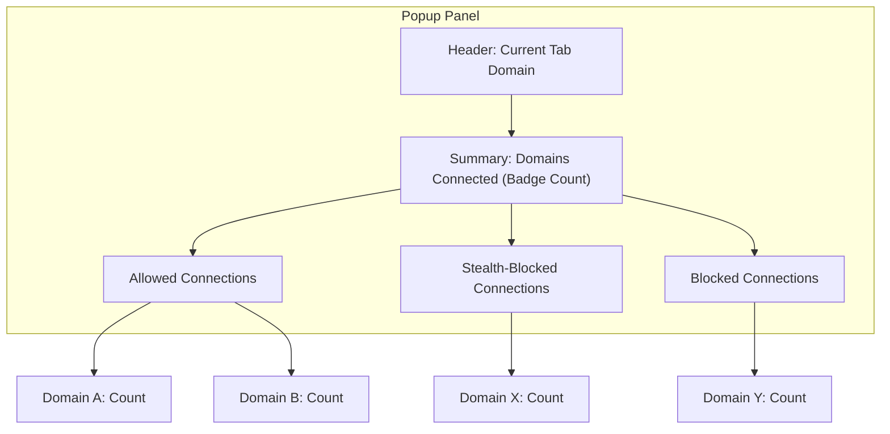

# Interpreting the Toolbar Badge and Popup Panel

Understand what the toolbar badge count signifies, how it updates, and how to read the detailed information in the popup panel. This guide explains the significance of 'allowed,' 'stealth,' and 'blocked' connections, making sense of the data for informed privacy and security decisions.

---

## 1. Overview

When you install and use uBO Scope, you rely heavily on two key UI elements to understand your browser's third-party network connections:

- The **toolbar badge count** on the extension icon
- The **popup panel** that shows detailed connection data

This guide helps you interpret these elements accurately, enabling you to assess network activity in real time, quickly spot privacy-relevant issues, and verify content blocking performance without guesswork.

### What You'll Learn

- The exact meaning behind the toolbar badge count.
- How and when the badge updates.
- How to read the popup panel’s domain connection details.
- The difference between **allowed**, **stealth**, and **blocked** categories.

### Prerequisites

- uBO Scope installed on a supported browser (Chromium 122+, Firefox 128+, Safari 18.5+).
- Basic understanding of what third-party domains are.
- Having visited at least one website to generate data.

### Expected Outcome

After following this guide, you will confidently interpret the toolbar badge and popup panel data to make informed privacy and security decisions. You can identify how many third-party connections your browser makes, which ones are blocked or allowed, and whether stealth blocking is active.

### Time Estimate

5–10 minutes to understand the concepts and practice with your popup panel.

### Difficulty Level

Beginner to Intermediate — no technical background needed.

---

## 2. Understanding the Toolbar Badge

### What the Badge Number Means

- The number shown on the toolbar badge is the **count of distinct third-party domains with successful network connections** initiated by the current active browser tab.
- A **lower badge count is better**, as it means fewer third-party servers received resources or data from the page.

### What is a Third-Party Domain?

- Third-party domains are domains that **differ from the main site you are visiting**.
- For example, when visiting `example.com`, a connection to `cdn.example.com` is considered third-party because it is a separate registered domain.

### When Does the Badge Update?

- The badge updates in near real-time as network requests from the active tab resolve.
- It counts **unique allowed third-party domains** at the tab level.
- It does **not** count blocked or stealth-blocked domains.

### Practical Interpretation

- A badge count of zero means **no third-party domains established successful connections** for that tab.
- A rising badge number means your browser is connecting with more third-party domains.
- This is useful for assessing exposure easily at a glance.

<Check>
If the badge does not update or stays blank, consider refreshing the tab or troubleshoot your installation as detailed in related docs.
</Check>

---

## 3. Exploring the Popup Panel

The popup panel provides a detailed breakdown of all third-party domains your browser interacted with in the active tab, categorized by connection outcomes.

### How to Access

- Click the uBO Scope toolbar icon to open the popup panel.
- The panel displays a domain summary header and three categorized sections.

### Popup Layout and Sections

1. **Header - Current Tab Domain**
   - Shows the full domain and subdomain of the website in the current tab.

2. **Summary - Domains Connected**
   - Displays the total count of distinct connected third-party domains as counted by the badge.

3. **Outcome Categories:**

| Category       | What It Means                                         | What Domains Appear                      |
| -------------- | ---------------------------------------------------- | ---------------------------------------|
| **Not Blocked (Allowed)**   | Domains where connections succeeded and resources loaded without blocking. | All third-party domains reached successfully. |
| **Stealth-Blocked** | Domains where connections were blocked stealthily, i.e., the blocking was done without revealing itself via errors or failed status. | Third-party domains silently blocked by content blockers using stealth techniques. |
| **Blocked**           | Domains where connections were blocked explicitly, typically resulting in errors or failures visible in the network logs. | Third-party domains where connections were visibly blocked. |

### Reading Each Section

- Each section lists domains with:
  - The **domain name** (punycode converted to readable Unicode).
  - The **number of connection attempts** made to that domain.

- The domain counts help you understand how active or persistent connections are.

<Info>
Stealth blocking means the blocking happens quietly, with no visible error reported by the browser’s network stack.
</Info>

### Example

Imagine visiting a popular news website:

- Banner ads might appear from domains in the **Not Blocked (Allowed)** list.
- Some trackers might be in the **Stealth-Blocked** section, silently prevented from connecting.
- Other more aggressive ads or third-party trackers could be in the **Blocked** list with visible blocking events.

### Tips for Effective Use

- Use the popup to identify unexpected third-party domains loading content.
- Check if your content blocker is stealth-blocking trackers effectively.
- Refresh pages and monitor how the badge and popup update dynamically during browsing.

---

## 4. Step-by-Step: Interpreting Badge and Popup

<Steps>
<Step title="Monitor the Toolbar Badge After Loading a Webpage">
- Load a website in your browser.
- Observe the uBO Scope toolbar badge number.
- Expect this number to represent the count of distinct third-party domains connected.
- If the badge is blank, no third-party connections succeeded yet.
</Step>

<Step title="Open the Popup Panel for Detailed Info">
- Click the uBO Scope icon.
- Look at the top for the active tab's domain name.
- View the total "domains connected" count matching the badge.
</Step>

<Step title="Review the Allowed Section">
- See which third-party domains successfully connected.
- Check the count column to spot frequent connections.
- These domains are potential privacy exposures.
</Step>

<Step title="Review the Stealth-Blocked Section">
- Identify any domains blocked without visible errors.
- This shows stealth-blocking effectiveness.
- Investigate any unexpected stealth connections appearing.
</Step>

<Step title="Review the Blocked Section">
- View domains blocked with explicit errors.
- Confirm your content blocker is actively blocking undesirable domains.
</Step>

<Step title="Make Informed Decisions">
- If you see high allowed counts, consider tightening your content blocker.
- If stealth-blocked list is empty but you expect it, check your blocker settings.
- Use this data as trustworthy evidence of what domains are contacted.
</Step>
</Steps>

---

## 5. Common Pitfalls & Troubleshooting

### Issue: Badge Shows No Number After Browsing

- Ensure the page has third-party content loaded.
- Refresh the tab and wait a few seconds.
- Confirm uBO Scope has permissions to monitor network requests.
- Visit a resource-rich website to generate data.

### Issue: Popup Shows No Data or 'NO DATA'

- Happens if the tab has no network activity or the extension failed to collect data.
- Try closing and reopening the popup.
- Reload the tab.

### Misinterpreting the Badge Count

- Remember: The badge is a **count of unique allowed third-party domains only**, not the total number of network requests.
- Do not assume a higher badge means more blocking; actually, more allowed third parties indicate more exposure.

### Performance Considerations

- The extension updates badge and popup asynchronously.
- There might be a slight delay after navigation before the badge updates.

---

## 6. Best Practices

- Periodically check the badge and popup when visiting sensitive or new websites.
- Use the domain counts in the popup to audit your filter lists and blocking strategy.
- Combine uBO Scope insights with your primary content blocker to enhance privacy.
- For developers or filter list maintainers, rely on this data for accurate, real-world network exposure stats.

---

## 7. Next Steps and Related Resources

- For installation help, see [Installing uBO Scope](https://github.com/gorhill/uBO-Scope#getting-started/introduction-installation/installation).
- To understand the fundamental terms, review [Core Concepts & Terminology](https://github.com/gorhill/uBO-Scope/overview/getting-started/core-concepts).
- For practical onboarding, check [Getting Started with uBO Scope](https://github.com/gorhill/uBO-Scope/guides/core-workflows/getting-started).
- To troubleshoot, visit [Troubleshooting Installation & First Use](https://github.com/gorhill/uBO-Scope/getting-started/troubleshooting/troubleshooting-installation).

---

By mastering the interpretation of the uBO Scope toolbar badge and popup panel, you hold the key to transparent and actionable insights into your browser’s third-party network connections.

---

## Appendix: Visual Reference of Popup Panel Sections

This logical layout will help you quickly identify what you are seeing when opening the popup panel.

---

### Quick Key

| Term            | Meaning                                   |
|-----------------|-------------------------------------------|
| Allowed         | Third-party domains successfully connected|
| Stealth-Blocked | Connections blocked silently (hidden)     |
| Blocked         | Connections explicitly blocked (errors)   |

---

_Last updated: 2024_

---

[Back to Guides](../../guides)

