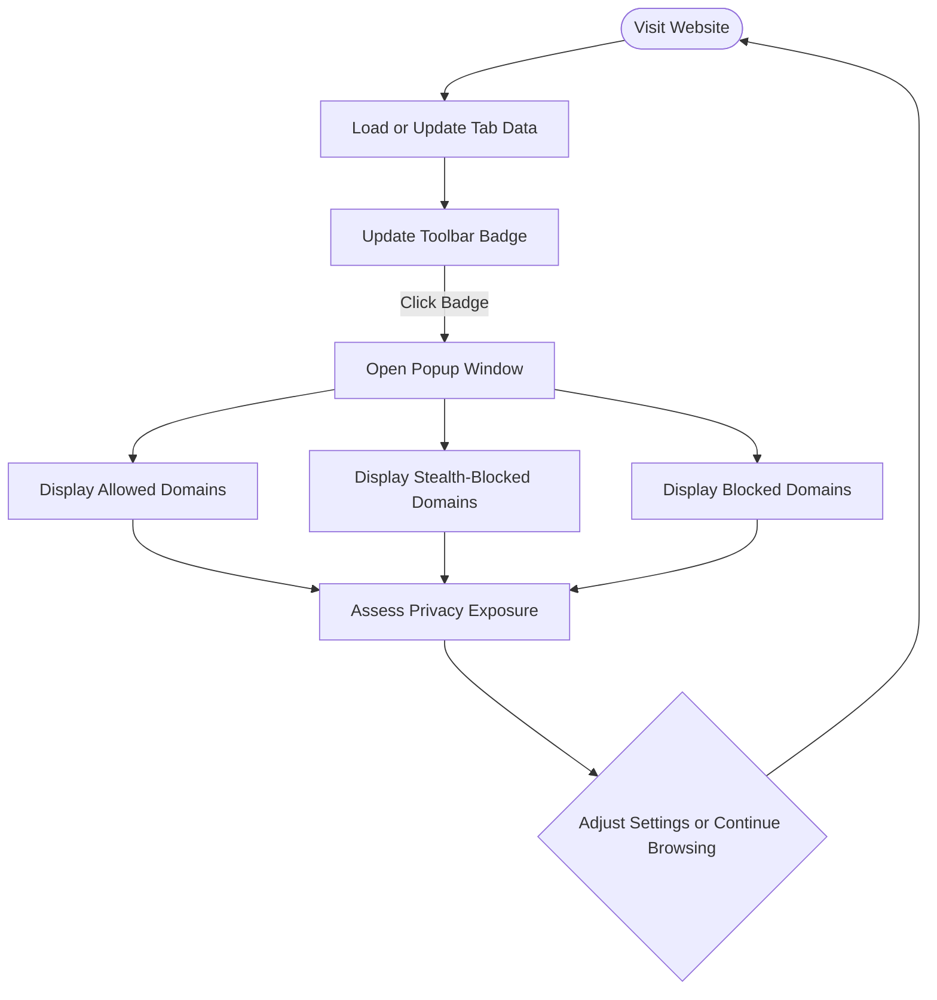

# Interpreting the Badge Count and Popup Breakdown

## Overview
This guide will help you understand how to use **uBO Scope's** toolbar badge and popup window to assess the number and types of third-party domains a website interacts with. You'll learn what each part of the UI represents, how to interpret counts effectively, and which metrics truly matter when evaluating your privacy risks on the web.

## Prerequisites
- You have successfully **installed** the uBO Scope extension and confirmed it is active.
- You are visiting any website in a tab where uBO Scope can monitor network activity.
- Basic understanding that uBO Scope tracks **third-party remote server connections**.

## Expected Outcome
By following this guide, you will:
- Confidently interpret the number shown on the uBO Scope toolbar badge.
- Understand the distinctions between allowed, stealth-blocked, and blocked domains in the popup.
- Use these insights to assess the privacy implications of site connections.

## Time Estimate
Approximately 5 to 10 minutes.

## Difficulty Level
Beginner to Intermediate.

---

## Understanding the Toolbar Badge

### What the Badge Number Represents
The badge count on the toolbar icon shows the **number of distinct third-party domains** that the current tab connected to successfully and were *not* blocked.

- **Only allowed connections count towards this number.**
- This number **does not include blocked or stealth-blocked domains.**

### Why the Badge Count Matters
A **lower badge count is more desirable**, indicating fewer distinct third-party domains your browser communicated with through the webpage.

This helps you gauge:
- The exposure of your browsing session to third parties.
- Potential privacy risks by the diversity of external domains contacted.

<Tip>
Keep in mind: The badge count reflects domains that actually had network communication. Some domains may appear in the popup but do *not* contribute to the badge if their requests were blocked.
</Tip>

---

## Exploring the Popup Breakdown

Clicking the uBO Scope toolbar icon opens a popup window that **breaks down all third-party domains contacted** by the current page into three distinct categories:

### 1. Not Blocked (Allowed)
- These domains successfully loaded resources or initiated network connections.
- Displayed under the "not blocked" section.
- Each domain is accompanied by the number of requests made to it.

### 2. Stealth-Blocked
- These are third-party domains where requests were *stealth-blocked* (requests altered or redirected invisibly by your content blocker to avoid script detection).
- Shown under the "stealth-blocked" section.
- Helps you understand what was blocked without alerting the webpage.

### 3. Blocked
- Domains where network requests simply failed or were fully blocked outright.
- Listed under the "blocked" section.

### Popup UI Details
- The **top header** shows the primary domain and subdomain of the active tab.
- The **summary line** shows the total count of distinct third-party domains contacted (from the allowed category).
- Each section lists domains with a count of requests.

---

## Step-by-Step: How to Interpret the Badge and Popup

<Steps>
<Step title="View the Toolbar Badge">
Open your browser and visit a website. Observe the badge number on the uBO Scope extension icon in the toolbar. This number represents how many unique third-party domains have communicated successfully with the site.
</Step>
<Step title="Open the Popup Panel">
Click the uBO Scope icon in your browser toolbar to open the popup window. You'll see the full breakdown of third-party domains categorized by connection outcome.
</Step>
<Step title="Identify the Main Site Domain">
At the top, note the displayed website's subdomain and domain. This anchors the third-party domains list for the current tab.
</Step>
<Step title="Analyze Allowed Domains">
Look under the "not blocked" section. These are domains that loaded resources from the site.

- Review the count of domains and request numbers to understand resource sources.
- This set contributes directly to the badge number.
</Step>
<Step title="Check Stealth-Blocked and Blocked Domains">
Observe the "stealth-blocked" and "blocked" sections.

- These include domains your blocker or privacy tools prevented from connecting successfully.
- While they do not affect the badge number, they indicate potential tracking or unwanted connections the blocker is handling.
</Step>
<Step title="Use Counts to Assess Privacy Risk">
A high number of allowed third-party domains suggests more exposure and possibly more tracking.

A sizable count in stealth or blocked categories indicates your content blocker is actively reducing exposure but also that the visited website attempts many third-party connections.

Use this insight to adjust your blocker settings or reconsider the trustworthiness of the site.
</Step>
</Steps>

---

## Real-World Example

Suppose you visit NewsSite.com and see a badge count of "5." Opening the popup, you see:

- **Not Blocked:** cdn.newssite.com (50 requests), analytics.example.com (3), ads.tracker.net (2), images.cdn.com (4), fonts.webfonts.com (1)
- **Stealth-Blocked:** ads.tracker.net, socialmedia.analytics
- **Blocked:** trackers.badadnetwork

### Interpretation:
- 5 distinct third-party domains successfully loaded resources.
- One of these (ads.tracker.net) also appears in stealth-blocked, which might indicate partial redirection or interaction prevented from detection.
- Blocking is happening on other known harmful domains, such as trackers.badadnetwork.

This means your extension is allowing some third-party connections but actively blocking or stealth-blocking potentially invasive domains.

---

## Best Practices and Tips

<Tip>
Use the badge count as a **quick privacy health indicator** of the current tab. Regularly check the popup to understand which domains are communicating.
</Tip>

<Tip>
Remember that **not all third-party requests are malicious**. Some legitimate services like CDN providers or font services increase the badge count but do not necessarily imply privacy risk.
</Tip>

<Tip>
High stealth-block and blocked domain counts indicate your content blockers are active. However, fewer allowed domains usually mean better privacy, so prioritize reducing allowed third-party domains.
</Tip>

<Warning>
Do not rely solely on the badge number to judge content blocker effectiveness. A blocker allowing many domains with few blocks can be worse than one that blocks more while allowing fewer third parties.
</Warning>

---

## Troubleshooting Common Issues

<AccordionGroup title="Troubleshooting Badge and Popup Issues">
<Accordion title="Badge Shows No Number or Zero">
- This may indicate the current tab has no successful third-party connections or the extension isn't monitoring properly.
- Ensure uBO Scope is installed correctly and the tab is active.
- Reload the tab or the extension if needed.
</Accordion>
<Accordion title="Popup Is Empty or Shows 'NO DATA'">
- Could happen if the extension can't retrieve data for the current tab.
- Make sure the tab is fully loaded and that uBO Scope has granted permissions.
- Try switching tabs and reopening the popup.
- Check for browser compatibility or conflicts with other extensions.
</Accordion>
<Accordion title="Counts Seem Inconsistent with What You Expect">
- Remember counts reflect distinct domains, not total network requests.
- Some domains might be grouping several hostnames.
- Stealth-block and block counts do not affect the badge.
- See the related docs on 'Debunking Toolbar Badge Myths' for deeper insight.
</Accordion>
</AccordionGroup>

---

## Next Steps & Related Content

- After mastering badge and popup interpretation, explore the "[Revealing All Remote Connections on a Webpage](./reveal-remote-connections)" guide for deeper analysis using the popup.
- Learn to optimize your browsing privacy with "[Debunking Toolbar Badge Myths](../real-world-usage-strategies/debunking-badge-myths)".
- For troubleshooting any issues, see "[Troubleshooting Common Issues](../../getting_started/validation_and_support/troubleshooting_common_issues)".

---

## Quick Reference

| UI Component         | What It Displays                                         | Impact on Badge Count      |
|----------------------|---------------------------------------------------------|---------------------------|
| Toolbar Badge        | Number of distinct allowed third-party domains           | Counts toward the badge    |
| Popup - Not Blocked  | Third-party domains with successful connections          | Included in badge count    |
| Popup - Stealth-Blocked | Domains with stealth-blocked requests                    | Not included in badge count |
| Popup - Blocked      | Domains whose requests were fully blocked                   | Not included in badge count |

---

## Visual Diagram of User Flow

---

For a deeper understanding, refer to the detailed product introduction, architecture, and usage scenarios provided in other documentation sections.

---

### Technical Notes (Optional for Users Interested)
- The badge number is derived from the count of distinct allowed domains in the current tab session.
- The popup reads detailed session data that is stored and updated in real-time by the background script.
- Domains are normalized using the Public Suffix List to accurately group subdomains under correct registrable domains.

---