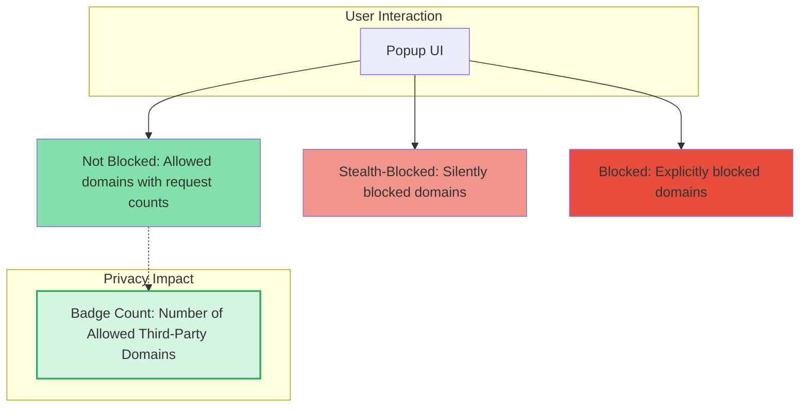

# Interpreting the Badge Count and Popup Results

## 1. Understanding the Badge Count: Your Privacy Indicator

The badge count displayed on the uBO Scope toolbar icon reflects the **number of distinct third-party remote domains** your current webpage connects to successfully. This count is a direct indicator of your **privacy exposure**—the fewer the count, the less your browser is communicating with external third parties.

### Why Focus on Third-Party Domains?
Third-party domains are servers external to the website you visit. They often provide resources like ads, trackers, or analytics scripts that can compromise your privacy. uBO Scope counts these distinct domains regardless of content blockers you have installed, providing a reliable baseline measure.

### Key Points About the Badge Count
- It only counts **allowed** (successful) connections.
- Blocked or stealth-blocked domains do **not** add to the badge count.
- The badge count **does not** count multiple requests to the same domain, only unique domains.

<Tip>
Think of the badge as your real-time privacy score for the current tab. The goal is to keep this number as low as possible.
</Tip>

---

## 2. Exploring the Popup Layout: Allowed, Stealth-Blocked, and Blocked

Opening the uBO Scope popup reveals detailed domain connection data organized into three sections:

| Section            | What It Shows                                  | Meaning                                                  |
|--------------------|-----------------------------------------------|----------------------------------------------------------|
| **Not Blocked**    | Domains with successful, allowed connections  | These servers supplied resources your browser fetched     |
| **Stealth-Blocked**| Domains with requests intercepted silently    | Requests blocked so stealthily the site and user don't see|
| **Blocked**        | Domains with blocked requests (errors)        | Domains your content blocker or network blocked explicitly |

### How Each Section Helps You
- **Not Blocked:** This list shows third-party domains your browser actually connected to, directly impacting your privacy.
- **Stealth-Blocked:** These domains are blocked but without revealing themselves; they reflect advanced blocking techniques.
- **Blocked:** These represent domains your blocker refused outright.

### Understanding Counts Next to Domains
Each domain entry includes a count indicating how many network requests interacted with it. Higher counts suggest more extensive resource loading or attempts from that domain.

<Note>
Domains might appear in more than one category in different browsing sessions, depending on blocking state or redirections.
</Note>

---

## 3. Common Misconceptions About Block and Badge Counts

Users often misinterpret blocking statistics. These clarifications help you correctly judge your browsing privacy:

### Myth: Higher Block Count Means Better Blocking

<uBO Scope shows this is incorrect.</u> A high block count only means many individual network requests were blocked, not that fewer third-party connections were allowed.

- A content blocker with a high block count can still allow **more unique third-party domains** and thus expose you to greater privacy risks.
- The badge count of allowed domains is the **true measure** of exposure, not blocked counts.

### Myth: Ad Blocker Test Pages Give Reliable Results

Many so-called ad blocker test pages make artificial network requests that don’t match real-world browsing behavior.

- uBO Scope counters these tests by showing **actual real-world connections** and their outcomes.
- Never rely solely on test pages for privacy assessments.

---

## 4. Step-by-Step Guide: How to Interpret Your Popup Data

<Steps>
<Step title="Open the uBO Scope Popup">
Locate the uBO Scope icon on your browser toolbar and click it to open the popup interface.

Look for the top section showing the current webpage's domain.
</Step>

<Step title="Review The Badge Count">
Check the badge count on the browser toolbar icon — this is the total number of distinct third-party domains allowed for this tab.
</Step>

<Step title="Analyze the Not Blocked Section">
This is your list of unique third-party domains that successfully connected.

Higher numbers here indicate more external exposure.
</Step>

<Step title="Check Stealth-Blocked Domains">
Review stealth-blocked domains to understand requests blocked without signaling detection.

This advanced blocking increases privacy without alerting websites.
</Step>

<Step title="Assess Blocked Domains">
See which domains were explicitly blocked, usually by your content blocker or network rules.

Blocked domains do not count towards your badge.
</Step>

<Step title="Interpret Domain Request Counts">
Look at the count badges next to each domain — these reflect the number of requests made to the domain.

Use this to identify heavily contacted domains.
</Step>

<Step title="Use Results to Inform Privacy Decisions">

- A high number in **Not Blocked** suggests potential privacy exposure.
- If many domains appear in **Blocked** or **Stealth-Blocked**, your blocker is actively limiting connections.

Consider adding or tuning content blockers if exposure is too high.
</Step>
</Steps>

---

## 5. Troubleshooting Unexpected Outcomes

<uBO Scope provides transparent connection data, but sometimes the results may seem confusing. This section helps you troubleshoot common surprises.</u>

<AccordionGroup title="Troubleshooting Tips">
<Accordion title="Badge Count Is Zero Despite Seeing Network Activity">
Ensure you have proper permissions and your browser version meets uBO Scope requirements. The badge counts only third-party **successful** connections; some network requests might be first-party or not reported by the browser API.

Check related documentation:
- [Prerequisites & System Requirements](https://example.com/getting-started/introduction-setup/prerequisites-and-requirements)
- [Installation Guide](https://example.com/getting-started/introduction-setup/installation)
</Accordion>

<Accordion title="Stealth-Blocked Section Is Empty Unexpectedly">
Some content blockers may not use stealth blocking or the sites visited haven't triggered it yet. This behavior varies depending on your blocker’s configuration.
</Accordion>

<Accordion title="Badge Count Is High Even With Blockers Enabled">
Remember: a high block count does not mean fewer allowed connections.

Use uBO Scope’s **Not Blocked** section to confirm actual third-party domains reached.

Consider adjusting content blocker lists, or consult the [Best Practices for Using uBO-Scope Effectively](https://example.com/guides/advanced-exploration/optimizing-scope-usage).
</Accordion>

<Accordion title="Popup Shows No Data or Loading Stuck">
Reload the current tab or restart your browser.

Confirm uBO Scope is enabled and check for conflicting extensions.

Refer to the [Troubleshooting Common Issues](https://example.com/getting-started/first-steps-validation/troubleshooting) guide.
</Accordion>
</AccordionGroup>

---

## 6. Practical Tips & Best Practices

- Regularly check the badge count and popup while browsing sensitive sites to monitor your exposure.
- Use the popup’s domain counts to identify suspicious or unexpected third-party domains.
- Understand that not all third-party domains are malicious; CDNs and common services often appear.
- Combine uBO Scope with trusted content blockers for a layered privacy defense.
- Avoid relying on block counts or test pages as a privacy metric.

---

## 7. Visual Summary: Understanding Popup Sections

---

## 8. Next Steps & Related Documentation

- [Revealing All Remote Server Connections](https://example.com/guides/core-workflows/connection-analysis) — Learn to use uBO Scope to analyze all remote server connections of a webpage.
- [Understanding the Badge Count and Popup Results](#) — This page for detailed interpretation.
- [Best Practices for Using uBO-Scope Effectively](https://example.com/guides/advanced-exploration/optimizing-scope-usage) — Optimize your workflow.
- [Troubleshooting Common Issues](https://example.com/getting-started/first-steps-validation/troubleshooting) — Resolve problems effectively.

---

By mastering the badge count and popup results, you gain an unparalleled window into your browser’s network activity, empowering confident privacy management and the ability to debunk misleading blocker metrics.

---