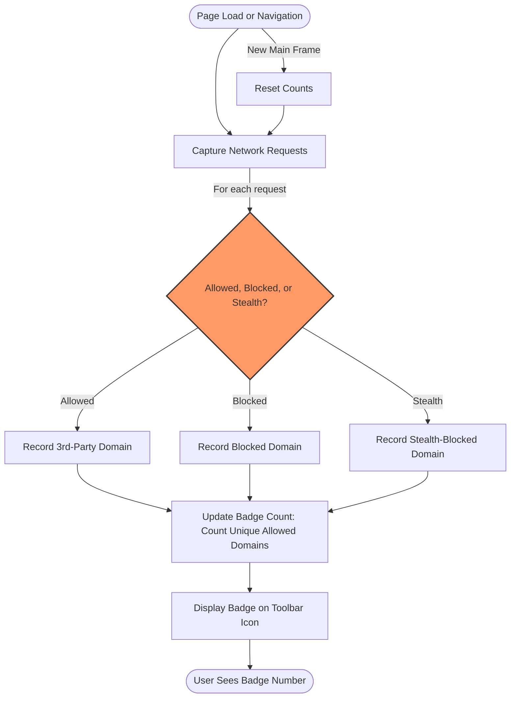

# Interpreting the Toolbar Badge Count

## Overview

The badge count displayed on the uBO Scope toolbar icon represents a vital key to understanding your browsing exposure to third-party remote servers. This number reports the **count of distinct third-party domains that your browser has connected to during your current tab session**. By interpreting this badge correctly, you gain direct insight into your page's privacy footprint and the effectiveness of any content blockers you use.

This guide helps you:

- Understand precisely what the badge number means
- Learn why this count is based on distinct third-party servers, not network requests or blocks
- Debunk common misconceptions about block counts as a metric for privacy or filter strength
- Apply this understanding to better evaluate page privacy and content blocker performance

---

## 1. What the Toolbar Badge Count Represents

### 1.1 Distinct Third-Party Domains

The badge number reflects the **number of unique third-party domains** contacted by the active browser tab, as perceived by uBO Scope. It counts domains regardless of how many times resources are requested from each domain — multiple requests to the same domain count as one.

<u>Example:</u> If you visit a news site that loads resources from 5 unique third-party servers (e.g., ad services, CDNs), the badge count will show "5" after the page finishes loading.

### 1.2 Allowed Connections Only

- The badge count tracks **allowed** remote connections made by the webpage.
- Connections **blocked** by content blockers or stealth-blocked connections (those redirected or hidden from the web request API) are excluded from this count.

This means a lower badge count generally indicates fewer third-party connections and thus a smaller exposure surface from the webpage.

### 1.3 Third-Party vs. First-Party

- Only **third-party domains** are counted, meaning domains different from the site you are visiting.
- First-party domains (the site domain itself) are excluded from the badge count.

---

## 2. Common Misconceptions About the Badge Count

### 2.1 Block Counts Are Not the Privacy Metric

Many users wrongly assume that a higher block count or block badge means a more effective or "better" content blocker. This is **false**:

- The block count corresponds to how many connections were actively **blocked**, not how many third-party servers were contacted.
- A content blocker with a high block count may still allow connections to many distinct third parties, leading to a **higher badge count and lower effective privacy**.

<u>Real-World Insight:</u> Some blockers stealthily allow more third-party connections to avoid webpage breakage, which results in a higher badge number despite blocking many requests.

### 2.2 Ad Blocker Test Webpages Are Unreliable

- Automated ad blocker test sites often generate artificial and unrealistic network scenarios.
- They cannot see stealth-blocked or DNS-level blocked requests.
- Their results don't reflect real-world browsing or extension stealth capabilities.

uBO Scope’s badge count bypasses these unfair tests by directly reporting actual network connection outcomes using the browser’s own web request API.

---

## 3. How uBO Scope Calculates the Badge Count

### 3.1 Tracking Network Requests

uBO Scope listens to web request events including redirects, errors, and successful responses. For each request:

- It extracts the hostname and domain.
- It records whether the request was allowed, blocked, or stealth-blocked.

### 3.2 Aggregating Domains

The badge count is calculated as the number of unique **allowed** third-party domains in a tab's session.

### 3.3 Reset on Main Frame Navigation

The count resets each time a new main frame (tab) navigation occurs, tracking connections fresh per page load.

---

## 4. Practical Tips for Users

### 4.1 Using the Badge for Privacy Awareness

- Aim for a **lower** badge number to reduce third-party exposure.
- Check the uBO Scope popup UI for detailed breakdowns of allowed, stealth, and blocked domains.
- Use the badge together with the detailed popup view ( see [Navigating the Popup UI](../guides/getting-started/navigating-the-popup)) for more context.

### 4.2 Evaluating Content Blockers

- Don't rely on block counts or external "ad blocker tests" to assess effectiveness.
- Use uBO Scope’s badge count as an independent metric:
  - Lower badge count = fewer third-party connections = better real-world privacy.

### 4.3 Understanding "Legitimate" Third Party Domains

- Some third-party domains, like Content Delivery Networks (CDNs) or essential web services, are legitimate and usually low count.
- A very high badge number indicates excessive third-party connections that may impact privacy.

---

## 5. Troubleshooting Badge Count Issues

### 5.1 Badge Not Updating or Showing Zero

- Ensure the extension is installed and permissions are granted.
- Visit multiple pages with known third-party activity to observe changes.
- Check for browser limitations on webRequest API usage.

### 5.2 Badge Shows Unexpectedly High Counts

- Check if you have visited complex sites with multiple third-party integrations.
- Review the popup domain breakdown to identify domains causing the count.
- Consider tightening your content blocking filters or using stricter privacy settings.

### 5.3 Badge Count Remains Stuck After Navigation

- Verify that the tab finished loading and triggered main frame navigation.
- Reload the tab or restart the browser to refresh session tracking.

If problems persist, consult the [Troubleshooting Common Setup Issues](../getting-started/making-first-use/troubleshooting-install) guide.

---

## 6. Summary

Understanding the badge count on the uBO Scope toolbar icon empowers you to see your true exposure to third-party domains during browsing. Remember:

- Badge = distinct allowed third-party domains per tab
- Lower is better for privacy
- Block counts or ad-block test page results do not indicate actual privacy

Use these insights to make informed decisions about content blockers and your browsing habits.

---

## Related Documentation & Next Steps

- [Navigating the Popup UI](../guides/getting-started/navigating-the-popup): Learn how to explore detailed domain lists behind the badge count.
- [Tracking Third-Party Remote Connections](../guides/core-workflows/tracking-remote-connections): Deep dive into how uBO Scope monitors connections.
- [Best Practices: Interpreting Network Results](../guides/advanced-tips/best-practices-interpreting-results): Advanced tips on making sense of network data.
- [Troubleshooting Common Setup Issues](../getting-started/making-first-use/troubleshooting-install): Fix issues with badge count and popup display.

---

## Visual Summary of Badge Count Workflow

This workflow illustrates how the badge count dynamically reflects the active third-party domains successfully connected to, refreshed upon tab navigation.

---

<Tip>
The badge count is your concise window into your browsing privacy. Regularly monitor it as you navigate the web to stay aware of your online exposure.
</Tip>

<Note>
A lower toolbar badge count does not guarantee complete privacy, but it does mean fewer third-party remote servers were contacted by the webpage during the current session.
</Note>

<Warning>
Beware of using block counts alone or 'ad blocker test' sites as a benchmark for content blocker effectiveness. Such metrics do not represent your true online privacy exposure.
</Warning>
