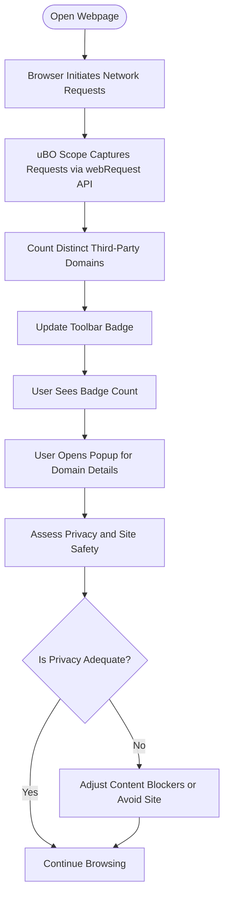

# Interpreting Badge Counts and Site Safety

## Overview
The toolbar badge displayed by uBO Scope shows the **number of distinct third-party remote servers** your browser connected to while loading a webpage. This count is a practical privacy indicator—the fewer distinct third-party domains, the smaller your exposure to potential tracking or unwanted resource loading.

This guide helps you understand what the badge count means, its limitations, and how to use this information effectively to assess the safety and privacy of websites you visit.

---

## What the Toolbar Badge Represents

- The badge count is the **number of unique third-party domains contacted** during the loading and execution of the current tab.
- This count is based on network requests your browser has made, including allowed, blocked, and stealth-blocked requests aggregated by distinct domain names.
- Lower badge numbers generally indicate fewer third-party resources, which usually means better privacy and less exposure to trackers.
- A zero or very low count often reflects a site that does not rely heavily on third-party services.

### Important Clarifications

- Third-party does not always mean harmful or malicious—many legitimate sites use Content Delivery Networks (CDNs) or trusted services, resulting in some third-party contacts.
- The count reflects domains, not individual network requests; multiple requests to the same domain count as one.

---

## How to Assess Site Safety Using the Badge Count

### Step 1: Observe the Badge When Visiting a Site
- When you open a new tab or reload a page, watch the badge number update.
- The badge updates in real-time based on network activity.

### Step 2: Interpret the Number
- **Low count (e.g., 0-3 domains):** Indicates fewer third-party connections, often good for privacy.
- **Moderate count (e.g., 4-10 domains):** Indicates multiple third parties, which might be necessary for site functionality or ads.
- **High count (above 10 domains):** Potentially exposes you to extensive tracking or many external resources, which could affect privacy and performance.

### Step 3: Use the Popup for Details
- Click the uBO Scope icon to open the popup.
- Review the listed third-party domains under the **not blocked**, **stealth-blocked**, and **blocked** categories.
- This detailed view helps you identify which domains are contacted and which are blocked.

### Step 4: Compare Badge Counts Across Sites
- When privacy is a priority, compare badge counts across websites you visit regularly.
- This comparison helps you understand which sites are more privacy-conscious or which rely on many third-party resources.

---

## Limitations and Caveats to Keep in Mind

- The badge count **only includes third-party domains detected through the browser's webRequest API**. Some network activity (e.g., certain WebSocket connections) or non-standard requests might not be reported.
- Some legitimate services use many subdomains or multiple domains, which inflates the count but may not indicate poor privacy practices.
- A higher badge count **does not inherently mean the site is unsafe or malicious**, but it increases exposure surface.
- Content blocker effectiveness cannot be judged solely by block counts; what matters is the **distinct allowed third-party domains**.

<Tip>
A lower badge count is a useful heuristic but not an absolute indicator of site safety or privacy. Always consider context and use the detailed popup view to investigate suspicious third parties.
</Tip>

---

## Best Practices for Using the Badge Count as a Privacy Metric

1. **Look Beyond the Number:** Use the popup to understand which domains are involved and why.
2. **Regularly Compare Across Sites:** Build awareness of typical third-party usage patterns on websites you trust.
3. **Interpret Stealth-blocked and Blocked Domains:** They highlight attempts blocked by your content blockers, indicating active protection.
4. **Don't Rely on Ad Blocker Test Pages:** These pages make artificial requests that exaggerate or distort real network behavior.
5. **Consider Extensions and Browser Configurations:** These may influence which network requests are visible to uBO Scope.

---

## Troubleshooting Common Questions

<AccordionGroup title="Troubleshooting Badge Count Interpretation">
<Accordion title="Why is the badge count sometimes zero, even on popular sites?">
The badge counts distinct third-party domains contacted successfully or attempted. If your content blocker or other privacy tools block all external connections effectively, the count may be zero.
</Accordion>
<Accordion title="Why does the badge count vary each time I visit the same site?">
Network connections can change dynamically due to personalization, ads, or services that load conditionally. Some third-party connections may be transient or dynamically blocked.
</Accordion>
<Accordion title="Can the badge count mislead me about site privacy?">
Yes. Some sites use many domains for legitimate reasons, and badge count does not measure cookie or tracking behavior directly. Use the badge as an indicator, not definitive proof.
</Accordion>
<Accordion title="What happens if my browser restricts webRequest API access?">
Some connections, especially encrypted WebSocket or DNS-level blocks, may not be visible to uBO Scope, causing the badge count to be lower than actual network requests.
</Accordion>
</AccordionGroup>

---

## Summary

The toolbar badge on uBO Scope offers a **transparent, real-time count of distinct third-party domains** your browser contacts, giving you valuable insight into the privacy footprint of each website you visit. By combining badge observation with detailed popup analysis and understanding the limitations, you can make informed decisions about your browsing habits and site safety.

---

## Related Documentation

- [Understanding the Popup and Toolbar Badge](/guides/getting-started/understanding-the-ui) — Learn how to read the popup interface linked to the badge.
- [Tracking Third-Party Server Connections](/guides/core-workflows/tracking-3rd-party-requests) — Deeper insights into third-party request categorization.
- [Common Myths and Realities](/overview/introduction_and_principles/mythbusting) — Clarifies misconceptions about block counts and test pages.
- [Validating That uBO Scope Is Working](/getting-started/first-run-validation/validating-functionality) — Ensures your extension functions correctly.

---

## Next Steps

- Install uBO Scope and observe badge counts on your favorite sites.
- Explore the popup details to identify domains and outcomes.
- Use this insight to adjust privacy protections and understand third-party network behavior.

---

## Visual Summary: Badge Count Interpretation Workflow

