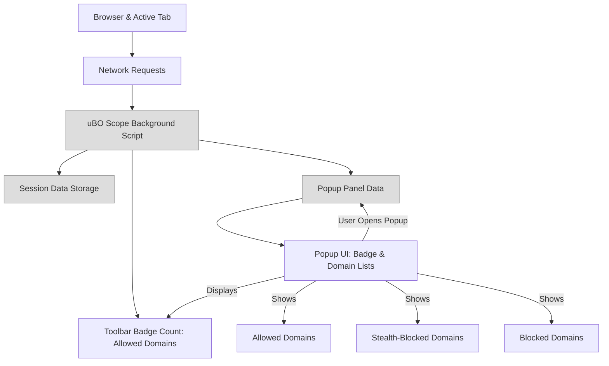

# Interpreting the Badge Count and Popup Panel

## Workflow Overview

### Task Description
This guide helps you understand the relationship between the toolbar badge count and the number of distinct third-party servers your browser interacts with. It will take you step-by-step through the layout and contents of the popup panel, enabling you to accurately interpret the domains listed, their connection outcomes, and identify potential privacy concerns.

### Prerequisites
- uBO Scope extension installed and active in your supported browser (Chromium 122+, Firefox 128+, Safari 18.5+).
- You have browsed a website so that uBO Scope has collected network data for the active tab.
- Familiarity with basic browser extension usage, such as clicking the toolbar icon to open the popup panel.

### Expected Outcome
By the end of this guide, you will confidently interpret:
- What the badge count number means
- How to read the domain summary in the popup
- The meaning of the sections: allowed, stealth-blocked, and blocked
- How these sections translate into real network connection outcomes
- How to spot domains that may pose privacy risks

### Time Estimate
Approximately 5 to 10 minutes to read and practice interpreting sample data in the popup panel.

### Difficulty Level
Beginner to Intermediate

---

## Step-by-Step Instructions

### 1. Understand the Toolbar Badge Count
- The number displayed on the uBO Scope toolbar badge represents the total count of **distinct third-party remote domains** that the active browser tab successfully connected to during page load or interaction.
- A **lower badge count is better**, indicating fewer third-party connections, which typically means less tracking or resource loading from external servers.
- The badge count reflects domains from the **"allowed"** category — those connections that were not blocked.

<Check>
The badge count does **not** reflect blocked or stealth-blocked domains.
</Check>

### 2. Open the Popup Panel
- Click the uBO Scope icon in your browser toolbar.
- The popup displays detailed data about the third-party connections detected for the current tab.

### 3. Read the Popup Header
- The header shows the domain of the website you are visiting, split into two parts:
  - The subdomain prefix (if applicable), shown in the first span.
  - The main domain, shown in the second span.
- If only a main domain is shown (e.g., 'example.com'), the site has no visible subdomain.

### 4. Review the Summary Section
- Located below the header, this section reads:
   `domains connected: <number>`
- This number reflects the total **distinct domains** connected to (the union of all categories).
- It gives an overview of how many unique third-party servers your browser interacted with.

### 5. Explore the Connection Categories

The popup separates domains into three outcome categories, each with its own section:

| Section         | Description                                                                                     |
|-----------------|------------------------------------------------------------------------------------------------|
| **not blocked** | Domains with connections that successfully loaded resources or data — these requests were allowed. |
| **stealth-blocked** | Domains where connection attempts were silently blocked or redirected in a way that the website may not detect (stealth blocking). |
| **blocked**     | Domains where connection attempts definitively failed due to blocking (e.g., by filters or security).

#### What to Expect in Each Section
- Each domain is listed along with a count showing how many connection attempts were made to it.
- Domains are sorted alphabetically within each category for easier lookup.
- The counts correspond to the number of **hostnames or instances** under the domain, aggregating detailed connection attempts.

<Note>
Stealth-blocked connections typically represent network requests that were redirected or blocked in a manner that does not visibly trigger errors on the webpage, which can indicate subtle privacy protections in place.
</Note>

### 6. Interpreting Real Connections and Potential Privacy Risks
- Domains in the **not blocked** section correspond to legitimate or third-party servers your browser successfully fetched content from — these may include content delivery networks (CDNs), trackers, or embedded services.
- A **high count** here can indicate extensive third-party resource loading; assess if all domains are trustworthy.
- The **stealth-blocked** and **blocked** lists help you understand which connections were stopped or modified, providing insight into your content blockers' effectiveness.

<Tip>
Compare these domain lists with your known filter lists or privacy preferences to evaluate if unexpected or suspicious domains appear in the allowed list.
</Tip>

### 7. Verify Data Accuracy
- Check that the popup matches your browsing context; if it shows 'NO DATA' or zero counts, ensure you have loaded a webpage and the extension has permission to monitor network requests.
- Badge updates are generally instantaneous but may lag slightly due to network request processing.

---

## Examples & Usage Scenarios

### Example 1: Typical News Website
- Badge count: 5
- Popup Summary: 5 distinct domains connected.
- Allowed section lists common CDN domains serving images and scripts.
- Stealth-blocked section shows a few tracker domains silently redirected.
- Blocked section lists known ad servers prevented from loading.

Outcome: You confirm the site loads content mostly from safe sources, while trackers are partially blocked.

### Example 2: E-commerce Site with Many Third Parties
- Badge count: 20
- Popup Summary: 20 domains connected.
- Allowed section includes payment gateways, analytics domains, and social media widgets.
- Stealth-blocked section is empty.
- Blocked section contains known ad networks.

Outcome: You identify extensive third-party connections, some expected (payment), others raise privacy concerns.

---

## Troubleshooting & Tips

### Common Issues
- **Badge count does not update:**
  - Reload the page.
  - Check if the site uses private browsing or incognito mode, which may affect monitoring.
  - Verify the extension has necessary permissions.

- **Popup shows 'NO DATA' or empty lists:**
  - Ensure the page is fully loaded and network requests have occurred.
  - Some background tabs or pages with minimal third-party connections may show empty.

- **High domain counts with unexpected entries:**
  - Use the popup to investigate domains. Research unknown domains online for trust level.
  - Adjust content blockers or filter lists accordingly.

### Best Practices
- Regularly review the popup after visiting new or less-trusted websites.
- Use the categorized lists to assess whether stealth or blocked connections may need adjustment.
- Remember that not all third-party connections are harmful; some are necessary for content delivery.

---

## Next Steps & Related Content

- After mastering badge and popup interpretation, explore the [Getting Started: Reveal All Remote Server Connections guide](/guides/core-workflows/getting-started-analysis) to understand the full workflow of analyzing uBO Scope data.
- Learn about the underlying data collection by reviewing the [Network Visibility Model](/overview/core-concepts-architecture/network-visibility-model).
- For deeper UI insights, see the [Quick Tour: The Popup UI](/overview/feature-overview/popup-ui-quicklook).
- To optimize privacy protection, consult [Privacy Audits: Identifying Stealth and Unexpected Requests](/guides/advanced-usage-patterns/privacy-audits).

---

## Visual Overview of Data Flow in the Popup Panel

---

## Summary
- The badge count reflects the number of distinct third-party domains your browser actually connected to and were allowed.
- The popup panel breaks down all observed third-party domains into allowed, stealth-blocked, and blocked categories.
- Use domain counts and categories to review your browsing privacy surface and content blocking effectiveness.
- Always cross-check domains for trustworthiness and adjust your filters accordingly.

---

For questions or detailed troubleshooting, visit the related documentation or reach out to community discussions centered on uBO Scope usage.