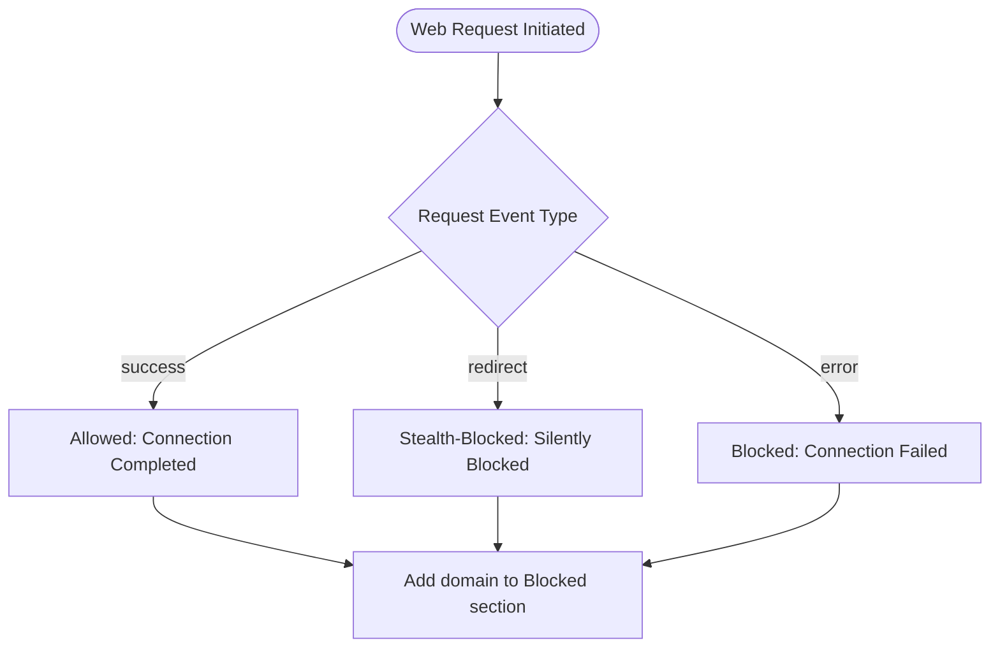

# Interpreting Blocked, Stealth, and Allowed Outcomes

Understanding the network request outcomes reported by uBO Scope is fundamental to leveraging the extension’s full potential to enhance your privacy awareness and web connection insights. This guide helps you distinguish between **blocked**, **stealth**, and **allowed** requests within the extension’s UI, interpret the meaning behind color-coded categories, and use this knowledge to make informed decisions about your browser’s privacy posture.

---

## 1. What This Page Helps You Accomplish

- Grasp the distinctions between the three main network request outcomes uBO Scope reports: **Blocked**, **Stealth-Blocked**, and **Allowed**.
- Learn how these categories relate to your browsing activity and privacy exposure.
- Understand how uBO Scope categorizes network requests and why this matters.
- Use the extension UI color codes and categories to quickly identify potential privacy risks or blocked connections.

### Prerequisites

- uBO Scope installed and properly activated in your browser.
- Familiarity with opening the uBO Scope popup panel and viewing connection data (see the [Understanding the User Interface](https://docs.uBOscope/guides/getting-started/understanding-ui-overview) page).
- Basic understanding of network requests and third-party connections.

### Expected Outcome

By the end of this guide, you will confidently interpret which network requests were:

- Allowed by your content blockers and browser,
- Silently blocked (stealth blocked) without notifying the webpage,
- Actively blocked,

and what each means for your browsing privacy.

### Time Estimate

10-15 minutes to read and practice interpreting outcomes in the popup UI.

### Difficulty Level

Beginner to Intermediate

---

## 2. Understanding Network Request Outcomes in uBO Scope

uBO Scope classifies network requests into three distinct outcomes, each reflecting how your browser and content blockers treat connections initiated by webpages:

### Allowed (Not Blocked)

- **Description:** These are network connections successfully established with third-party servers.
- **UI Representation:** Shown in the green-colored section labeled "not blocked"
- **What it Means:** The request was permitted by your browser's content blocker (or no blocker intervened). Resources from these domains loaded successfully.
- **Implication for Privacy:** Allowed requests increase your exposure to third-party servers and potential tracking. A lower count in this section indicates better privacy.

### Stealth-Blocked

- **Description:** These requests were intercepted and blocked silently by content blockers or filtering mechanisms without generating visible errors.
- **UI Representation:** Displayed in the yellow-colored "stealth-blocked" section.
- **What it Means:** Although the request was stopped, the webpage could be unaware because the blocking was designed to be undetectable to the site.
- **Implication for Privacy:** Stealth blocking effectively stops connections without alerting trackers, offering privacy protection while minimizing site breakage.

### Blocked

- **Description:** Requests that were actively blocked and reported as errors during the network connection attempt.
- **UI Representation:** Listed in the red-colored "blocked" section.
- **What it Means:** These requests failed to complete due to blocking or errors detected by the browser or extensions.
- **Implication for Privacy:** This indicates traditional blocking mechanisms where connections are explicitly denied, often visible in the browser’s developer tools as errors.

---

## 3. How uBO Scope Detects and Categorizes Outcomes

uBO Scope relies on the browser's `webRequest` API to observe network activity and categorize each connection attempt based on its final status:

- **Success Event:** Marks the request as allowed if it completed without error.
- **Redirect Event:** Classified as stealth, representing connections where blocking was transparent to the browser.
- **Error Event:** Indicates a blocked request that failed due to filtering or other network errors.

This approach provides comprehensive visibility irrespective of which specific content blockers or DNS filters are active, giving you an objective view of actual network traffic.

---

## 4. Using Color Codes and Categorization in the Extension UI

The popup panel in uBO Scope visually separates domains into these three categories. Here is how to make the most of the UI to interpret outcomes:

| Outcome           | Color   | What to Look For                                  | User Action                            |
|-------------------|---------|-------------------------------------------------|--------------------------------------|
| Allowed           | Green   | Domains listed here load successfully            | Review which third parties are active; consider additional blocking if concerned|
| Stealth-Blocked   | Yellow  | Domains silently blocked without alerting site  | Recognize effective stealth blocking protecting you; no immediate action needed |
| Blocked           | Red     | Domains that triggered connection errors        | If unexpected, investigate or adjust your blocker settings|

### Practical Tip

- Regularly monitoring the **Allowed** list helps you audit which third-party domains your browser actually fetches resources from and identify any unexpected or suspicious domains that might affect privacy.

- Check the **Blocked** and **Stealth-Blocked** sections to assess how well your extensions are protecting your browsing session.

---

## 5. Step-by-Step: Interpreting Outcomes in Practice

<Steps>
<Step title="Open the uBO Scope Popup Panel">
Open the extension popup by clicking the uBO Scope icon in your browser toolbar. This launches the domain connections panel showing categorized request outcomes for the active tab.
</Step>
<Step title="Locate the Color-Coded Sections">
Identify the three sections: green 'not blocked', yellow 'stealth-blocked', and red 'blocked'. Each section lists distinct third-party domains.
</Step>
<Step title="Review Domain Counts">
See next to each domain the request count—indicating how many requests succeeded or were blocked per domain.
</Step>
<Step title="Understand Domain Relevance">
Consider whether listed third-party domains are expected (e.g., well-known CDNs) or unfamiliar/suspicious.
</Step>
<Step title="Use Outcome Information to Guide Privacy Settings">
If many allowed domains concern you, consider tightening your content blocking or consult filter list maintenance guides. Alternatively, frequent requests in stealth or blocked sections show effective blocking.
</Step>
</Steps>

---

## 6. Common Scenarios and What They Mean

| Scenario                                              | What It Indicates                                                   | Recommended User Action                         |
|-------------------------------------------------------|--------------------------------------------------------------------|------------------------------------------------|
| High number of allowed domains                        | Your browser allows many third-party connections                   | Review and possibly enhance your blocker rules |
| Domains only in stealth-blocked and blocked sections | Your blockers are effectively hiding connections and blocking them| Continue current privacy setup                    |
| Domains unexpectedly listed as allowed but you expect blocking | Blocking not working as intended                              | Check content blocker configuration               |

---

## 7. Troubleshooting and Best Practices

### Troubleshooting Common Issues

- **No Data or Empty Lists:**
  - Ensure uBO Scope is enabled and has necessary permissions.
  - Reload the tab or toggle the extension.
  - See [Quick Troubleshooting](https://docs.uBOscope/getting-started/first-steps-validation/quick-troubleshooting) for deeper help.
- **Unexpected Outcome Distribution:**
  - Verify your installed content blockers’ configurations.
  - Understand that some DNS-based or stealth blocking methods do not report in the same way.

### Best Practices

- Regularly review the allowed domains and assess if additional blocking is warranted.
- Use uBO Scope alongside your existing blocker for transparent insight—not as a blocker replacement.
- Keep your content blocker filter lists updated.

---

## 8. Real-World Example

Consider you visit an online news website. uBO Scope shows:

- **Allowed:** `cdn.example.com (15)`, `analytics.trusted.com (3)`
- **Stealth-Blocked:** `tracker.ads.com (12)`
- **Blocked:** `adserver.evil.com (9)`

This indicates your browser loaded essential CDN and trusted analytics domains successfully, stealth-blocked some ad trackers silently, and explicitly blocked others causing connection failures. From a privacy stance, this confirms that your setup is balancing functionality and protection.

---

## 9. Next Steps & Related Documentation

- Dive deeper into the UI with [Understanding the User Interface](https://docs.uBOscope/guides/getting-started/understanding-ui-overview).
- Learn how to analyze connections in detail with [Analyzing Third-Party Connections on Any Webpage](https://docs.uBOscope/guides/core-workflows/connection-analysis).
- Explore best practices for managing your filter lists in [Using uBO Scope as a Tool for Filter List Maintenance](https://docs.uBOscope/guides/core-workflows/filter-list-use-cases).
- If you want to understand the badge count meaning and how it relates to these outcomes, visit [Understanding the Extension Badge](https://docs.uBOscope/getting-started/first-steps-validation/understanding-the-extension-badge).

<Tip>
Regularly interpreting these network request outcomes arms you with knowledge about your real browsing exposure, helping you maintain a strong privacy posture and avoid common misconceptions about blocking efficacy.
</Tip>

---

## 10. For Developers and Filter List Maintainers

While this guide focuses on user interpretation, if you are interested in how outcomes are recorded and categorized, the extension’s background script listens to webRequest API events:

- **Success events** mark allowed connections.
- **Redirect events** indicate stealth blocking.
- **Error events** correlate with blocked requests.

You can explore more on implementation in the [uBO Scope repository](https://github.com/gorhill/uBO-Scope). This insight helps filter list maintainers verify the real impact of rules on connection flows.

---

## Summary Diagram: Outcome Categorization Flow

This diagram illustrates how uBO Scope views network requests and places them into categories your UI shows.

---

For further questions or troubleshooting, consult the linked guides or reach out via the community forums.

-----

*This documentation is part of the uBO Scope's Core Workflows and Best Practices series.*

---

[Back to Guides Overview](https://docs.uBOscope/guides/core-workflows/index)

---

<Source url="https://github.com/gorhill/uBO-Scope" paths={[{"path": "js/background.js", "range": "60-148"},{"path": "js/popup.js", "range": "25-70"}]} />

