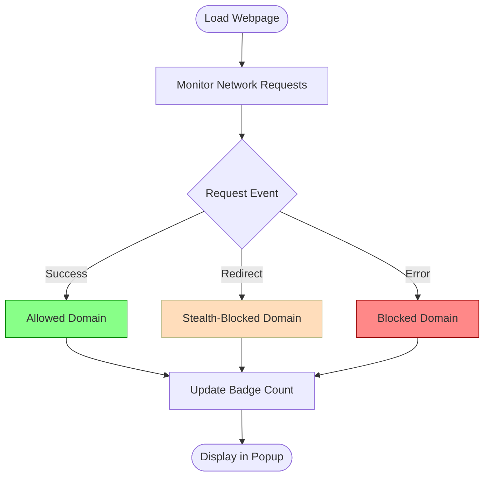

# Interpreting Blocked and Stealth-Blocked Domains

A practical guide to understanding the significance of the domains listed as **blocked** or **stealth-blocked** in uBO Scope, and how these categories help you uncover subtle differences to enhance your filter-making and troubleshooting efforts.

---

## Understanding Domain Outcome Categories

uBO Scope classifies third-party domains your browser encounters into three key categories:

- **Not Blocked (Allowed):** Domains successfully contacted and loaded resources.
- **Stealth-Blocked:** Domains for which connections were redirected or silently blocked in a way that is less obvious to the webpage.
- **Blocked:** Domains for which network requests failed or were explicitly blocked.

This guide focuses on helping you differentiate and interpret the **blocked** and **stealth-blocked** domains.

---

## 1. Why Distinguish Blocked from Stealth-Blocked Domains?

Web content blockers and DNS-based filters perform blocking in different ways. While some network requests are outright blocked (resulting in errors), others may be intercepted earlier or redirected in a stealthy manner to avoid breaking web pages or detection.

Understanding these distinctions empowers you to:

- Diagnose subtle blocking behaviors that affect page rendering or scripts.
- Improve filter rules by identifying stealth-blocked domains that don’t show as obviously blocked.
- Interpret uBO Scope's detailed reporting to get a complete picture of privacy exposure.

<Tip>
Stealth-blocking is often used by content blockers to minimize website breakage by hiding the blocking action from scripts running on the page.
</Tip>

---

## 2. How uBO Scope Detects and Categorizes Domains

uBO Scope leverages the browser's `webRequest` API to monitor network request events and classify domains accordingly:

- **Blocked Domains:** Identified when network requests result in an error event (`onErrorOccurred`), indicating the browser failed to successfully connect.

- **Stealth-Blocked Domains:** Identified when requests are redirected (`onBeforeRedirect`) typically as part of stealthy blocking techniques.

- **Allowed Domains:** Those that complete successfully with status codes and valid responses.

This fine-grained detection works regardless of the content blocker in use, exposing connections even when other tools miss stealth blocking.

---

## 3. Using the Popup to Explore Blocked and Stealth-Blocked Domains

### Step-by-Step Workflow

1. **Open the uBO Scope Popup:** Click the extension icon near your browser's address bar to open the popup dashboard.

2. **View Domain Categories:** The popup displays three sections - 'not blocked', 'stealth-blocked', and 'blocked'. Each lists domains observed in the current active tab grouped by outcome.

3. **Interpret Counts:** Each domain entry shows the number of requests made or blocked, indicating how frequently interactions happened.

4. **Analyze Patterns:** Look for stealth-blocked domains that could be silently interfering without visibly impacting the block count.

<Tip>
Domains listed under stealth-blocked typically represent connections redirected by filters to avoid detection or page breakage.
</Tip>

### Practical Example

- If you visit a news site and see ad-related domains in the **stealth-blocked** section, it often means your content blocker redirected those requests silently.
- Domains in the **blocked** section usually correspond to outright request failures imposed by your blocker or DNS filtering.

---

## 4. Best Practices for Using Blocked and Stealth-Blocked Counts

- **Cross-Reference Domains:** Use the domain names with privacy or filter list databases to verify if stealth-blocked domains should be blocked more explicitly.
- **Refresh Popup Frequently:** Network requests can change as pages load scripts dynamically; keep the popup updated to catch new stealth-blocks.
- **Use Domain Counts:** High counts in stealth-blocked indicate heavy redirection or silent blocking, which might justify tweaking filter rules.
- **Avoid Misinterpretation:** Not all blocked domains pose privacy risks; some may be essential third-party tools or CDNs inadvertently blocked.

<Warning>
Do not rely solely on blocked counts in the toolbar badge—stealth-blocked domains can mask true blocking impact.
</Warning>

---

## 5. Troubleshooting and Advanced Insights

### Common Issue: Blocked Domain List Looks Empty

- Ensure that uBO Scope has the necessary permissions.
- Reload the active tab and reopen the popup to refresh data.
- Confirm that the extension is properly installed and running.

### Investigating Stealth Blocking

- Stealth-blocked domains are often obscured; investigate redirects by manually inspecting network requests in your browser’s dev tools.
- Adjust content blocker settings if stealth-blocking causes issues or confusion.

### Using Domains for Filter Rule Improvement

- Export or manually note domains appearing as stealth-blocked.
- Add specific blocking rules where appropriate to enhance your content blocker’s effectiveness.

---

## 6. Summary

Your mastery of distinguishing blocked from stealth-blocked domains unlocks a powerful layer of privacy insight. Use uBO Scope’s categorized domain lists to refine filter rules, recognize subtle blocking techniques, and sustain a transparent view of your third-party network exposure.

---

## Related Documentation

- [Tracking All Remote Connections on a Webpage](guides/core-workflows/tracking-remote-connections)
- [Understanding the Popup Dashboard](guides/getting-started/first-look-popup)
- [Quick Validation Checklist](getting-started/first-use-and-validation/quick-validation)
- [Troubleshooting Installation & Setup](getting-started/first-use-and-validation/troubleshooting-installation)

---

## Appendix: Domain Outcome Categorization Flow

---