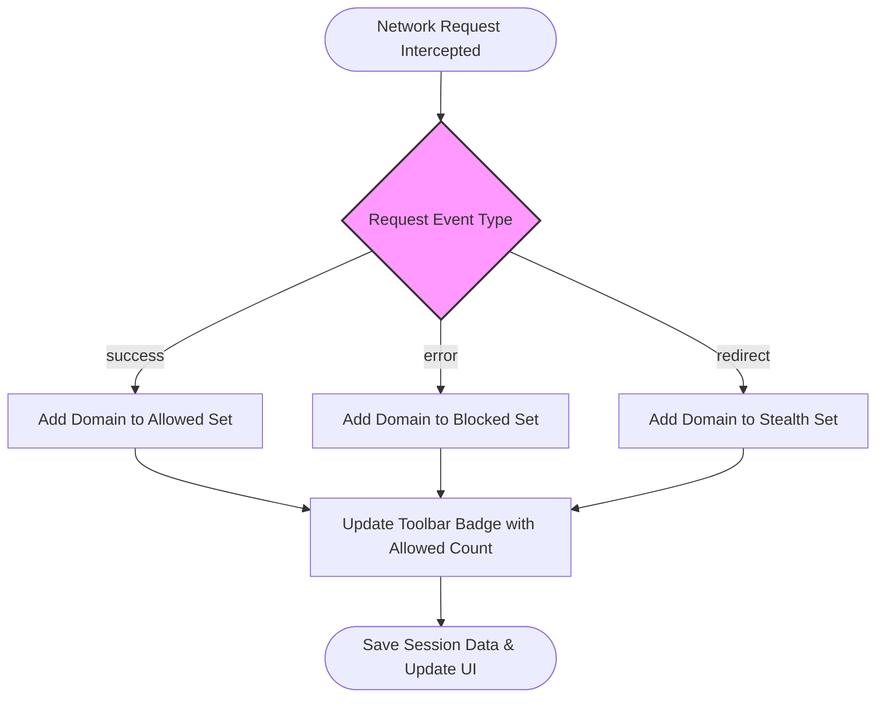

# Understanding Allowed, Blocked, and Stealth Outcomes in uBO Scope

## Workflow Overview

### Task Description
This guide helps you understand the meaning behind the connection outcomes reported by uBO Scope: "Allowed," "Blocked," and "Stealth." You will learn how uBO Scope classifies network requests, how these distinctions affect your privacy insights, and how to interpret the popup's domain listing for real webpages.

### Prerequisites
- uBO Scope installed and running in your browser (Chromium v122+, Firefox v128+, or Safari 18.5+).
- Basic familiarity with the uBO Scope popup interface.
- Open a webpage for which network connections will be analyzed.

### Expected Outcome
- Understand how uBO Scope categorizes connections.
- Differentiate visible blocking from stealth blocking.
- Confidently interpret which third-party domains were accessed, blocked, or stealthily suppressed.
- Apply this understanding to identify privacy-relevant network activity.

### Time Estimate
5–10 minutes.

### Difficulty Level
Beginner to Intermediate.

---

## How uBO Scope Classifies Connection Outcomes

uBO Scope listens to all network requests your browser makes while loading web pages and tracks their outcome based on the response from network layers and content blockers. It categorizes connections into three clear outcomes:

### 1. Allowed
These are network requests that succeeded and were not blocked by any content blocker. They represent third-party or first-party domains from which resources were successfully fetched.

- *Example*: Loading images, scripts, or fonts from a CDN.
- *Effect*: These domains are fully loaded and visible; such connections can impact your privacy since network traffic is shared.

### 2. Blocked
These requests were explicitly prevented from completing by content blockers or network errors indicating blocking. This is the *visible* blocking that uBO Scope registers.

- *Example*: A tracker request blocked by a filter rule, or a DNS block.
- *Effect*: The network connection was prevented; user privacy is protected from these domains.

### 3. Stealth (Stealth-Blocked)
Stealth refers to network requests that were silently blocked or redirected in a way that the webpage or detection scripts cannot see. These are *hidden* blockings performed cautiously by content blockers to avoid breakage or detection.

- *Example*: A tracker request redirected to avoid detection without throwing an explicit block error.
- *Effect*: Though the connection was prevented like a blocked outcome, the stealth category indicates the blocking action remains invisible to the webpage’s scripts.

<Tip>
Understanding stealth blocking helps debunk myths about "block counts" since actual blocking may occur silently without detection on typical block reports.
</Tip>

---

## Using uBO Scope Popup to Interpret Outcomes

When you open the uBO Scope popup for an active tab, you'll see domains organized into three distinct sections:

| Outcome       | What It Means                                    | User Impact                                  |
|---------------|-------------------------------------------------|----------------------------------------------|
| Not Blocked   | Domains that successfully fetched resources.    | Represents active connections affecting privacy.
|
| Stealth-Blocked | Domains where blocking was silent (stealth).  | The page can't detect these blocks; connection attempts were suppressed.
|
| Blocked       | Domains where blocking was explicit and visible.| Confirmed blocked connections; no data fetched.

### Sections Explained
- **Not Blocked:** Lists domains from which resources were loaded; these are confirmed allowed connections.
- **Stealth-Blocked:** Shows domains that were silently blocked, usually via redirection or filtered responses masked from the page.
- **Blocked:** Records visible blocking events such as failed connections or explicit cancellation by rules.

All domains appear with a count representing how many requests were made to that domain during the page load.

---

## Practical Example: Typical Web Page Analysis

When loading a popular news site:

- You might see some widely known CDN domains listed under "Not Blocked" — these are resources needed for functional reasons (fonts, images).
- Several advertising or tracking domains could appear in the "Stealth-Blocked" category, meaning they tried to connect but were silently suppressed.
- Other tracking domains might appear under "Blocked", indicating they were prevented outright and visibly.

This breakdown allows you to assess which third parties your browser connected to, which were blocked outright, and which were stealthily suppressed to avoid user exposure.

---

## Step-by-step Instructions to Interpret uBO Scope Outcomes

<Steps>
<Step title="Open uBO Scope Popup for the Active Tab">
Click the uBO Scope icon in your browser toolbar while on a webpage to view connection details.
</Step>
<Step title="Observe the Domains Listed Under Each Outcome">
Review the three main sections — Not Blocked, Stealth-Blocked, and Blocked — to see domain names and counts.
</Step>
<Step title="Understand Domain Counts">
Each domain is followed by a number representing how many connection attempts occurred during the page load.
</Step>
<Step title="Differentiate Allowed from Blocked Connections">
- Domains under "Not Blocked" indicate resources successfully fetched.
- "Blocked" shows domains that were visibly prevented.
- "Stealth-Blocked" reveals those blocked silently beyond the page's awareness.
</Step>
<Step title="Check the Toolbar Badge for Summary">
The extension icon's badge shows the number of distinct allowed third-party domains connected on that tab — a proxy for potential privacy exposure.
</Step>
</Steps>

---

## Troubleshooting & Tips

<AccordionGroup title="Common Issues Interpreting Outcomes">
<Accordion title="No Domains Shown in the Popup">
- Ensure you have uBO Scope properly installed and enabled.
- Confirm the tab is active and has network requests.
- Verify browser permissions for webRequest and activeTab are granted.
</Accordion>
<Accordion title="Unexpected Domain Counts">
- The badge count reflects distinct allowed domains only, stealth and blocked domains do not increase it.
- Some connections might be made by background scripts or browser services and could be excluded.
</Accordion>
<Accordion title="Understanding Stealth Blocking">
- Stealth blocking is subtle; pages cannot detect these blocks.
- This may confuse traditional ad-blocking test pages which expect visible blocking.
- Trust uBO Scope’s stealth category as an indicator of hidden protection.
</Accordion>
</AccordionGroup>

<Tip>
Use the "Blocked" and "Stealth-Blocked" sections together to get a complete picture of blocked activity.
</Tip>

---

## Best Practices

- Regularly check the popup after visiting privacy-sensitive sites to monitor third-party network activity.
- Aim for a lower number on the badge count indicating fewer allowed external connections.
- Use uBO Scope’s output to guide adjustments to content blocking filters or privacy preferences.

---

## Diagram: Workflow of Connection Classification in uBO Scope

---

## Next Steps & Related Content

- Explore the [Getting Started with uBO Scope](https://example.com/guides/core-workflows/getting-started-ubo-scope) guide to begin monitoring your connections.
- Learn about [Debunking Block Count Myths](https://example.com/guides/advanced-and-best-practices/debunk-block-count-myths) to better understand the significance of counts.
- Review the [First Run & Interpreting the Interface](https://example.com/getting-started/first-steps-and-usage/first-run-and-interface) page for a guided introduction to your first usage.

---

## Resources
- Official GitHub Repository: [https://github.com/gorhill/uBO-Scope](https://github.com/gorhill/uBO-Scope)
- uBO Scope Wiki and FAQ

<Tip>
Use this guide as your foundation to confidently interpret uBO Scope’s data and make informed decisions to protect your privacy.
</Tip>
