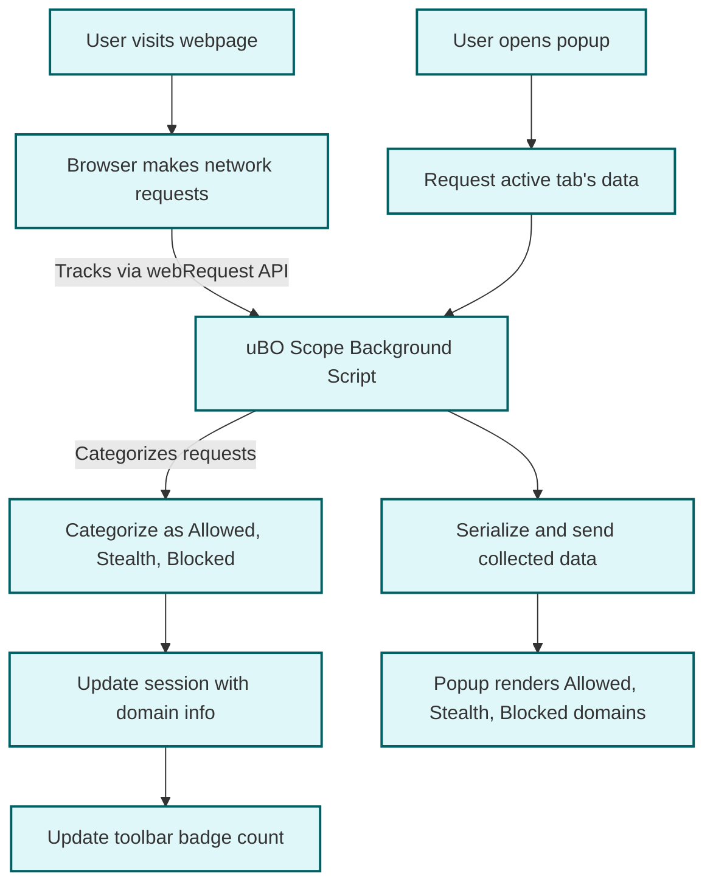

# Investigating Third-Party Requests

## Workflow Overview

This guide walks you through the essential steps to uncover which third-party domains a web page is connecting to using uBO Scope. You will learn how to distinguish between desirable third-party content delivery networks (CDNs) and unnecessary tracking domains, and how to interpret the connection status categories displayed by the extension’s popup interface.

### Prerequisites
- uBO Scope installed and activated on your supported browser (Chrome, Firefox, Safari).
- Basic familiarity with the uBO Scope popup interface (see Popup Interface Guide).
- A web page loaded in your browser tab whose network connections you want to analyze.

### Expected Outcome
By the end of this guide, you will confidently identify third-party remote servers contacted by webpages, understand their classification as allowed, stealth-blocked, or blocked connections, and use that insight to assess your privacy exposure and content blocker effectiveness.

### Time Estimate
5-10 minutes for the initial exploration; deeper analysis may require more.

### Difficulty Level
Beginner to Intermediate

---

## Step-by-Step Instructions

### Step 1: Open the uBO Scope Popup for the Active Tab
1. Click on the uBO Scope extension icon in your browser toolbar.
2. The popup will display data related to the current active tab, including the main domain and summary of connections.

_Expected Result_: You see the domain name of the current webpage and a count of connected third-party domains.

### Step 2: Understand the Connection Status Categories

The popup groups domains into three categories:
- **Not Blocked (Allowed)**: Domains from which resources were successfully retrieved.
- **Stealth-Blocked**: Domains where the request was redirected in a way that hides the request from the page.
- **Blocked**: Domains where requests failed or were explicitly blocked.

_Expected Result_: A clear visual separation of domains by their request outcome.

### Step 3: Examine Individual Domains and Request Counts

Within each category, you will find a list of domains with a count of the number of requests made.
- Review the domains and their counts to identify common or suspicious third parties.
- Legitimate CDNs typically appear in the Allowed list with relatively low counts.
- Trackers or unwanted services may appear in the Blocked or Stealth-Blocked lists.

_Expected Result_: Identification of domains that may require blocking or further investigation.

### Step 4: Differentiate Between Hostname and Domain

uBO Scope processes hostnames into registered domains using the Public Suffix List (PSL).
- The main domain (e.g., example.com) represents the site you visited.
- Third-party domains are those distinct from the main domain.

Use this to avoid flagging subdomains of the visited site as third parties.

### Step 5: Use Counts to Gauge Exposure

The numeric badge on the toolbar icon reflects the number of distinct allowed third-party domains.
- Lower counts generally mean fewer remote connections and better privacy.
- Monitor changes to this count as you browse to assess exposure.

### Step 6: Repeat Analysis on Different Pages

Analyze multiple web pages to discover persistent or unique third parties.
- Compare results to confirm whether certain third parties are consistent across sites.

---

## Practical Examples

### Scenario: Identifying Trusted CDNs versus Trackers

- You visit `example-news-site.com`.
- The Allowed list shows `cdn.examplecdn.com` and `fonts.gstatic.com` with several requests.
- The Blocked list shows `tracker.adnetwork.com`.
- Interpretation: The former two are legitimate CDNs, while the latter is a tracker which your content blocker successfully blocked.

### Scenario: Spotting Stealth-Blocked Domains

- A domain appears in the Stealth-Blocked list, such as `analytics.hiddentracker.net`.
- These requests were intercepted or redirected stealthily to prevent the page from detecting blocking.

This helps confirm that your content blocker employs stealth measures for enhanced privacy.

---

## Troubleshooting & Tips

<AccordionGroup title="Common Issues When Investigating Third-Party Requests">
<Accordion title="No Data Showing in Popup">
- Ensure the page is fully loaded.
- Verify that uBO Scope is enabled and has necessary permissions.
- Reload the page and open the popup again.
- If still empty, check for browser compatibility or conflicts with other extensions.
</Accordion>
<Accordion title="Unexpected High Number of Allowed Domains">
- Consider if the site legitimately relies on many third-party resources.
- Check if some allowed domains are trackers you might want to block.
- Adjust your content blocker’s filter lists accordingly.
- Remember, some CDNs and services are essential for site functionality.
</Accordion>
<Accordion title="Misinterpretation of Subdomains as Third Parties">
- uBO Scope uses the Public Suffix List to group domains.
- Confirm that domains listed as third-party are not subdomains of the main site.
- If you spot inaccuracies, confirm site domain structure or check for edge cases.
</Accordion>
</AccordionGroup>

<Tip>
Use uBO Scope alongside your content blocker dashboard to gain the fullest insight into which third-party connections are permitted, stealth-blocked, or outright blocked.
</Tip>

---

## Best Practices

- Regularly monitor connections to popular sites to detect changes in third-party domains.
- Keep your content blocker filter lists updated to maintain effective blocking.
- Use the domain counts to prioritize which third parties to investigate.
- Combine uBO Scope findings with other privacy tools for comprehensive audits.

---

## Next Steps & Related Content

- **Your First Connection Analysis**: Walkthrough for initial usage of uBO Scope's popup.
- **Understanding the Popup Interface**: Detailed descriptions of the user interface elements.
- **Verifying Installation**: Ensure uBO Scope is correctly installed and collecting data.
- **Troubleshooting Common Setup Issues**: Resolve common problems related to data visibility.

For deeper understanding of terminology and architecture, consult:
- [Core Concepts & Terminology](../overview/architecture-and-core-concepts/core-terminology)
- [System Architecture](../overview/architecture-and-core-concepts/system-architecture)

---

## Diagram: Overview of Third-Party Request Processing in uBO Scope

