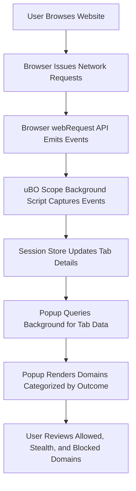

# Monitoring Network Connections on Any Site with uBO Scope

Explore how to use uBO Scope to inspect all network connections on any website you visit. This guide helps you distinguish between allowed, blocked, and stealth-blocked requests and effectively analyze third-party connections.

---

## 1. Workflow Overview

### Task Description
This guide walks you through the process of examining all network requests made by a specific webpage using the uBO Scope extension popup. It will help you understand which domains are connected, categorize connections by outcome, and interpret the results for privacy and security insights.

### Prerequisites
- uBO Scope installed and enabled in your browser.
- Active internet connection and a webpage loaded in the active tab.
- Basic familiarity with browser extensions and how to open extension popups.

### Expected Outcome
- You will be able to open the uBO Scope popup for the current tab.
- Understand the breakdown of domains connected: not blocked, stealth-blocked, and blocked.
- Use the extension to monitor real-time network connections.

### Time Estimate
Approximately 5 minutes to perform an initial analysis.

### Difficulty Level
Beginner to Intermediate

---

## 2. Step-by-Step Instructions

<Steps>
<Step title="Open the uBO Scope Extension Popup">
Open your browser and click the uBO Scope extension icon next to the address bar to open the popup window.

**Expected Result:** The popup will display information about the current tab, including domains connected and connection outcomes.
</Step>

<Step title="Understand the Popup Header">
At the top of the popup, view the hostname of the current tab.

- The main hostname is split into two parts: any subdomain (left) and the registrable domain (right).
- If there is no data yet, the popup will show "NO DATA".

**Expected Result:** Clear identification of the tab's hostname and domain.
</Step>

<Step title="Check the Summary Section">
Review the 'domains connected' count below the header.

- This number represents distinct third-party domains contacted during page load.

**Expected Result:** A numerical summary of third-party domains connected.
</Step>

<Step title="Examine Allowed Domains">
Look under the 'not blocked' section.

- This lists domains where network connections succeeded and were allowed.
- Each domain entry includes a count badge showing connection attempts.

**Expected Result:** A list of allowed domains, with counts, showing resources successfully loaded.
</Step>

<Step title="Review Stealth-Blocked Domains">
Scroll to the 'stealth-blocked' section.

- This contains domains that were blocked transparently by stealth techniques (e.g., redirects).

**Expected Result:** Understand domains stealthily blocked by content blocking or privacy protections.
</Step>

<Step title="Identify Blocked Domains">
Check the 'blocked' section for domains where connection attempts failed or were explicitly blocked.

- Counts here represent network requests that did not succeed.

**Expected Result:** Full visibility into blocked network requests per domain.
</Step>

<Step title="Interpret Domain Counts and Patterns">
Analyze counts beside domains to identify heavily contacted third parties.

- Higher counts may indicate frequent resource fetching.
- Low or zero counts may suggest rare or blocked connections.

**Decision Point:** Investigate domains with high request counts for privacy implications.
</Step>

<Step title="Refresh and Browse to Update Data">
Reload the page or navigate to new sites to see updates in the popup reflecting new network requests.

**Expected Result:** Real-time updating of connection data in the popup.
</Step>
</Steps>

---

## 3. Examples & Practical Use Cases

### Example Scenario: Checking Third-Party Connections on a News Site
1. Visit a news website in your browser.
2. Click the uBO Scope extension icon.
3. In the popup, observe:
   - Several allowed domains (e.g., content delivery networks).
   - Some stealth-blocked domains that may attempt to track.
   - Possibly blocked ad-serving domains.
4. Use this information to assess privacy exposure.

### Typical Output Snapshot:
| Section          | Domain Example                 | Count | Description                          |
|------------------|-------------------------------|-------|------------------------------------|
| Not Blocked      | cdn.examplecdn.com             | 12    | Allowed CDN connections             |
| Stealth-Blocked  | tracker.invisibleads.net       | 3     | Redirected or stealthily blocked   |
| Blocked          | ads.exampleads.com             | 8     | Explicitly blocked ad domains       |

---

## 4. Troubleshooting & Tips

<AccordionGroup title="Common Issues and How to Fix Them">
<Accordion title="Popup Shows 'NO DATA' or Remains Empty">
- Ensure you have an active tab with a loaded webpage.
- Reload the page to trigger network request monitoring.
- Verify the extension is installed and enabled.
</Accordion>

<Accordion title="Domain Lists Not Updating After Navigation">
- Refresh the popup by closing and reopening it.
- Ensure the browser supports the required `webRequest` APIs.
- Confirm no conflicts with other extensions blocking the popup.
</Accordion>

<Accordion title="High Domain Count But Low Connections Seen">
- Understand the count reflects distinct third-party domains, not total requests.
- Stealth-blocked connections may not fully appear counted but are categorized separately.
- Investigate filtering rules or browser privacy settings that impact monitoring.
</Accordion>

<Accordion title="Tips for Effective Analysis">
- Focus on domains with the highest request counts to identify key third parties.
- Use stealth-blocked and blocked sections to discover trackers and ads.
- Combine this with your content blocker’s reports for a full picture.
</Accordion>
</AccordionGroup>

---

## 5. Next Steps & Related Content

- **Interpreting the Badge and Popup**: Deepen understanding of the toolbar badge count and popup interface features.
- **Analyzing Third-Party Domains and Connections**: Learn how to investigate domain relationships and privacy impacts.
- **Validating Block Lists and Content Blockers**: Use uBO Scope to verify content blocker effectiveness.
- **Installation and Setup Guides**: For first-time users, ensure uBO Scope is correctly installed.

Explore the full documentation navigation to expand your mastery:
- [Using the Extension](https://example.com/getting-started/usage-and-troubleshooting/using-the-extension)
- [Understanding the Badge and Popup](https://example.com/guides/getting-started/understanding-the-badge-and-popup)

---

## 6. Diagram: Simplified Data Flow When Monitoring Connections

---

## Callout
<Tip>
To get the most meaningful results, analyze active browsing sessions on sites you frequent, paying particular attention to third-party domains with frequent connections.
</Tip>

---

For more information, refer to the related guides and overview documentation linked above.

---