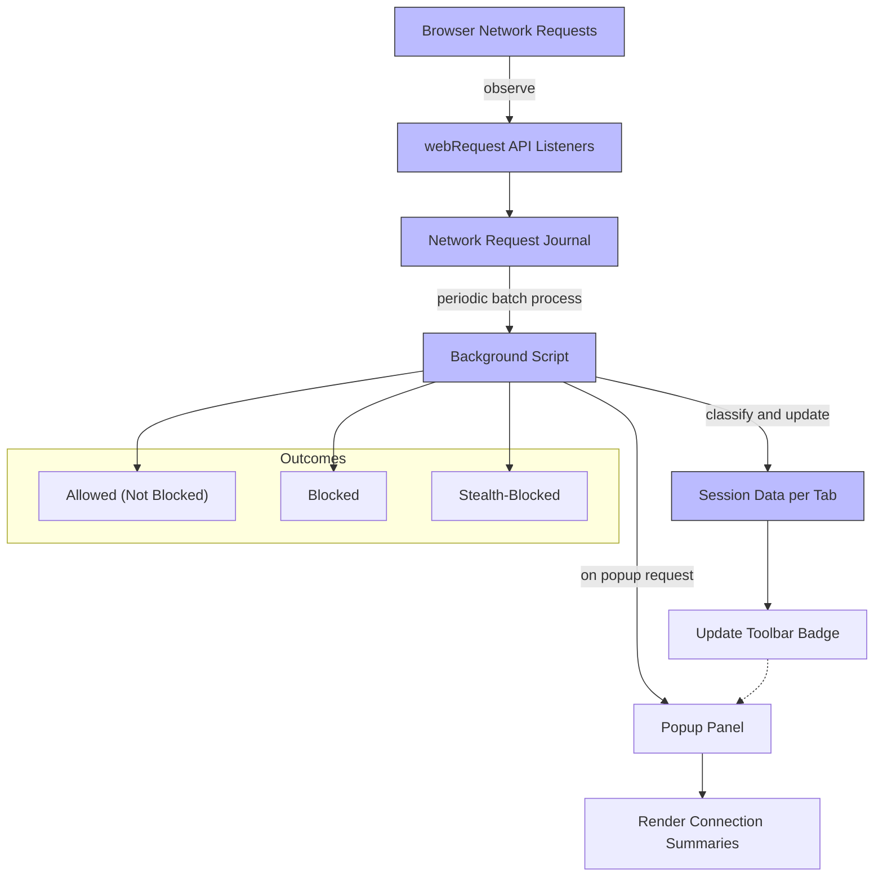

# Making Sense of Network Requests and Outcomes

## Workflow Overview

### What This Guide Helps You Accomplish

This guide reveals how uBO Scope gathers, classifies, and presents detailed information about network requests made by the active browser tab. It clarifies the distinctions between **allowed**, **blocked**, and **stealth-blocked** requests, helping you understand the actual effectiveness of your content blockers and browser privacy settings.

### Prerequisites

- uBO Scope installed and running in your browser
- An active browser tab with network activity (e.g., loading a website)
- Basic understanding of browser network connections and domains

### Expected Outcome

After following this guide, you will be able to:
- Interpret the data displayed by uBO Scope about network requests
- Understand the different outcomes of network requests
- Detect the behavior and impact of content blockers and browser privacy settings

### Time Estimate

5–10 minutes to understand and explore the connection report

### Difficulty Level

Beginner to intermediate — suitable for privacy-aware users and filter list maintainers

---

## How uBO Scope Collects and Displays Network Request Outcomes

### 1. Capturing Network Requests

uBO Scope monitors your browser's network activity through the browser's `webRequest` API. It listens asynchronously to three key events:

- **Redirects (`onBeforeRedirect`)**
- **Errors (`onErrorOccurred`)**
- **Successful Responses (`onResponseStarted`)

Requests matching your active tab are queued for processing to ensure timely and efficient aggregation.

### 2. Classifying Domain Outcomes

All recorded requests are analyzed and sorted into these distinct categories:

- **Allowed (Not Blocked):** Requests that successfully connected and fetched resources
- **Blocked:** Requests that failed due to blocking by a content blocker or browser security
- **Stealth-Blocked:** Redirected requests that are blocked in a manner intended to be undetectable by the originating webpage

Each category tracks counts by hostname and top-level domain to present a clear picture of what domains your browser interacted with.

### 3. Organizing Data for the Active Tab

For each active tab, uBO Scope maintains an internal data structure keeping track of:
- The main page's hostname and domain
- Allowed domains and hostnames
- Stealth-blocked domains and hostnames
- Blocked domains and hostnames

Requests on the main frame reset this tracking to ensure data corresponds to the current page.

### 4. Presenting the Results in the Popup Panel

The popup panel (opened by clicking the uBO Scope icon) displays:
- The hostname of the active tab
- A **summary** count of distinct connected domains
- Sections listing domains under the three categories mentioned above

Each domain entry shows the domain name along with the number of requests associated.

## Step-by-Step Instructions to Read and Understand Outcomes

### Step 1: Open the uBO Scope Popup Panel

- Click the uBO Scope icon in your browser toolbar.
- Wait for the popup panel to load the current tab's data.
- The main heading shows the current tab's hostname and subdomain details.

### Step 2: Understand Outcome Categories

- **Not Blocked (Allowed):** Domains from which your browser successfully retrieved data. These represent connections allowed by your content blockers and browser settings.

- **Stealth-Blocked:** Domains detected where requests underwent stealthy redirection blocking. These are network requests that were requested but silently blocked in a way that is less detectable to web pages.

- **Blocked:** Domains where network requests were outright denied or failed due to content blocking.

### Step 3: View Domains and Request Counts

- Within each category, domains are listed alphabetically.
- Each domain entry displays the number of requests made to that domain.
- The summary at the top shows the total number of distinct connected domains.

### Step 4: Interpret the Toolbar Badge Count

- The number on the uBO Scope toolbar icon represents the count of distinct **allowed** third-party domains contacted by the page.
- A *lower* badge count generally means fewer third parties were connected to — indicating possibly stronger privacy controls or fewer external dependencies.

### Step 5: Assess Content Blocker Effectiveness

- Use the counts in **blocked** and **stealth-blocked** sections alongside the allowed count to understand blocking activity.
- Beware that a high block count does not always mean better protection, as it might indicate that more requests were made in the first place.

### Step 6: Recognize Limitations

- Some network requests may not be observable if they bypass the browser's `webRequest` API.
- Not all third-party connections are malicious or undesirable; legitimate services like CDNs often appear in the allowed list.

## Practical Examples

### Example Scenario

Assume you open a news website in a tab:

- You open uBO Scope's popup panel.
- You see 3 distinct domains under **Not Blocked**: cdn.news.example, ads.example, analytics.example
- You see 2 domains under **Blocked**: trackers.example, ads.badexample
- You see 1 domain under **Stealth-Blocked**: stealthtracker.example

Interpretation:
- Your browser allowed resources from 3 domains.
- 2 domains were fully blocked, preventing content loading.
- 1 domain was stealth-blocked, likely blocked silently for privacy.
- The toolbar badge will show '3' as it reflects allowed domains.

## Troubleshooting & Tips

<AccordionGroup title="Troubleshooting & Tips for Interpreting Network Outcomes">
<Accordion title="Popup Panel Does Not Show Domain Data">
- Ensure you have an active tab with network traffic (reload if necessary).
- Verify uBO Scope has the required permissions.
- Check that the browser is compatible and updated.
</Accordion>
<Accordion title="Mismatch Between Badge Count and Popup Data">
- The badge count reflects only allowed third-party domains.
- Blocked domains do not add to the badge count.
- Stealth-blocked domains are categorized separately.
</Accordion>
<Accordion title="Unexpectedly High Allowed Domain Count">
- Consider that some pages legitimately require many third-party resources.
- High count could indicate fewer blocking rules enabled.
- Review Browser and extension settings for content blockers.
</Accordion>
<Accordion title="No Stealth-Blocked Domains Detected">
- Not all blocking methods generate stealth-blocked entries.
- Your content blocker settings or browser may not use stealth blocking.
</Accordion>
<Accordion title="Understanding Domain vs. Hostname">
- uBO Scope groups counts by domain (e.g., example.com) and includes subdomains (e.g., ads.example.com) as hostnames.
- This aggregation provides clearer insights into source entities.
</Accordion>
</AccordionGroup>

## Best Practices

- Regularly monitor your active tabs with uBO Scope, especially on privacy-critical sites.
- Use the combination of allowed, blocked, and stealth counts to evaluate blocker effectiveness.
- Interpret the badge count as a meaningful privacy indicator — lower is better.
- Avoid relying solely on ad-blocker test pages; use uBO Scope's real data.

## Next Steps & Related Content

- Review [Reading the Popup Panel: Understanding Connection Summaries](../reading-popup) for in-depth UI explanation.
- Explore [Comparing Content Blockers Objectively](../advanced-usage/comparing-content-blockers) to understand blocker comparisons.
- Learn about [Debunking Misleading Analytics and 'Ad Blocker Test' Pages](../advanced-usage/avoiding-bad-metrics) to avoid common evaluation pitfalls.
- If you encounter issues, consult [Troubleshooting Installation & Setup](../../getting-started/first-use-and-validation/troubleshooting-setup).

---

## Diagram: Flow of Recording and Displaying Network Request Outcomes

---

## Source Code Reference

For developers interested in how this process is implemented, start by reviewing the background script where network requests are captured, processed, and stored:

- [js/background.js#L46-L140](https://github.com/gorhill/uBO-Scope/blob/main/js/background.js#L46-L140) — Core network request event listeners and request outcome classification
- [js/popup.js](https://github.com/gorhill/uBO-Scope/blob/main/js/popup.js) — Popup rendering logic that presents outcomes

---

<u>By understanding the classification of network requests and the meaning behind allowed, blocked, and stealth outcomes, users gain precise insight into what is happening behind the scenes with their web browsing — empowering smarter privacy decisions and better filter management.</u>
