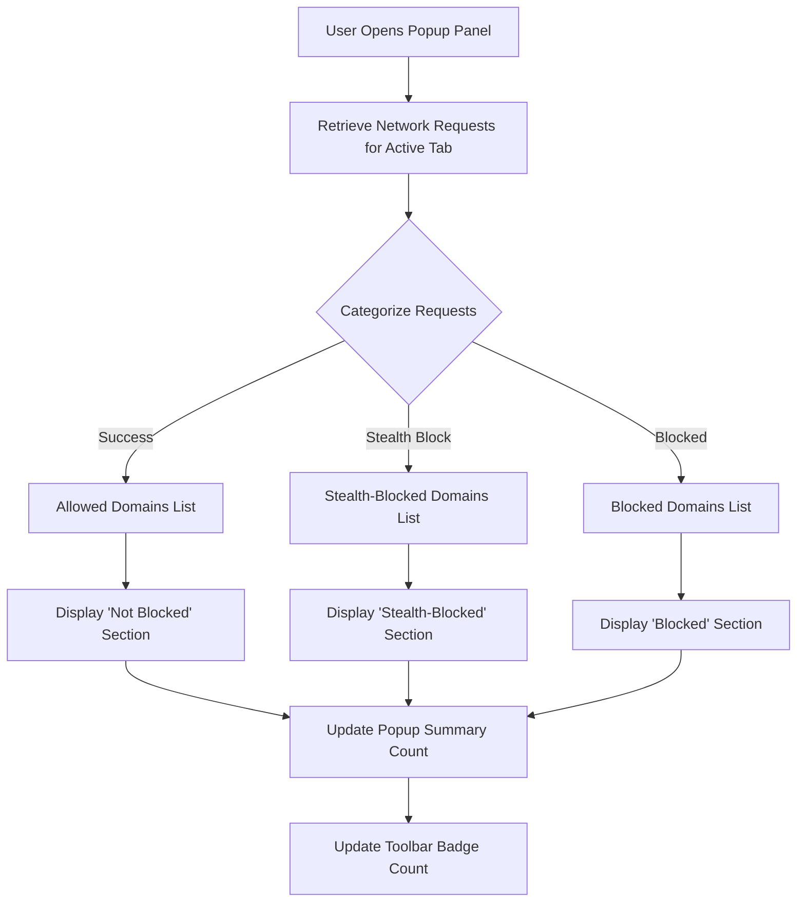

# Reading the Popup Panel: Understanding Connection Summaries

## Overview

The uBO Scope popup panel is your gateway to instantly understanding all third-party network connections attempted or established by the active webpage. This guide will help you interpret the connection summaries displayed in the popup, understand what each outcome category means (`not blocked`, `stealth-blocked`, and `blocked`), and how these insights reflect on your web privacy.

By mastering the popup panel, you empower yourself with clear visibility into the real-world impact of content blockers and network behaviors on the page you’re browsing.

---

## What This Guide Helps You Accomplish

- **Interpret the connection summary counts** for different network request outcomes.
- **Understand how the toolbar badge count reflects allowed connections.**
- **Gain insights into what third-party connections mean for privacy.**
- **Use the popup effectively to diagnose and analyze network behaviors on webpages.**

### Prerequisites

- uBO Scope extension installed and active in a supported browser (Chromium, Firefox, or Safari).
- Open the popup panel by clicking the uBO Scope toolbar icon while on a webpage.

### Expected Outcome

After following this guide, you will confidently read the popup panel data and comprehend the relationship between allowed, stealth-blocked, and blocked domains. You'll be able to correlate the badge count with active connections and use this information to evaluate web privacy and content blocker effectiveness.

### Time Estimate

5 minutes

### Difficulty Level

Beginner to intermediate – no technical background required.

---

## Understanding the Popup Panel Interface

When you open the uBO Scope popup, you see a structured panel divided into these key sections:

- **Current Page Domain:** Shows the active tab's domain with Unicode domain name support.
- **Summary Count:** Displays the total number of distinct third-party domains with connections.
- **Outcome Sections:** Three distinct areas listing domains categorized by their connection outcomes:
  - **Not Blocked:** Domains from which network connections succeeded.
  - **Stealth-Blocked:** Domains whose requests were stealthily blocked (hidden from webpages).
  - **Blocked:** Domains explicitly blocked and reported by content blockers.

Each outcome section includes a list of third-party domains along with the count of network requests made.

### How Counts Are Displayed

- Each domain is listed with a request count representing how many times that domain was contacted.
- The **Summary Count** at the top aggregates all distinct third-party domains currently allowed (i.e., `not blocked`).
- The **toolbar badge count** mirrors this summary count, providing quick at-a-glance insight.

### Unicode Domain Support

Domains appear in their Unicode form (human-readable internationalized domain names) thanks to integrated punycode decoding. This ensures clarity when domains use non-ASCII characters.

---

## Step-by-Step: Using the Popup Panel to Analyze Connections

<Steps>
<Step title="Open uBO Scope Popup">
Click the uBO Scope icon on your browser’s toolbar while you are on the webpage you want to analyze. This opens the popup panel displaying connection data for the active tab.
</Step>

<Step title="Identify the Current Page Domain">
Look at the top header, where the page’s hostname and domain are shown. This represents the address of the page whose third-party connections are summarized.
</Step>

<Step title="Read the Summary Count">
Observe the number next to 'domains connected:' which shows the total count of distinct third-party domains with allowed connections. This number directly impacts the toolbar badge count.
</Step>

<Step title="Understand the Allowed Domains Section">
Scroll to the 'not blocked' section. Here you see domains that your browser successfully connected to, indicating resources from these domains were fetched without interference. The count beside each domain shows the number of requests.
</Step>

<Step title="Explore Stealth-Blocked Domains">
Next, examine the 'stealth-blocked' area. These domains are ones where network requests were blocked silently, meaning the webpage is unaware these requests were intercepted. This helps prevent fingerprinting and obfuscates blocking.
</Step>

<Step title="Review Explicitly Blocked Domains">
Finally, review the 'blocked' section, listing domains whose requests were explicitly blocked and visibly denied by your content blocker or other blocking mechanisms.
</Step>

<Step title="Use This Data to Evaluate Privacy">
Use the counts and domains shown to understand how many third parties are contacted from the page, which are blocked, and which might be tracking you stealthily. A lower allowed count indicates fewer active third-party connections, and potentially better privacy.
</Step>
</Steps>

---

## Practical Tips & Best Practices

- **Focus on the allowed domains count:** This is the most important metric indicating how many third parties your browser connected to. A lower number means less tracking surface.
- **Stealth-blocked domains reveal sophisticated blocking:** They show where blockers prevent detection by the page itself, a critical factor for privacy.
- **Regularly check the popup when visiting new sites:** This helps you build awareness of third-party requests and track if blocking measures work.
- **Beware of the badge count misinterpretations:** The badge shows allowed third-party domains only, not blocked ones. Hence, a badge count of zero means no allowed third-party domains.
- **Use domain request counts to spot heavy trackers:** Domains with high request counts might be tracking or serving many embedded resources.

---

## Common Pitfalls & Troubleshooting

<AccordionGroup title="Troubleshooting Popup Panel Issues">
<Accordion title="Popup Shows 'NO DATA' or Blank">
- Ensure you have the extension installed and enabled.
- Verify your browser version supports required APIs.
- Reload the page or switch tabs to refresh data.
</Accordion>
<Accordion title="Badge Count Does Not Update">
- The badge updates after network requests are processed. Wait a few seconds.
- Confirm you have active network requests on the page.
- Check for browser-specific permission issues or disable conflicting extensions.
</Accordion>
<Accordion title="Domains Displayed Seem Unexpected">
- Remember domains are shown as third parties relative to the page.
- Some CDNs or service providers may appear frequently as third parties.
- Review domains for fakes or typos carefully.
</Accordion>
</AccordionGroup>

---

## How Connection Outcomes Are Determined

uBO Scope uses browser APIs to monitor network requests and classifies each third-party domain connection into one of three outcomes:

- **Not Blocked:** Requests that completed successfully.
- **Stealth-Blocked:** Requests blocked in a way that hides blocking from webpage scripts, such as redirects or silent failures.
- **Blocked:** Requests actively denied and reported as errors by blocking rules.

This classification helps you distinguish between visible and invisible blocking, critical for assessing privacy levels.

---

## Visual Representation

---

## Example Scenario

Imagine browsing a news website. You open the uBO Scope popup and see:

- **Not Blocked:** 5 domains including 'cdn.example-news.com' and 'analytics.tracker.com'
- **Stealth-Blocked:** 3 domains like 'ads.hidden-network.net'
- **Blocked:** 2 domains such as 'known-malware-site.com'

This means your browser allowed connections to 5 third-party domains. It quietly blocked requests to 3 domains without alerting the site, while 2 domains were visibly blocked. This granular breakdown informs you about what third parties are active and which are being filtered.

---

## Next Steps & Related Documentation

- **Validate Your Installation:** Confirm uBO Scope is properly installed and working ([link](https://github.com/gorhill/uBO-Scope/blob/main/doc/getting-started/first-use-and-validation/validating-installation.mdx)).
- **Reading the Popup Panel: Detailed UI Guide:** For a deeper understanding of UI elements and interactions.
- **Network Request Visibility:** Understand how requests are detected and recorded ([link](https://github.com/gorhill/uBO-Scope/blob/main/doc/guides/core-workflows/network-request-visibility.mdx)).
- **Troubleshooting Installation & Setup:** Solutions for common initial setup issues.

---

## Resources

- uBO Scope GitHub repository: [https://github.com/gorhill/uBO-Scope](https://github.com/gorhill/uBO-Scope)
- Public Suffix List (used for domain parsing): [https://publicsuffix.org/](https://publicsuffix.org/)

---