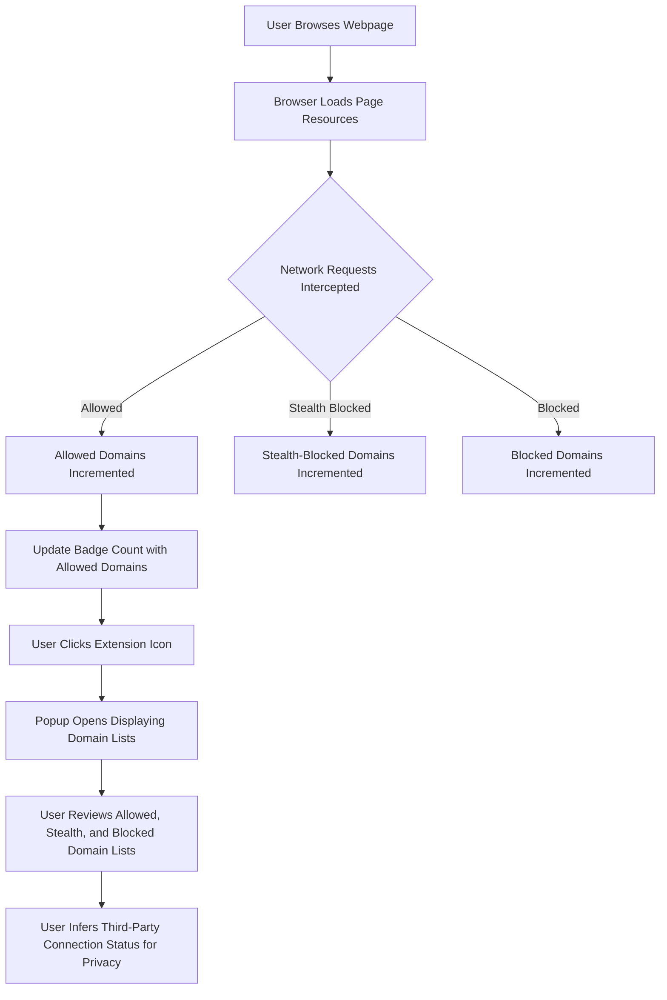

# Reading the Popup UI and Badge Counts

Understand how to interpret uBO Scope's main user interface elements: the badge count on the toolbar icon and the categorized connection lists visible in the popup panel. This guide empowers you to make sense of what the extension reports about network connections for the current active tab.

---

## 1. Overview of the Popup Interface and Toolbar Badge

### What This Guide Helps You Accomplish
This documentation explains how to read and interpret the core uBO Scope interface:

- The **badge count** indicating the number of distinct allowed third-party domains connected by the active tab.
- The **popup panel sections** showing domains categorized as Allowed, Stealth-Blocked, and Blocked.
- Understanding the significance of these categories for assessing network connections.

### Prerequisites
- uBO Scope installed and active on your browser.
- Basic familiarity with browsing tabs and opening extension popups.
- The current active tab has loaded content that initiated network requests.

### Expected Outcome
- Quickly understand how to interpret the badge count on the toolbar.
- Confidently read the domain lists and their associated counts within the popup.
- Distinguish between allowed, stealth-blocked, and blocked network connections.

### Time Estimate
5–10 minutes

### Difficulty Level
Beginner

---

## 2. Understanding the Toolbar Badge Count

- The badge number reflects **the count of distinct third-party domains with allowed network connections** for the currently active tab.
- A **lower badge count means fewer third-party connections**, which is generally better for privacy.
- This count **excludes blocked or stealth-blocked domains**, focusing solely on successful connections.
- The badge dynamically updates as the page loads resources and connections

<Info>
The badge shows domains, not connections. Multiple connections to the same domain count as one.
</Info>

---

## 3. Exploring the Popup Panel

### Opening the Popup
Click the uBO Scope icon in your browser’s toolbar to open the popup for the active tab.

### Interface Sections
The popup is divided into three main sections:

1. **Allowed** — domains the page connected to successfully and were not blocked.
2. **Stealth-Blocked** — domains detected as stealth-blocked (connections interfered with in a way that is less obvious than direct blocking).
3. **Blocked** — domains where the connection attempts were directly blocked.

Each section lists domains with:
- The domain name.
- The number of connections recorded for that domain.

### Hostname Display
At the top, the popup displays the hostname of the active tab. It separates root domain and subdomains for clarity.

---

## 4. Detailed Interpretation of Connection Categories

| Category        | What It Means                                                   | How to Interpret                                   |
|-----------------|----------------------------------------------------------------|---------------------------------------------------|
| Allowed         | Domains from which resources loaded successfully.              | These represent active third-party/network connections. Important for assessing exposure. |
| Stealth-Blocked | Connections that were silently redirected or interfered with.  | These may indicate blocking that doesn’t fully prevent domain access.
| Blocked         | Connection attempts actively blocked by some mechanism.       | Domains prevented from loading resources, indicating filtering.

<Note>
Stealth blocking is a nuanced category and may not prevent all network activity from these domains.
</Note>

---

## 5. Example Popup Data

When viewing the popup, you may see:

### Example Summary:
```
domains connected: 5
```

### Allowed Section:
- `cdn.example.com` (3 connections)
- `analytics.example.net` (1 connection)

### Stealth-Blocked Section:
- `ads.example.org` (2 connection attempts)

### Blocked Section:
- `tracker.example.co` (4 connection attempts)

This lets you instantly grasp which third-party domains your active tab communicated with and their network request outcomes.

---

## 6. Best Practices & Tips

- Use the **badge count** as a quick privacy indicator: fewer connections often imply less third-party tracking exposure.
- Always open the **popup to verify details**, as the badge won't show stealth-blocked or blocked domains.
- If you encounter unusually high allowed domain counts, investigate the Allowed section to identify any unexpected third parties.
- Remember that **not all third-party domains are malicious or unwanted**; some are essential services like CDNs.

<Warning>
Do not confuse a high block count on other blockers with better privacy. uBO Scope focuses on allowed connections — the actual exposure.
</Warning>

---

## 7. Troubleshooting Common Issues

### Badge Not Showing or Not Updating
- Ensure the extension has the necessary permissions granted (activeTab, webRequest).
- Confirm the site is accessed in a supported browser version.
- Try reloading the tab or restarting the browser.

### Popup Shows "NO DATA"
- The tab may have no network activity yet or failed to load.
- Check your network connection and refresh the tab.
- If persistent, verify that uBO Scope’s background processing is operational.

---

## 8. Next Steps & Related Documentation

- [Using the Popup Panel](https://docs.example.com/getting-started/using-and-validating/using-popup) — deeper guide on popup interaction and real-time updates.
- [Analyzing Network Request Outcomes](https://docs.example.com/guides/core-workflows/analyzing-network-request-outcomes) — understand how outcomes are classified.
- [Debunking Content Blocking Myths](https://docs.example.com/guides/use-cases-and-best-practices/debunking-common-myths) — interpret block counts correctly.
- Visit the [Official GitHub Repository](https://github.com/gorhill/uBO-Scope) to explore source and contribute.

---

## 9. Illustrative User Flow



---

## 10. Summary Table of UI Elements

| UI Element            | Function                                   | User Action                     |
|-----------------------|--------------------------------------------|--------------------------------|
| Toolbar Badge         | Shows count of distinct allowed domains   | Click to open popup            |
| Popup Hostname Header | Displays active tab’s hostname and domain | Read for context               |
| Allowed Domains List  | Lists allowed third-party domains & counts| Review domains and connection counts |
| Stealth-Blocked List  | Lists stealth-blocked domains & counts    | Identify stealth blocking       |
| Blocked Domains List  | Lists blocked domains & counts             | Recognize blocked requests      |

---