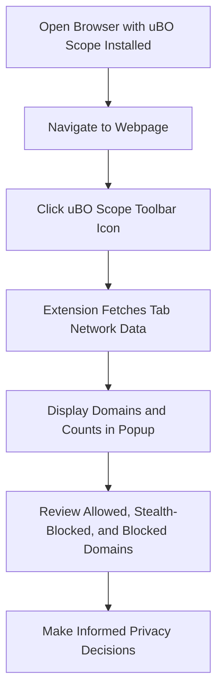

# Revealing All Remote Connections on a Webpage

Discover every third-party server that a webpage connects to, whether these connections succeed, are stealth-blocked, or outright blocked. This guide empowers you to unveil hidden network activities behind your browsing sessions and understand the full picture of remote server interactions.

---

## Workflow Overview

### Task Description
This guide helps you use uBO Scope’s popup panel to reveal all remote server connections related to the currently active webpage/tab, categorizing them by their actual connection outcome.

### Prerequisites
- uBO Scope must be installed in your Chromium, Firefox, or Safari browser.
- You need to have at least one active tab open with a webpage loaded.
- The extension’s permissions must be granted, including `webRequest` and `activeTab`.

### Expected Outcome
By completing this guide, you will:
- Open the uBO Scope popup for an active tab.
- View all third-party remote servers contacted by that webpage.
- Understand which connections were allowed, stealthily blocked, or blocked.
- Analyze domain-level summaries with request counts.

### Time Estimate
Approximately 3-5 minutes.

### Difficulty Level
Beginner to Intermediate—no technical background needed.

---

## Step-by-Step Instructions

### 1. Open uBO Scope Popup for the Active Tab

- Locate the uBO Scope browser extension icon in your toolbar.
- Click the icon to open the popup panel.

**Expected Result:**
The popup displays connection data related to the active tab.

### 2. Interpret the Tab Hostname Display

- At the top, the header shows the current tab’s hostname and its base domain.
- If no data is available (e.g., on a new tab or unsupported page), it will show 'NO DATA'.

**Tip:** This confirms the popup is showing data for the correct webpage.

### 3. Examine the Summary Section

- Below the hostname header is a summary stating the total number of distinct connected domains.
- This number equals the count shown on the toolbar badge.

**Tip:** A lower number indicates fewer third-party connections.

### 4. Review Detailed Connection Categories

uBO Scope classifies remote connections in three groups:

- **Not Blocked (Allowed):** Domains of remote servers that the webpage successfully connected to.
- **Stealth-Blocked:** Domains where network requests were stealthily blocked (subtle blocking by content blockers).
- **Blocked:** Domains where requests were outright blocked or failed.

Each category shows a list of domains with the count of connection attempts.

### 5. Analyze Domain Names and Counts

- Domain names are displayed with Unicode support for internationalized domains.
- Count shows how many network requests were made to each domain.

**Best Practice:** Pay attention to unexpected or unfamiliar third-party domains.

### 6. Refresh or Change Tabs to Update Data

- Switch to another tab and open the popup again to see its remote connection data.
- Reload the webpage in the active tab to refresh the connections.

**Expected Result:** Popup dynamically updates to reflect the current tab’s network activity.

---

## Practical Example

Imagine you visit `https://example.com`.

- Open the uBO Scope popup.
- The header shows `example.com` as the hostname and domain.
- The summary reports `5` connected domains.
- Under "Not Blocked," you see domains like `cdn.example.net` with a count of `12`.
- Under "Stealth-Blocked," you see a domain like `tracking.thirdparty.com` with a count of `3`.
- Under "Blocked," a domain like `ads.badserver.io` is listed with count `8`.

This lets you directly understand which third parties are fetched normally, which are stealthily blocked, and which are blocked, giving transparency to network traffic.

---

## Troubleshooting & Tips

<AccordionGroup title="Common Issues and How to Fix Them">
<Accordion title="Popup Shows 'NO DATA' or Empty">
- Ensure you have an active webpage loaded and try reloading the tab.
- Verify uBO Scope extension permissions (`webRequest`, `activeTab`) are granted.
- Reload or reinstall the extension if the problem persists.
</Accordion>
<Accordion title="Badge Count Not Updating">
- Wait a few seconds after page loads; connection data updates asynchronously.
- Reload the active tab to trigger a fresh data capture.
- Confirm you are browsing over HTTP/S or WebSocket protocols, as these are monitored.
</Accordion>
<Accordion title="Unexpected High Number of Connections">
- Not all third-party domains are malicious; many legitimate CDNs or APIs will appear.
- Use domain lookups or online reputation services to investigate unfamiliar domains.
- Consider cross-checking against your content blockers’ block logs.
</Accordion>
</AccordionGroup>

### Best Practices
- Regularly check connections on sites you frequent to monitor third-party activity.
- Use the stealth-blocked and blocked categories as indicators of your content blocker’s effectiveness.

### Performance Considerations
- uBO Scope listens to browser network events but does not block or slow connections itself.
- It is designed to have minimal impact on browsing performance.

### Alternative Approaches
- Complement uBO Scope with network monitoring tools or browser developer tools for more granular packet info.

---

## Next Steps & Related Content

- Explore the guide **Interpreting the Badge Count and Popup Breakdown** to deepen your understanding of the connection categories.
- Review **Debunking Toolbar Badge Myths** to avoid common misconceptions about connection counts.
- Visit the **Installing uBO Scope** page if you have not installed the extension yet.
- For troubleshooting, see **Troubleshooting Common Issues**.

---

## Visual Workflow of Using uBO Scope Popup

---

## Additional Resources

- GitHub Repository: [uBO-Scope GitHub](https://github.com/gorhill/uBO-Scope)
- Related Documentation:
  - [What Is uBO Scope?](/overview/intro-value/about-ubo-scope)
  - [Core Concepts & Terminology](/overview/architecture-concepts/key-terminology)
  - [Installing uBO Scope](/getting_started/installation_and_setup/installing_ubo_scope)
  - [Interpreting the Badge Count and Popup Breakdown](/guides/core-workflows/interpreting-badge-and-popup)

---

Start revealing the hidden paths of your browsing activity with confidence and clarity using uBO Scope’s remote connection viewer.
