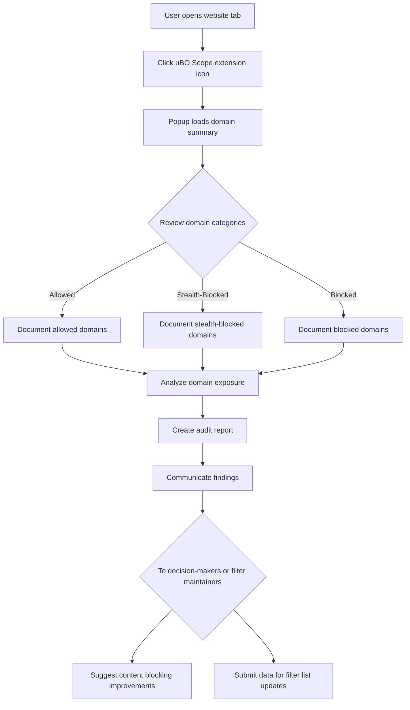

# Conducting Site Privacy Audits with uBO Scope

## Overview

This guide details how to use uBO Scope’s reports to perform comprehensive privacy audits of websites by cataloging outbound network requests. You will learn to document observed connections, identify stealth-blocked domains, and effectively communicate findings to decision-makers or filter maintainers.

---

## What You Will Achieve

- Understand the types of network request outcomes reported by uBO Scope.
- Learn to distinguish allowed, blocked, and stealth-blocked domains in a site’s privacy audit.
- Develop a method for documenting and interpreting privacy exposure based on connection counts.
- Gain strategies for summarizing and communicating findings clearly.

---

## Prerequisites

- Have uBO Scope installed and fully operational in your supported browser. See [Installing uBO Scope](https://github.com/gorhill/uBO-Scope) guide for installation steps.
- Familiarity with basic browser extension operations and accessing the uBO Scope popup interface.
- The site you want to audit should be loaded in the active browser tab.

---

## Time Estimate

10-20 minutes per site, depending on audit depth and documentation detail.

---

## Difficulty Level

Intermediate — suitable for privacy-conscious users and professionals familiar with web requests and content blocking.

---

## Step-by-Step Workflow

### Step 1: Open uBO Scope Popup on the Target Website

1. Navigate to the website you wish to audit in your browser.
2. Click the uBO Scope extension icon to open the popup.
3. Observe the hostname displayed at the top, confirming it matches the site under analysis.

<Check>
Always verify the domain displayed corresponds exactly to the active tab to ensure accurate audit context.
</Check>

### Step 2: Review the Summary of Connected Domains

Within the popup, locate the **domains connected** count summary:

- This number indicates the total distinct third-party domains the website connected to.
- A lower number generally signifies a smaller privacy footprint.

### Step 3: Analyze Domain Sections

The popup categorizes network requests by these outcomes:

- **Not Blocked (Allowed)**: Domains from which network resources were successfully fetched.
- **Stealth-Blocked**: Domains where requests were blocked using stealth blocking mechanisms, invisible to the webpage but recorded by uBO Scope.
- **Blocked**: Domains for which requests were directly blocked and failed.

Each section lists domains along with a connection count representing how many requests were made.

---

### Step 4: Document Findings

Create a record categorizing domains as per the popup sections:

- List all **Allowed** domains as active connections potentially affecting privacy.
- Include **Stealth-Blocked** domains separately, noting their stealth status which may suggest attempts to prevent detection.
- Record **Blocked** domains to understand which providers are prevented from connecting.

Example documentation format:

| Category         | Domains                              | Notes                              |
|------------------|------------------------------------|----------------------------------|
| Allowed          | example-cdn.com, analytics.com     | Active third-party domains       |
| Stealth-Blocked  | stealth-tracker.com                 | Blocked silently                 |
| Blocked          | adserver.com, trackinghub.net      | Fully blocked domains            |

### Step 5: Interpret and Assess Privacy Exposure

- **Allowed Domains** represent the actual network exposure of the site.
- **Stealth-Blocked Domains** indicate domains that were targeted by sophisticated blocking methods, signaling tracking or data collection attempts.
- **Blocked Domains** show what is prevented from loading, useful to verify content blocker effectiveness.

Use this categorization to gauge the privacy risk posed by the website.

### Step 6: Communicate Results

- Summarize the audit in clear, non-technical language for decision-makers.
- Highlight stealth-blocked domains as potential privacy threats that evaded typical detection.
- Present actionable recommendations, such as employing stricter content blockers or filter lists.
- For filter maintainers, provide detailed domain counts and observed stealth-blocked domains to aid list refinement.

---

## Practical Tips & Best Practices

- **Focus on Domains, Not Just Requests:** Multiple requests may come from the same domain; counting unique domains better reflects privacy exposure.

- **Watch for Stealth Blocking:** Stealth-blocked domains indicate advanced blocking by content blockers and help reveal hidden trackers.

- **Leverage the Badge Counts:** The toolbar badge shows distinct allowed third-party domains, a useful quick metric during auditing.

- **Perform Multiple Audits:** Visit multiple pages on the site to capture different third-party behaviors.

- **Keep Context:** Use recorded hostnames and domains to understand if requests are first-party or third-party interactions.

---

## Common Pitfalls and How to Avoid Them

- **Misreading Stealth-Blocked Domains as Allowed:** They are blocked silently, so treat them as blocked but potentially stealth tracking attempts.

- **Ignoring Subdomains and Domain Levels:** uBO Scope resolves hostnames to their registered domains using the public suffix list, simplifying the audit.

- **Relying Solely on Block Counts:** High block counts don’t guarantee better privacy—the number of allowed distinct domains matters more.

- **Not Verifying Tab Context:** Ensure you audit the correct active tab; data shown corresponds only to the active site in the popup.

---

## Troubleshooting

If the popup shows **NO DATA** or domains appear missing:

- Ensure uBO Scope has the necessary permissions and is active.
- Refresh the audited website tab and reopen the popup.
- Confirm your browser supports the `webRequest` API reporting as required.
- Refer to [Troubleshooting Common Setup Issues](https://documentation/guides/getting-started/using-extension/troubleshooting-setup) for detailed fixes.

---

## Example Scenario

**You want to audit `https://example.com` for privacy exposure:**

1. Open the website tab.
2. Click the uBO Scope icon.
3. Observe that the summary shows 5 connected domains.
4. Review the allowed list, seeing `cdn.examplecdn.com` and `analytics.anotherdomain.net`.
5. See stealth-blocked domain `hiddentracker.xyz` indicating concealed blocking.
6. Blocked domains include `ads.badads.com`.
7. Document these findings in a report highlighting stealth-blocked domains as privacy risks.
8. Provide recommendations based on the results.

---

## Visual Diagram: Site Privacy Audit Workflow Using uBO Scope

---

## Next Steps and Further Learning

- Review the [Popup Interface Guide](https://documentation/guides/getting-started/using-extension/popup-ui-guide) to deepen understanding of the popup’s data presentation.
- Explore [Investigating Third-Party Requests](https://documentation/guides/core-workflows/investigating-third-party-requests) for detailed analysis workflows.
- Consult [Comparing Content Blockers Accurately](https://documentation/guides/core-workflows/comparing-content-blockers) to understand privacy implications across blockers.
- For troubleshooting, see [Troubleshooting Common Setup Issues](https://documentation/guides/getting-started/using-extension/troubleshooting-setup).

---

## Resources

- GitHub repository: [uBO Scope on GitHub](https://github.com/gorhill/uBO-Scope)
- uBO Scope Badge Counts and API details: see [What is uBO Scope?](https://documentation/overview/product-introduction/what-is-ubo-scope)
- Public Suffix List used for domain resolution: [publicsuffix.org](https://publicsuffix.org/)

---