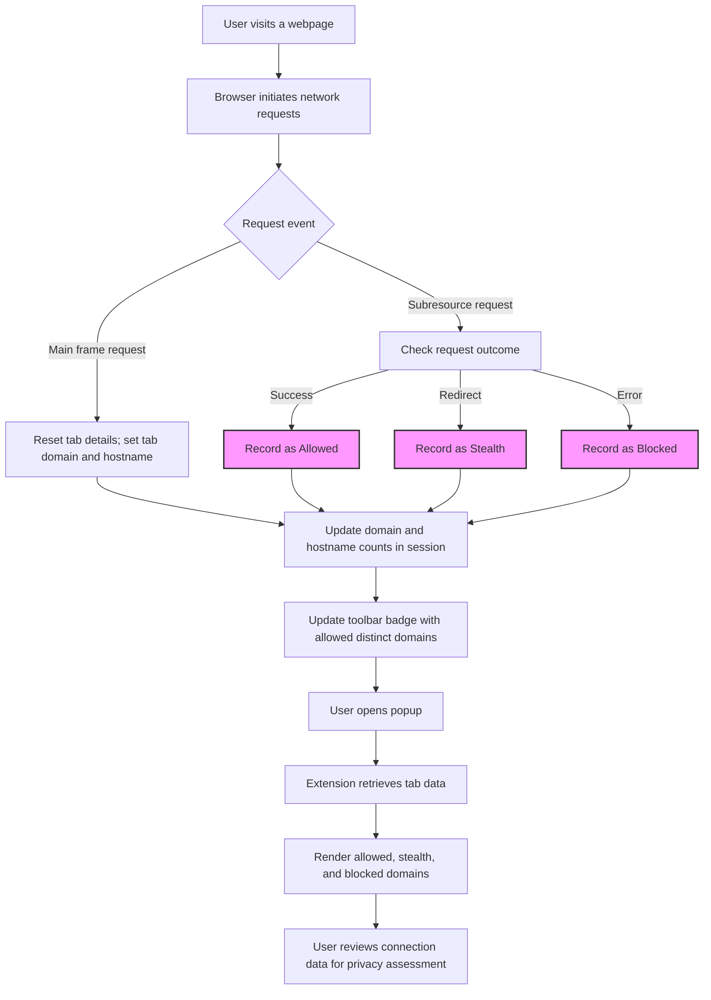

# Tracking Third-Party Remote Connections with uBO Scope

## Overview

This guide helps users understand how to monitor all attempted and successful connections that a webpage makes to third-party servers using uBO Scope. By tracking these connections, the extension provides a window into your browser’s network activities, enabling you to assess your privacy exposure and the effectiveness of content blocking.

### What You'll Learn
- How uBO Scope collects and categorizes connection data.
- The meaning of different connection outcomes: allowed, blocked, and stealth-blocked.
- How to interpret domain and hostname distinctions in displayed data.
- Practical techniques to use this information for privacy assessment.

---

## Prerequisites

- uBO Scope installed and enabled on your supported browser (Chrome, Firefox, Safari).
- Basic familiarity with browsing tabs and the browser toolbar.
- Active internet connection to visit websites and generate network requests.

---

## Expected Outcome

You will be able to view within uBO Scope's popup the list of third-party domains your current tab contacted or attempted to contact, differentiated by whether connections were allowed, blocked, or stealth-blocked. This visibility empowers you to:

- Recognize unexpected or excessive third-party requests.
- Understand the effectiveness of your content blocker.
- Make informed decisions about privacy and security.

---

## How uBO Scope Tracks Connections

uBO Scope leverages your browser's `webRequest` API to monitor all network requests originating from the active tab. It tracks requests regardless of other blocking methods, including DNS-based filtering, as long as these requests traverse the browser's API.

### Connection Outcomes

Each connection attempt is categorized into three groups:

- **Allowed:** Network requests that successfully reached remote servers.
- **Blocked:** Requests that the browser or content blockers explicitly blocked.
- **Stealth-blocked:** Requests hidden from the page via redirects or other stealth techniques.

This classification helps you see not only what passes through but also what was stopped or masked.

---

## Step-by-Step: Observing and Understanding Connections

<Steps>
<Step title="Open uBO Scope Popup for Current Tab">
To inspect connections for the page you are viewing:
- Click the uBO Scope icon in your browser's toolbar.
- The popup opens showing connection data relevant to the active tab.
</Step>

<Step title="Identify the Hostname and Domain">
At the top of the popup, the site's hostname and registered domain are displayed:
- The first part (in the left span) shows subdomains.
- The second part shows the core registered domain.
This helps you contextualize the origin of the network requests.
</Step>

<Step title="Review Domain Connection Summary">
The summary section shows the count of distinct domains connected in the current tab, giving an immediate sense of third-party exposure.
</Step>

<Step title="Explore Connection Outcomes">
Three main sections categorize connected domains:
- **Not blocked:** Domains where connections were allowed.
- **Stealth-blocked:** Domains where connections were stealthily blocked.
- **Blocked:** Domains with outright blocked connections.

Each section lists domains alongside the number of requests attempted or succeeded.
</Step>

<Step title="Interpret Counts and Domains">
For each domain listed:
- The count indicates how many hostnames or requests originated from that domain.
- Punycode is automatically decoded to Unicode to display internationalized domain names clearly.

This detailed listing helps identify frequent third-party connections and possible privacy implications.
</Step>
</Steps>

---

## Practical Example

Imagine you visit a news site:

- Open the uBO Scope popup.
- You see the site’s domain at the top (e.g., `news.example.com`).
- The summary shows "domains connected: 12".
- In "Not blocked," you recognize legitimate domains such as content delivery networks (CDNs).
- In "Blocked," you spot advertising domains which got blocked.
- "Stealth-blocked" shows domains where requests were redirected or hidden.

This snapshot lets you assess if your content blocker is working properly and if any surprising third parties are accessing your data.

---

## Tips for Effective Use

- **Frequent checks:** Use the popup regularly when visiting sites to monitor third-party exposure trends.
- **Compare with other blockers:** Complement your assessment by checking how different blockers affect the lists.
- **Watch stealth-blocked domains:** Domains here can indicate hidden tracking attempts.
- **Consider domain vs. hostname:** Domains group related hostnames, giving a high-level overview.

---

## Troubleshooting

<AccordionGroup title="Common Issues When Tracking Connections">
<Accordion title="Popup Shows 'NO DATA' or Empty Lists">
- Ensure you have permitted the extension to access the active tab.
- Confirm uBO Scope is properly installed and enabled.
- Reload the page to generate fresh network requests.
- See [Troubleshooting Common Setup Issues](../getting-started/making-first-use/troubleshooting-install) for detailed guidance.
</Accordion>

<Accordion title="Counts Do Not Update or Seem Incorrect">
- uBO Scope updates badges and data about once per second after network activity stops.
- Allow a moment after browsing to see updated info.
- If problems persist, check your browser's permissions and extension conflicts.
</Accordion>

<Accordion title="Unicode Domains Display Incorrectly">
- uBO Scope decodes punycode to Unicode.
- If you see encoding issues, refresh the extension by disabling and re-enabling it.
</Accordion>
</AccordionGroup>

---

## What Happens Behind the Scenes (User-Relevant Summary)

Each network event is intercepted by uBO Scope’s background service. It captures details such as:

- Request type (main frame, sub-resource, etc.)
- URL and hostname
- Outcome event (success, error, redirect)

Data is aggregated and categorized per tab, then presented on demand in the popup panel.

The badge count on the toolbar icon reports the number of distinct allowed third-party domains for the active tab, giving quick insight without opening the popup.

---

## Next Steps

Once comfortable with observing connections:

- Visit [Interpreting the Toolbar Badge Count](../guides/core-workflows/interpreting-badge-counts) to learn how the badge relates to your privacy exposure.
- Explore [Navigating the Popup UI](../guides/getting-started/navigating-the-popup) for comprehensive understanding of the interface.
- Review [Best Practices: Interpreting Network Results](../guides/advanced-tips/best-practices-interpreting-results) to deepen your analysis skills.

---

## Additional Resources

- [What is uBO Scope?](../overview/introduction-core-concepts/what-is-ubo-scope) — Understand the extension's purpose and philosophy.
- [Core Concepts & Terminology](../overview/introduction-core-concepts/core-terminology) — Learn important definitions for third-party tracking and network outcomes.
- [System Architecture Overview](../overview/architecture-features/system-architecture) — For insights into internal workings.

---

## GitHub Source

To explore implementation details or contribute, visit the source on GitHub:

<https://github.com/gorhill/uBO-Scope>

---

## Visual Workflow Diagram

