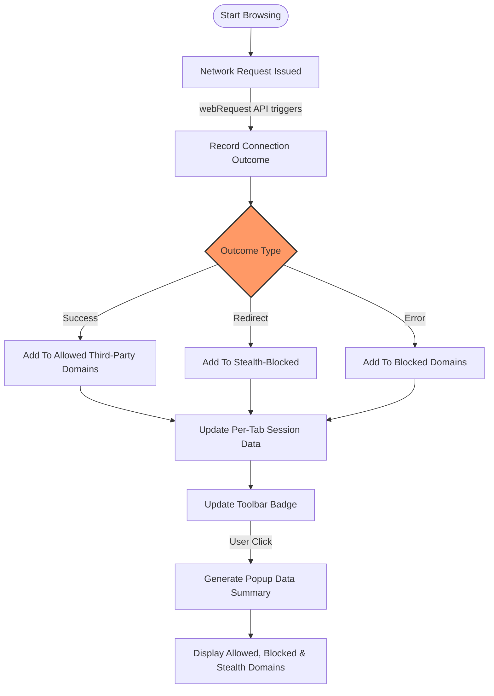

# Understanding Badge Counts and Connection Outcomes

## Workflow Overview

- **Task Description**: This guide helps you understand how uBO Scope counts third-party connections per browser tab, the significance of connection outcomes categories (allowed, blocked, stealth-blocked), and how these metrics empower you to evaluate privacy status on any webpage.
- **Prerequisites**: uBO Scope installed and running in a supported browser (Chrome, Firefox, Safari). Basic familiarity with browsing tabs and accessing the extension popup.
- **Expected Outcome**: You will clearly comprehend what the toolbar badge number means, how connection outcomes are tracked and categorized, and how the extension visualizes network activity on a per-tab basis.
- **Time Estimate**: 10-15 minutes
- **Difficulty Level**: Beginner to Intermediate

---

## How uBO Scope Counts and Categorizes Connections

uBO Scope tracks connections that your browser attempts or completes to remote servers while browsing webpages. It focuses specifically on **third-party** network connections — those to remote servers distinct from the site you are visiting.

### The Core Metric: The Toolbar Badge Count

- The toolbar badge number reflects the **count of distinct third-party domains** from which network requests were successfully allowed during the current tab session.
- **Lower counts indicate better privacy**, as fewer external third-party connections are established.
- This count only includes **allowed connections**, excluding those that were blocked or stealth-blocked.

### Connection Outcome Categories

uBO Scope classifies each network request outcome into one of three distinct categories:

1. **Allowed (Not Blocked)**
   - Requests that succeeded in connecting to third-party domains.
   - These domains appear under the “not blocked” category in the popup UI.
   - They contribute to the badge count shown on the toolbar.

2. **Blocked**
   - Requests that failed due to active blocking by content blockers or network errors.
   - These domains are shown under the “blocked” category.
   - They do *not* contribute to the badge count.

3. **Stealth-Blocked**
   - Requests that were secretly blocked or interrupted through stealth techniques (such as redirects or stealthy filtering that the page cannot detect).
   - These are shown in the “stealth-blocked” category.
   - Also do *not* contribute to the badge count.

---

## Detailed User Workflow: Tracking Third-Party Connections per Tab

### Step 1: Monitor the Toolbar Badge

- When you open a webpage, watch the **uBO Scope toolbar icon**.
- The **number displayed is the count of unique third-party domains successfully contacted** on the current tab.
- An empty badge indicates no third-party connections have been observed yet or allowed.

### Step 2: Open the uBO Scope Popup for Detailed Insights

- Click the toolbar icon to open the popup interface.
- Observe the top section showing the total number of connected domains.
- Review the three outcome sections, each listing third-party domains and the count of requests per domain:
  - **Not Blocked:** Domains contacted successfully.
  - **Stealth-Blocked:** Domains whose connections were stealthily blocked.
  - **Blocked:** Explicitly blocked domains.

### Step 3: Analyze Per-Domain Counts

- Each domain entry includes a count indicating how many requests were made to it.
- This helps you identify heavily contacted or potentially privacy-relevant domains.

### Step 4: Understand Connection Attribution

- uBO Scope records these details **per browser tab**, ensuring analysis is scoped to your current browsing context.
- For your current tab, the extension stores:
  - The tab's main domain and hostname.
  - Counts of domains and hostnames per outcome category.

### Step 5: Use Insights to Assess Privacy

- A high number of allowed third-party domains warrant closer inspection.
- Identifying domains blocked or stealth-blocked helps confirm your content blockers' effectiveness.

---

## Practical Example

Suppose you visit `example.com`. During loading:

- The toolbar badge shows **7**, meaning 7 unique third-party domains were successfully contacted.
- Opening the popup reveals:
  - Not Blocked: `cdn.example.net` (10 requests), `analytics.example.org` (3 requests)
  - Stealth-Blocked: `tracker.hidden.com` (2 requests)
  - Blocked: `ads.badsite.net` (4 requests)

From this, you know which third-party connections actually happened, which were blocked visibly, and which were stealthily interrupted.

---

## Practical Tips & Best Practices

- **Review badge counts regularly:** Use the number as a quick privacy health check.
- **Open the popup on different tabs:** Compare connection patterns across sites.
- **Look for unexpected allowed domains:** These might indicate unwanted trackers or CDNs.
- **Correlate blocked and stealth block lists:** Ensure your blockers are effective.
- **Remember domain grouping:** Connections are counted by distinct domains, not individual hosts; this avoids inflated counts due to subdomains.

---

## Common Pitfalls to Avoid

- **Confusing badge counts with block efficiency:** The badge counts allowed domains only; a higher count may indicate less effective blocking.
- **Ignoring stealth blocks:** These can be subtle but important privacy protections.
- **Assuming all third-party domains are malicious:** Legitimate sites often load content from well-known CDNs or services.

---

## Troubleshooting

**If badge count is zero or popup shows NO DATA:**
- Confirm uBO Scope is properly installed and enabled.
- Ensure the current tab has active network activity.
- Check browser permissions and that the extension can access webRequest APIs.
- Visit the [Troubleshooting: No Data or Empty Popup](https://docs.ubos.com/getting-started/troubleshooting/troubleshooting-no-data) guide for detailed steps.

**If counts do not update live:**
- Refresh the current tab.
- Confirm your browser version supports the required APIs.

---

## How It Works Behind the Scenes (For Context)

- uBO Scope’s background script listens to browser network events (success, redirect, error) using webRequest APIs.
- For each network event, it extracts the hostname and computes the registered domain using the Public Suffix List.
- Connections are categorized and counted in session data keyed per tab.
- The toolbar badge updates dynamically to reflect allowed distinct third-party domains.
- The popup fetches tab-specific data asynchronously and renders it for user comprehension.

---

## Diagram: Overview of uBO Scope Connection Tracking Flow

---

## Next Steps & Related Guides

- Explore [Using uBO Scope for Privacy Diagnostics](https://docs.ubos.com/guides/core-workflows/using-for-diagnostics) to apply these insights to real privacy assessments.
- Review [Exploring the uBO Scope Popup Interface](https://docs.ubos.com/guides/getting-started/exploring-popup-ui) for detailed UI navigation.
- Consult [Troubleshooting: No Data or Empty Popup](https://docs.ubos.com/getting-started/troubleshooting/troubleshooting-no-data) if you face data display issues.

---

## References

- [uBO Scope Source Code: background.js](https://github.com/gorhill/uBO-Scope/blob/main/js/background.js)
- [Popup UI Script: popup.js](https://github.com/gorhill/uBO-Scope/blob/main/js/popup.js)
- [Core Terminology](https://docs.ubos.com/overview/core-concepts-architecture/core-terminology)
- [How It Works: Architectural Overview](https://docs.ubos.com/overview/core-concepts-architecture/how-it-works-architecture)

---