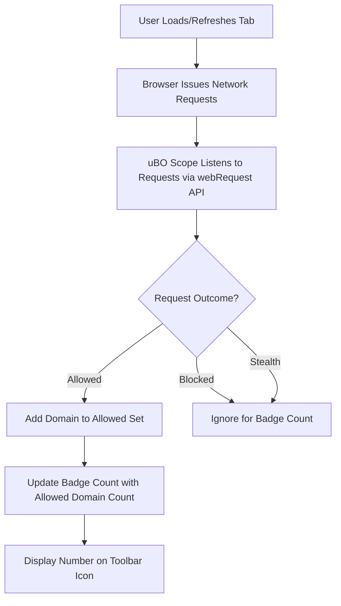

# Understanding and Using the Toolbar Badge Count

## Workflow Overview

### What This Guide Helps You Accomplish
This guide empowers you to understand and leverage the badge count displayed on uBO Scope's toolbar icon. By following this, you will be able to:
- Interpret what the badge numbers represent.
- Understand why a lower badge count is preferable.
- Recognize scenarios where badge data might be influenced or limited.

### Prerequisites
- uBO Scope installed and activated in your supported browser (Chrome, Firefox, Safari).
- Basic familiarity with browser extensions and the uBO Scope popup panel.

### Expected Outcome
After completing this guide, you will confidently decipher the badge count meaning, use it for privacy assessment, and avoid common misinterpretations that could arise from the counts.

### Time Estimate
Approximately 10 minutes.

### Difficulty Level
Beginner to Intermediate.

---

## Step-by-Step Guide to Understanding the Badge Count

### 1. What the Badge Count Represents
- The badge on the toolbar icon shows **the number of distinct third-party remote domains** your current active browser tab has connected to successfully.
- This count is aggregated from all network requests not blocked by content blockers, DNS filtering, or other means.

✅ Action: When you see the badge number, interpret it as how many unique external sources web pages are connecting to behind the scenes.

### 2. Why a Lower Count Is Better
- Privacy-conscious browsing aims to minimize connections to third-party domains.
- Legitimate usage typically involves only a small number of trusted third-party domains (such as major CDNs).
- A high badge count indicates a larger footprint of external servers potentially tracking or serving content.

✅ Action: Use the badge count to evaluate how much external exposure a website generates. Lower numbers typically mean better privacy.

### 3. How the Badge Count Updates
- The extension listens to your network requests in the background.
- Each unique allowed third-party domain increases the badge count.
- The badge updates dynamically as the tab loads or when new connections occur.

✅ Action: Watch for badge count changes when loading or refreshing pages to observe domain connection patterns.

### 4. What the Badge Does Not Show
- It does **not** count blocked or stealth-blocked domains (connections your content blocker prevented).
- It excludes internal or first-party domains.
- Network requests outside your browser's `webRequest` API monitoring scope (e.g., certain system-level DNS or non-browser apps) aren’t included.

<Note>
The badge count only reflects the visible third-party connections detected by uBO Scope through browser APIs. It does not represent all network activity on your system.
</Note>

### 5. Situations Affecting Badge Accuracy
- Private or incognito windows may impact data visibility.
- Some browsers or extension permissions might limit access to `webRequest` events.
- Network conditions and redirects may cause transient counts.

<Warning>
If the badge shows unexpected values (such as a non-zero count on a blank or new tab), verify extension permissions and reload the page to refresh counts.
</Warning>

---

## Practical Tips and Best Practices

- **Use the badge count as a quick privacy indicator**: Low numbers suggest fewer third-party connections.
- **Cross-check with the popup panel**: Click the toolbar icon to open the popup and see detailed domain counts categorized by allowed, blocked, and stealth outcomes.
- **Beware of common misconceptions**: A zero badge does not always mean perfect privacy; some connections might not be visible due to browser API limits.

---

## Troubleshooting Common Badge Count Issues

### Badge Does Not Update or Remains Empty
- Ensure uBO Scope has the required permissions (`webRequest`, `storage`, `activeTab`).
- Refresh or reload the browser tab.
- Confirm your browser version supports the extension and its APIs.

### Badge Shows Non-Zero on New Tab or Blank Page
- This can occur if the page has background processes or scripts initiating connections.
- Reload the tab to confirm the count.
- Check the popup panel to see which domains are reported.

### Badge Count Seems Too High
- Review the popup panel for large numbers of third-party domains.
- Consider whether the site loads many external resources or trackers.

---

## Examples

### Scenario: Visiting a Major News Website
- Upon loading, the toolbar badge shows `8`.
- Opening the popup reveal domains under “not blocked” such as `cdn.example.com`, `analytics.provider.com`, and `ads.network.com`.
- Interpretation: The page connects to 8 distinct third-party services.

### Scenario: Visiting a Minimal Blog Site
- Badge displays `1` or no number.
- Popup shows a single trusted CDN domain.
- Interpretation: Minimal external exposure, likely better privacy.

---

## Next Steps & Related Content

- Explore **Monitoring Domain Connections in Real Time** to see how connections evolve during browsing.
- Learn about **Interpreting Allowed, Blocked, and Stealth Outcomes** for deeper insight into request outcomes.
- For installation and setup, see **Installing uBO Scope** and **First Launch & Extension Activation**.

---

## Additional Resources
- Source Code and Extension Details: [uBO Scope GitHub Repository](https://github.com/gorhill/uBO-Scope)
- Browser Compatibility and Permissions: See manifest files for [Chromium](platform/chromium/manifest.json), [Firefox](platform/firefox/manifest.json), and [Safari](platform/safari/manifest.json).

---

## Visualization of Badge Count Update Flow

---