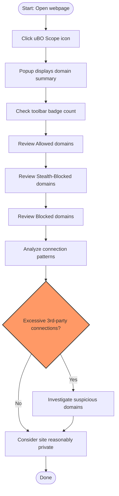

# Using uBO Scope for Privacy Diagnostics

## Workflow Overview

### Task Description
This guide teaches you how to effectively use uBO Scope to assess website privacy by analyzing network connections. You'll learn to interpret connection outcomes, uncover stealth-blocked requests, and distinguish legitimate third-party domains from potentially intrusive ones.

### Prerequisites
- uBO Scope installed and active in your supported browser (Chrome, Firefox, Safari).
- Basic familiarity with browsing websites and accessing browser extension popups.
- Understanding of domains and third-party connections is helpful but not required.

### Expected Outcome
By following this guide, you'll confidently use uBO Scope to:
- Identify distinct third-party servers contacted by webpages.
- Decode the meaning of allowed, blocked, and stealth-blocked requests.
- Debunk common misconceptions about ad blocker effectiveness.
- Interpret complex connection patterns in the popup interface.

### Time Estimate
Approximately 15–20 minutes to complete and apply the workflow on real websites.

### Difficulty Level
Intermediate — assumes you want to deepen insight beyond basic extension use.

---

## Step-by-Step Instructions

### 1. Open uBO Scope Popup
- Click the uBO Scope toolbar icon while visiting any webpage.
- The popup displays the current tab's hostname and provides connection summaries.

### 2. Interpret the Domain Summary
- At the top, note the number of distinct third-party domains connected.
- A smaller number generally indicates fewer third-party connections, often better for privacy.

### 3. Review Connection Categories
The popup organizes connected domains into three categories:

- **Not Blocked (Allowed):** Domains from which resources were successfully fetched.
- **Stealth-Blocked:** Domains whose requests were redirected or hidden silently—these connections happen without explicit block notification.
- **Blocked:** Domains for which requests were actively blocked by the content blocker or filter list.

### 4. Analyze Stealth-Blocked Domains
- Recognize stealth-blocking is used to avoid webpage breakage or detection by blocking behind the scenes.
- These domains may still receive some interaction attempts, although resources might not load.

### 5. Validate Connection Outcomes
- Use the badge count on your toolbar icon to see how many unique third-party domains were contacted.
- The badge updates dynamically as you browse sites.

### 6. Use Real-World Scenarios to Debunk Myths
- Understand a higher block count does not always mean better privacy protection. More blocked requests might coincide with more allowed third-party connections.
- Avoid relying on synthetic ad blocker test pages as they create artificial request scenarios and do not reflect real-world browsing.

### 7. Distinguish Legitimate Third Parties
- Many low-count third-party domains are legitimate content delivery networks (CDNs) often necessary for site functionality.
- High numbers or unfamiliar domains may indicate extensive tracking or ad-related connections.

### 8. Assess Complex Connection Patterns
- For pages with many services, use domain counts and categories to prioritize privacy risks.
- Check stealth-blocked entries carefully to see if they represent residual or partial blocking.

### 9. Persist and Compare Data
- Use the extension as a companion tool alongside your primary content blocker to verify what third-party connections actually occur.

### 10. Confirm Outcome
You successfully completed your privacy diagnostics when you can:
- Read and interpret the popup interface correctly.
- Identify connection outcomes for any visited website.
- Recognize the nuances in allowed vs. blocked third-party domains.

---

## Examples & Scenarios

### Example: Diagnosing a News Site
You visit example-news.com and open uBO Scope popup:
- The badge shows "8" — meaning 8 third-party domains contacted.
- "Not blocked" includes cdn.example.com, fonts.googleapis.com — likely needed resources.
- "Stealth-blocked" lists trackers.example.net — blocked silently.
- "Blocked" contains ads.ad-network.com — actively blocked.

You conclude that the site loads essential content from few third-party sources, trackers are stealth-blocked to avoid breakage, and ads are actively blocked.

### Example: Evaluating an E-commerce Site
Visiting shop.example.com, the badge shows "22".
The popup lists several unknown domains under allowed and stealth-blocked — indicating a complex mix of third-party connections.
You decide to investigate domains further to prioritize what to filter next.

---

## Troubleshooting & Tips

### Common Issues
- **Popup Shows NO DATA:** Ensure the extension is installed and enabled correctly. Verify permissions and browser support.
- **Badge Count Doesn’t Update:** Try refreshing the page or switching tabs. Confirm no conflicts with other extensions.
- **Stealth-Blocked Domains Unclear:** Remember stealth blocking means requests were diverted or suppressed silently; use it as a hint rather than definitive block evidence.

### Best Practices
- Don't judge blocker quality solely by the number of blocked requests; focus on allowed third-party connections.
- Use uBO Scope alongside your main content blocker to get an unbiased network perspective.
- Be cautious about test pages claiming to prove blocker effectiveness—they often present unrealistic request patterns.

### Performance Considerations
- uBO Scope runs efficiently using browser webRequest APIs with minimal delay.
- Session data optimizes repeated loading; clearing the session cache can help if stale data appears.

### Alternative Approaches
- Combine uBO Scope data with browser developer tools for in-depth network traffic analysis.
- Use domain reputation services or public suffix lists (built into uBO Scope) to understand domain hierarchy and risks.

---

## Next Steps & Related Content

### What's Next
- Explore the [Understanding Badge Counts and Connection Outcomes](https://docs.ubos.com/guides/core-workflows/understanding-badge-and-outcomes) guide to deepen your knowledge of connection types.
- Use [Exploring the uBO Scope Popup Interface](https://docs.ubos.com/guides/getting-started/exploring-popup-ui) for a detailed UI walkthrough.
- Review [Best Practices for Filter List Maintainers](https://docs.ubos.com/guides/advanced-usage/filter-list-maintainer-patterns) if you're involved in creating or maintaining filters.

### Related Guides
- [Installing and Configuring uBO Scope](https://docs.ubos.com/guides/getting-started/install-configure)
- [Troubleshooting: No Data or Empty Popup](https://docs.ubos.com/getting-started/troubleshooting/troubleshooting-no-data)

### Advanced Topics
- Integration details with content blockers for diagnostic synergy.
- Using uBO Scope in security auditing workflows.

### Resources
- uBO Scope GitHub Repository: [https://github.com/gorhill/uBO-Scope](https://github.com/gorhill/uBO-Scope)
- Public Suffix List (embedded in uBO Scope) for domain analysis: [https://publicsuffix.org/](https://publicsuffix.org/)

---

# Visual Summary of Privacy Diagnostic Workflow

---

<Tip>
Use the toolbar badge as your immediate privacy health indicator: a lower count means fewer third-party connections and usually better privacy.
</Tip>

<Warning>
Do not rely on "ad blocker test" sites to evaluate privacy or blocker effectiveness; they often simulate unrealistic network scenarios.
</Warning>

<Note>
Stealth-blocked domains represent connections silently intercepted by content blockers to minimize web breakage. They are integral to understanding true network activity.
</Note>

<Check>
Always verify your uBO Scope extension's permissions and that your browser is supported when popup shows empty or no data.
</Check>
