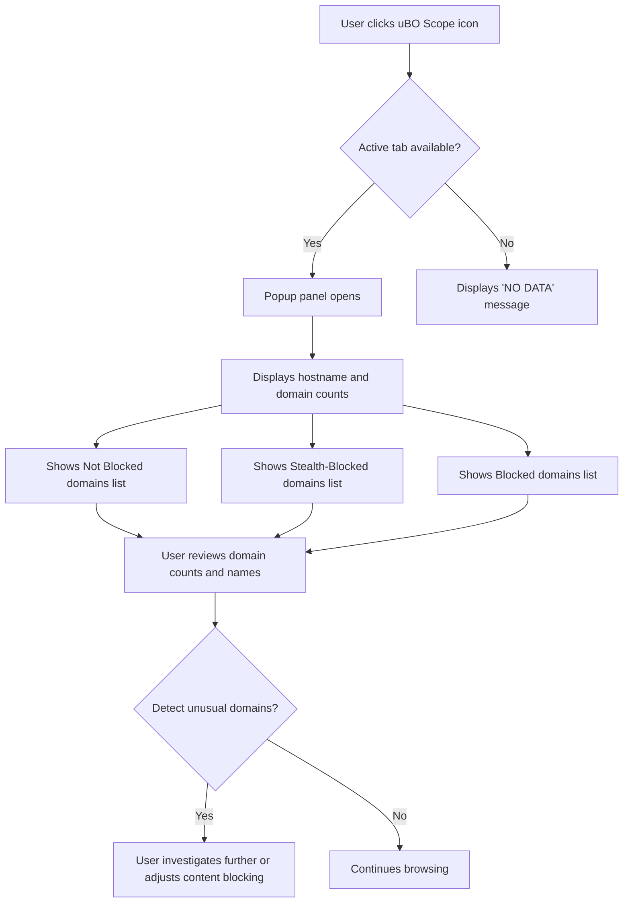

# Using the Popup Panel

Explore the uBO Scope popup panel, your primary window into the live network interactions of the active browser tab. This guide walks you through understanding the popup’s layout, reading the lists of allowed, stealth-blocked, and blocked domains, interpreting their color-coded status, and leveraging this insight to assess the network behavior of web pages.

---

### 1. Workflow Overview

**What this guide helps you achieve:**
- Understand every section of the popup interface.
- Interpret domain connection outcomes with confidence.
- Use the panel effectively for daily monitoring and decision-making.

**Prerequisites:**
- uBO Scope extension installed and enabled.
- The extension’s icon visible on your browser toolbar.
- Active browsing session with a loaded webpage.

**Expected Outcome:**
- You will be able to open the popup panel and read detailed per-tab connection reports.
- You’ll distinguish between domains that are allowed, stealth-blocked, or outright blocked.
- The popup will become your trusted tool for real-time network activity evaluation.

**Time Estimate:** 5 minutes for initial familiarization; ongoing expert use over time.

**Difficulty Level:** Beginner to Intermediate

---

### 2. Step-by-Step Instructions

<Steps>
<Step title="Opening the Popup Panel">
Click the uBO Scope icon on your browser’s toolbar. This launches the popup panel related to the current active browser tab, showing a summary of domains contacted by the page.

**Result:** The panel displays with three domain sections: not blocked, stealth-blocked, and blocked.
</Step>

<Step title="Reading the Tab Hostname Header">
At the top of the popup, observe the hostname display that identifies the active tab’s main domain. The hostname is split into parts if applicable, displaying subdomains and the main domain clearly.

**Example:** If the tab hostname is `news.example.com`, the popup splits and shows `news.` before `example.com`.

**Why it matters:** This helps you anchor the network report to the actual page you are examining.
</Step>

<Step title="Understanding Domain Connection Counts">
Beneath the header is the summary section showing the total count of distinct domains connected to by the current page.

**Interpretation:**
- A lower connected domain count usually means fewer external sources contacted.
- This metric helps quickly gauge the third-party exposure of a page.
</Step>

<Step title="Interpreting the Three Outcome Sections">
The core of the popup divides domains into three clearly labeled sections:

- **Not Blocked (Allowed):** Domains from which connections were successful.
- **Stealth-Blocked:** Domains where connections were redirected or modified to prevent tracking but not fully blocked.
- **Blocked:** Domains fully blocked by content blocking measures or network errors.

Each section includes:
- A list of domain names.
- A count badge showing how many times each domain was connected or attempted.

**Color Coding:**
- Allowed domains use a neutral or positive highlight.
- Stealth-blocked domains are visually distinct, indicating partial blocking.
- Blocked domains appear with warning colors to emphasize blocked status.

**Use case:** These distinctions let you assess which third parties are accessing data and how effectively blocking is being applied.
</Step>

<Step title="Exploring Domain Details">
Each domain row shows the domain name and the total number of requests associated.

**Tip:**
- Hover over or visually scan domains to identify frequent connections.
- Frequent connections to unexpected third parties may warrant further scrutiny.
</Step>

<Step title="Interpreting Real-Time Updates">
When switching tabs or reloading a page, open the popup to see dynamically updated connection breakdowns.

**Expected behavior:**
- Counts adjust as new network requests occur.
- The domains list refreshes to reflect the current per-tab state.

**Why it matters:**
Immediate feedback aids quick identification of privacy-impacting behaviors or abnormal network activity.
</Step>
</Steps>

---

### 3. Examples & Practical Scenarios

#### Scenario 1: Monitoring a News Site

You visit `https://news.example.com` and open the popup panel. You see:
- Allowed: `example.com` (50), `cdn.examplecdn.net` (10)
- Stealth-Blocked: `trackers.thirdparty.com` (3)
- Blocked: `ads.adnetwork.net` (4)

**Interpretation:**
- The main site and CDN are expected and allowed.
- A few trackers are stealth-blocked, indicating some privacy protection.
- Ads were blocked entirely.

This snapshot informs you the site is moderately invasive, but blocking is effective.

#### Scenario 2: Diagnosing Unexpected Connections

If you notice unfamiliar domains under allowed with surprisingly high counts, this may reveal unwanted third-party services.

Use the popup to identify those domains, and consider configuring your content blockers accordingly.

---

### 4. Troubleshooting & Tips

<AccordionGroup title="Common Issues and Solutions">
<Accordion title="Popup Displays 'NO DATA' or Remains Blank">
- Confirm the active tab has finished loading and network activity occurred.
- Ensure the extension is enabled and has the necessary permissions.
- Try closing and reopening the popup.
- If persistent, reload the tab or restart the browser.
</Accordion>
<Accordion title="Counts Do Not Update After Reloading Tab">
- Verify the browser supports dynamic popup updates.
- Wait a moment as the extension processes network events (updates occur with slight delay).
- If necessary, click the popup icon again to refresh.
</Accordion>
<Accordion title="Domain Names Appear in Punycode Format">
- The extension automatically converts punycode to Unicode.
- Some rare domains may still display in punycode if not convertible.
- This does not affect the accuracy of domain reporting.
</Accordion>
<Accordion title="Understanding Stealth Blocked Behavior">
- Stealth-blocked domains represent requests intercepted and redirected or masked, reducing tracking.
- This is distinct from outright blocking.
- If you see many stealth-blocked domains, this indicates your content blocker or network environment is actively disrupting trackers.
</Accordion>
</AccordionGroup>

<Tip>
For optimal use, keep the popup panel open only when actively investigating tabs to reduce performance overhead. Frequent popup openings will reflect fresh network activity.
</Tip>

---

### 5. Next Steps & Related Content

- After mastering the popup panel, explore **Understanding the Badge Count** to correlate popup data with the toolbar icon indicator.
- Review **Core Concepts & Terminology** for detailed definitions of connection outcomes used in the popup.
- Look into **Troubleshooting & Quick Validation** if you encounter persistent popup issues.
- For deeper insights, check **Analyzing Network Requests and Outcomes** to learn advanced methods for interpreting network activities.

---

### Summary Diagram of User Interaction with the Popup Panel

---

For comprehensive understanding and smooth onboarding, always keep related documentation handy and don't hesitate to revisit installation and configuration pages if unexpected popup behavior occurs.