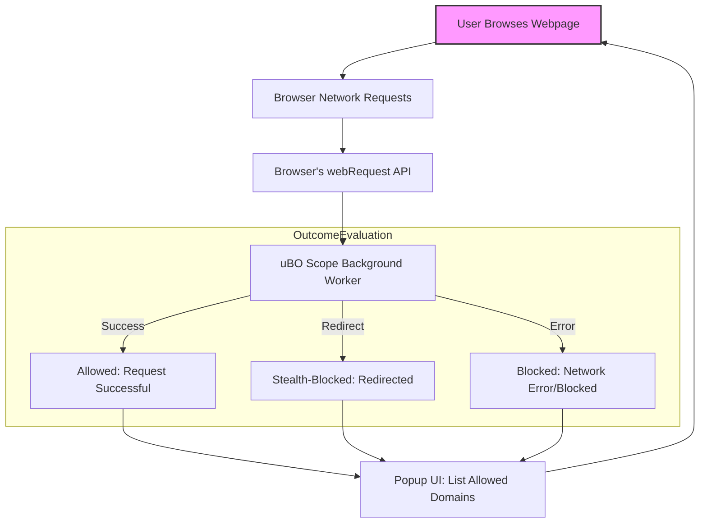

# Interpreting Network Request Data with uBO Scope

Understanding the detailed network request information presented by uBO Scope is essential to gain meaningful insights into third-party connections, privacy exposure, and content blocker effectiveness. This guide walks you through how to read the connection data, distinguish different connection outcomes, and interpret what each means for your browsing privacy or content blocking setup.

---

## 1. Overview of Network Request Outcomes

uBO Scope categorizes third-party network requests into three distinct outcomes:

- **Allowed (Not Blocked)**: Requests that successfully connected to third-party domains without being blocked.
- **Stealth-Blocked**: Requests that have been redirected or intercepted stealthily, commonly by content blockers employing non-standard blocking methods.
- **Blocked**: Requests explicitly blocked, typically through errors reported by the browser's network API.

These outcomes reflect the actual fate of network calls made by webpages on the active tab, allowing you to analyze distinct third-party domains your browser interacts with.

<Tip>
The **badge count** on uBO Scope’s toolbar icon reflects the number of distinct third-party domains successfully connected (Allowed).
A lower count here means fewer third-party servers accessed, which generally indicates better privacy.
</Tip>

---

## 2. How uBO Scope Determines Domains and Hostnames

### Hierarchy Explained

- **Hostname**: The full host part of a URL (e.g., `a.sub.example.com`).
- **Domain**: The registered domain derived by uBO Scope using the [Public Suffix List](https://publicsuffix.org/list/).
  For example, `example.com` is the domain of `a.sub.example.com`.

uBO Scope groups requests by domain for high-level privacy insights but also tracks individual hostnames.

<Info>
For accurate domain extraction — crucial for grouping related hosts — uBO Scope uses the official Public Suffix List, kept up to date internally.
</Info>

### Why Domains Matter

Grouping requests by domain helps focus on distinct third-party providers rather than every individual host.
For example, multiple CDN edge nodes under the same domain count as a single entity.

---

## 3. Reading the Popup Detailed UI

When you open the uBO Scope popup on an active browser tab, the data is organized as follows:

### Tab Hostname Display

At the top, the popup shows the currently active tab's hostname and its base domain.

### Domains Connected Count

A summary field displays the count of **distinct third-party domains** successfully connected (allowed).

### Outcome Sections

Three categorized sections list domains and the number of requests associated:

- **Not Blocked (Allowed)**: Lists domains with successful connections and their request counts.
- **Stealth-Blocked**: Shows domains where connections were stealthily redirected or blocked.
- **Blocked**: Reflects domains with network errors preventing connection.

Each domain entry includes the domain name and the total requests made to that domain.

<Tip>
Domain names displayed are decoded with Unicode support (using Punycode decoding), ensuring internationalized domain names are shown correctly.
</Tip>

---

## 4. Understanding Each Outcome Category

### Not Blocked (Allowed)

This represents third-party domains from which resources were fetched successfully without obstruction.

#### What This Means for You:
- These domains are actively connected by the website.
- Fewer allowed third-party domains typically suggest a lower privacy risk.
- This count reflects the actual exposure to third parties beyond simple block counts.

### Stealth-Blocked

These connections were subject to indirect blocking techniques such as redirection or stealth methods used by content blockers.

#### Key Insight:
- Stealth blocking aims to prevent detection or breakage on websites.
- Such domains might not show as blocked by a simple block counter but are effectively prevented.
- This category shows the subtle privacy defenses beyond explicit blocking.

### Blocked

Explicitly blocked requests where network errors or blocking prevented the connection outright.

#### What to Look For:
- These domains were prevented from loading resources.
- Count here helps in understanding the scope of explicit content blocking on the active tab.

---

## 5. Practical Workflow: Analyzing a Website

<Steps>
<Step title="Open uBO Scope Popup">
Click the uBO Scope toolbar icon to open the popup, displaying the active tab’s domain and connection summary.
</Step>
<Step title="Review the Domains Connected Count">
Check the summary number representing all distinct allowed third-party domains connected on this tab.
</Step>
<Step title="Examine the Allowed Domains List">
Scroll through the 'Not Blocked' section to see which third-party domains are actively used by the site.
</Step>
<Step title="Investigate Stealth-Blocked Domains">
Check domains marked under 'Stealth-Blocked' to understand subtle blocking activity potentially unnoticed by other tools.
</Step>
<Step title="Check Blocked Domains for Explicit Blocks">
Review the 'Blocked' section to identify which third-party servers were explicitly stopped.
</Step>
<Step title="Interpret Privacy Implications">
Combine all outcomes to evaluate the actual third-party exposure and content blocking effectiveness for the active website.
</Step>
</Steps>

---

## 6. Common Scenarios and Interpretation Examples

### Scenario 1: High Allowed Count With Few Blocks

If many third-party domains appear in 'Not Blocked' and few in the blocked categories:
- The website has extensive third-party integrations.
- Your content blocker might be permissive or less effective.
- Privacy exposure risk is high due to many active third parties.

### Scenario 2: Many Stealth-Blocked Domains

An unusual number of stealth-blocked domains may indicate:
- Stealthy blocking techniques in effect.
- Normal blocking counts underestimate actual blocking.
- The extension detects complex blocking tactics used by filter lists.

### Scenario 3: Few Allowed Domains, Many Blocked

A low count of allowed domains with many blocked ones means:
- The content blocker is stringent.
- The website is restricted from loading many third-party resources.
- This typically reduces privacy risk.

---

## 7. Best Practices and Tips

- Always focus on **distinct domains connected** as the primary privacy metric — not just the number of blocked requests.
- Use the expanded domain lists in the popup to identify third parties you might want to block selectively.
- Understand that stealth-blocking is an advanced feature to prevent detection and subtle tracking.
- Regularly update uBO Scope to benefit from updated Public Suffix List extraction handling.

<Note>
uBO Scope’s data is based on browser `webRequest` API events and is accurate only when the extension runs and the API reports correctly.
</Note>

---

## 8. Troubleshooting Common Network Data Interpretation Issues

<AccordionGroup title="Troubleshooting Network Request Data">
<Accordion title="Popup Shows No Data or 'NO DATA'">
Ensure the extension is properly enabled and has permissions for the current tab. Reload the tab to trigger network events again. Cross-check installation troubleshooting guides if needed.
</Accordion>
<Accordion title="Badge Count Does Not Update">
Verify that the current tab is actively making network requests. Sometimes browser throttling or background tabs report limited data. See troubleshooting docs for extension visibility issues.
</Accordion>
<Accordion title="Unexpected Domains in Allowed List">
This may be legit third-party CDN or service domains. Investigate domains individually to assess privacy impact. Remember distinction between domains and hostnames helps condense large sets.
</Accordion>
<Accordion title="Stealth-Blocked Section Always Empty">
Stealth blocking is not guaranteed in every scenario; it depends on upstream content blockers' behavior and browser event reporting.
</Accordion>
</AccordionGroup>

---

## 9. Additional Resources

For a comprehensive understanding and seamless onboarding, see these related documentation:

- [Understanding the Popup and Badge](./guides/getting-started/understanding-ui-badge) — How to read badge counts and navigate the popup UI
- [Basic Usage: Analyzing Site Connections](./guides/getting-started/basic-usage) — Hands-on walkthrough of using uBO Scope
- [Troubleshooting Common Issues](./getting-started/validation-troubleshooting/common-issues) — Help resolve extension operation problems
- [Core Concepts & Terminology](./overview/core-concepts-arch/core-concepts-terminology) — Deep dive into domain definitions and outcome categories

For filter list maintainers and advanced users:
- [Advanced Usage for Filter List Maintainers](./guides/deep-dive-analysis/usage-for-filter-list-maintainers)

---

## 10. Summary Diagram of Data Flow for Request Outcomes

---