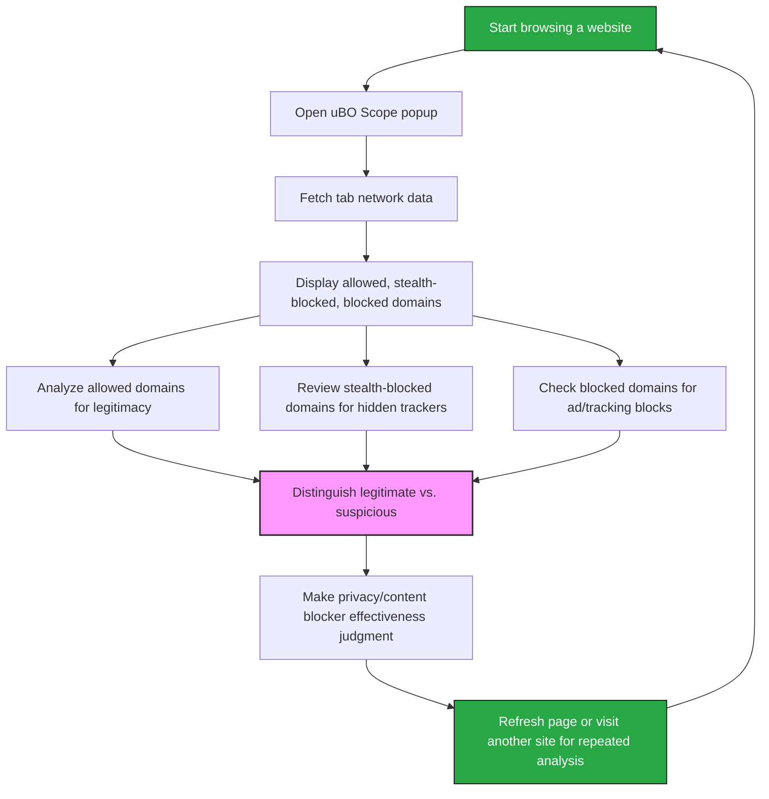

# Analyzing Network Requests and Outcomes

## Overview
This guide equips you with practical skills to inspect and analyze the network requests observed by **uBO Scope** when browsing real-world websites. You will learn how to identify patterns among allowed, blocked, and stealth-blocked requests — enabling you to distinguish legitimate third-party domains from undesirable or tracking-related ones. Additionally, you will gain insight on using the extension to debunk misleading ad blocker test claims.

## Prerequisites
- **uBO Scope** extension installed and activated in your supported browser.
- Familiarity with the extension's popup UI, including the layout and meaning of allowed, blocked, and stealth-blocked domains (see [Understanding the UI](../getting-started/first-use-validation/understanding-the-ui.md)).
- Basic knowledge of what third-party network requests are and the privacy implications (see [Core Concepts & Terminology](../../overview/introduction-and-concepts/core-concepts-and-terminology.md)).

## Expected Outcome
By following this guide, you will confidently:
- Interpret the network data presented in the popup.
- Recognize patterns of third-party resource loading.
- Identify legitimate and benign third-party domains.
- Detect domains most likely associated with trackers or unwanted advertising.
- Use uBO Scope to critically evaluate content blockers and ad blocker test sites.

## Time Estimate
Approximately 15-30 minutes depending on familiarity and site complexity.

## Difficulty Level
Intermediate — involves analysis and judgment based on observed data.

---

## Step-by-Step Analysis Workflow

### 1. Open the uBO Scope Popup on a Website
- Navigate to the website you want to analyze.
- Click the uBO Scope toolbar icon in your browser to open the popup panel.
- Observe the header displaying the current tab's hostname and domain.
- Note the **domains connected** count showing how many distinct third-party domains were connected.

**Expected Result:**
You see three sections titled _not blocked_, _stealth-blocked_, and _blocked_, each listing domains corresponding to request outcomes.

<Check>
Make sure the popup shows data for the active tab. If it shows "NO DATA", try refreshing the page or verifying installation.
</Check>

### 2. Examine the Allowed (Not Blocked) Domains
- Review all domains listed under the 'not blocked' section.
- Recognize common legitimate service providers, such as CDNs (e.g., `cloudflare.net`, `akamai.net`), analytics providers, or content delivery domains.
- Consider domains matching the main website's service ecosystem (e.g., official subdomains or related partner domains).

**Tip:**
High counts on a domain indicate frequent connections; this can be normal for core services.

<Note>
Remember that a low number of distinct allowed third-party connections usually indicates better privacy.
</Note>

### 3. Inspect Stealth-Blocked Domains
- Look at domains listed as 'stealth-blocked'. These represent network requests that were redirected or blocked silently by content blockers or other stealth measures.
- Understand that stealth blocking is different from outright blocking: the browser behaves as if the request succeeded, but the resource is never actually loaded.
- Pay attention to stealth-blocked domains indicating undeclared trackers or requests:
  - They might be known trackers quietly blocked.
  - They help reveal subtle tracking attempts unseen by traditional UI.

**Warning:**
Do not confuse stealth-blocked with allowed domains; stealth-blocked domains represent requests intercepted without alerting the site.

### 4. Review Blocked Domains
- Check the domains under the 'blocked' section.
- These are network connections explicitly blocked, often by your content blocker or due to network errors.
- Typically, this list includes known ad servers, tracking domains, or problematic resources.
- Note that some blocked domains might be legitimate, but blocked due to filter settings.

**Best Practice:**
Use this section to adjust your content blocking rules based on observed network behavior.

### 5. Distinguish Legitimate Third Parties from Potential Trackers
- Cross-reference domains seen in allowed and stealth-blocked sections against known CDN providers and trusted services.
- Look up unfamiliar domains using online domain information or public suffix lists.
- Domains with cryptic or brandless names appearing frequently are often trackers or advertising.

**Tip:**
Use the extension as an investigative tool — if a domain appears as stealth-blocked and known as a tracking network, confirm your filter rules are effective.

### 6. Exploit uBO Scope to Myth-Bust Ad Blocker Performance Claims
- Open sites that claim to test ad blockers and observe the network request outcomes.
- Notice if the site reports blocked ads but uBO Scope shows allowed third-party domains connected despite the block count.
- Understand that higher block counts do not always mean better blocking; some blockers may allow more distinct third-party connections.
- Use uBO Scope data to judge based on the actual count of distinct allowed connections — this reflects real privacy impact.

**Example:**
    - A content blocker might show 500 blocked requests, but allowed connections span across 50 different domains.
    - Another blocker with fewer blocked requests might allow only 20 third-party domains.
    - The second blocker effectively provides stronger privacy despite seemingly blocking less.

### 7. Refresh and Repeat
- For deep analysis, visit multiple pages on the site or different sites.
- Observe how the domain lists change, especially for allowed and stealth-blocked sections.
- Use repeated sessions to detect persistent third parties and patterns.

<Info>
This iterative analysis lets you build an informed profile of how websites interact with third parties and the effectiveness of content blockers.
</Info>

---

## Practical Example

Imagine visiting an e-commerce site. You open uBO Scope and observe:

- Allowed domains include `cdn.shopify.com`, `fonts.googleapis.com`, and several payment providers.
- Stealth-blocked domains include `tracker.example.net` and `ads.example.org`, domains you suspect are trackers.
- Blocked domains list contains `doubleclick.net`, a known ad server.

From this, you conclude the site relies on legitimate third parties for content delivery and payments but attempts to load trackers and ads silently prevented.

---

## Troubleshooting & Tips

### Common Issues
- **Popup shows no data:** Confirm you have reloaded the page after uBO Scope installation. Check for any browser permission restrictions.
- **Unexpected high domain count:** Some websites load many third-party resources; inspect the list carefully to check for trackers.
- **Stealth-blocked domains missing:** Verify that uBO Scope is correctly installed and has the necessary webRequest permissions.

### Best Practices
- Always start analysis on a freshly loaded page.
- Compare results when toggling your content blocker on and off to note differences.
- Use domain knowledge or online tools to investigate unexpected domain names.

### Performance Considerations
- uBO Scope processes network data in batches every second to balance accuracy and performance.
- Delays in network request reporting may happen; allow a few seconds after browsing actions.

### Alternative Approaches
- Combine uBO Scope insights with browser developer tools for network pane analysis.
- Use external domain reputation tools for deeper domain evaluation.

---

## Next Steps & Related Documents

- Explore [Using the Popup Panel](../guides/core-workflows/using-the-popup.md) for detailed popup interaction.
- Review [Understanding the Badge Count](../guides/core-workflows/understanding-the-badge.md) to better interpret toolbar badges.
- Consult [Core Concepts & Terminology](../../overview/introduction-and-concepts/core-concepts-and-terminology.md) for foundational knowledge.
- For troubleshooting, see [Troubleshooting & Quick Validation](../getting-started/first-use-validation/troubleshooting-and-validation.md).

---

## Summary
This guide empowers you to make the most of uBO Scope's network request data, allowing you to derive real insights on third-party connections during browsing. With practical steps, tips, and an example scenario, you will transform raw domain lists into actionable privacy assessments and content blocker validations.

---

## Source and Further Information
- Official repository and latest code: [uBO Scope GitHub](https://github.com/gorhill/uBO-Scope)

---

### Diagram: Basic Workflow of Analyzing Network Requests

