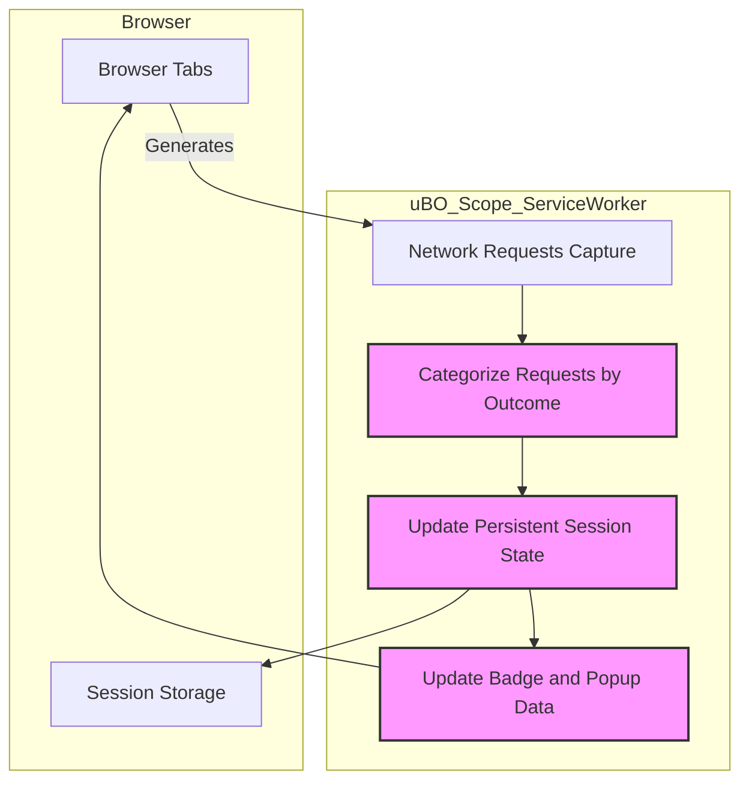

# Session Analysis and Persistent Tracking

uBO Scope’s session analysis and persistent tracking features empower you to observe how connections to third-party domains evolve over multiple browsing sessions. This goes beyond immediate, one-tab insights by retaining aggregated connection data across browsing sessions and page loads, helping you detect long-term tracking patterns, diagnose persistent network behaviors, and contribute to filter list improvement.

---

## 1. Overview

This guide explains how to use uBO Scope to:

- Leverage its persistent session state that tracks connection outcomes across multiple browser tabs and sessions.
- Analyze connection events through the popup interface and understand summarized data beyond a single page load.
- Identify recurring third-party domains involved in tracking or content delivery, reflected through allowed, stealth-blocked, and blocked categories.

### Prerequisites

- uBO Scope installed and enabled in a supported browser (Chromium, Firefox, Safari).
- Basic familiarity with the popup interface and domain categorizations (allowed, stealth-blocked, blocked). Refer to [Exploring the Popup Interface](/getting-started/getting-using/using-popup) for details.

### Expected Outcome

By following this guide, you will:

- Understand how uBO Scope records connection events beyond the lifetime of a single tab, maintaining persistent state.
- Use session analysis to diagnose ongoing or repeat connections to third-party domains.
- Leverage insights to fine-tune your privacy protection or assist filter list maintainers.

### Time Estimate

Around 10–15 minutes to explore the session analysis workflow and understand data persistence.

### Difficulty Level

Intermediate user level—basic knowledge of browser extensions and privacy tools is recommended.

---

## 2. Understanding Persistent Session State

uBO Scope maintains detailed session data by recording connection events for each browser tab and aggregating them across multiple sessions. This persistent state:

- Tracks domains and hostnames by connection outcome categories (`allowed`, `stealth-blocked`, `blocked`).
- Updates continuously as your browsing generates network requests.
- Retains data in the browser’s session storage, surviving page reloads and tab switches, but resets when the browser session ends.

This mechanism enables uBO Scope to provide historical context, crucial for spotting stealth tracking and diagnosing unusual network behaviors that manifest over time.

### Key Concepts:

- **Allowed**: Domains with successful connections.
- **Stealth-Blocked**: Domains where connections tried to redirect or evade blocking.
- **Blocked**: Domains where connection attempts failed with errors indicating blocked requests.

---

## 3. How to Analyze Sessions in uBO Scope

### Step 1: Open uBO Scope Popup

Click the uBO Scope toolbar icon to open its popup panel for the active tab. The header shows the tab’s hostname and domain.

### Step 2: Review Domain Categories

The popup is divided into sections showing:

- **Allowed domains**: Third-party domains successfully connected.
- **Stealth-blocked domains**: Domains with redirect attempts or stealth blocking events.
- **Blocked domains**: Domains whose connection attempts were blocked.

Each domain's occurrence count aggregates all connection attempts recorded across the session for the current tab.

### Step 3: Spot Persistent Trackers and Patterns

- Look for domains that appear regularly with high counts in the **allowed** or **stealth-blocked** lists.
- Frequent stealth-blocked domains may represent trackers attempting to circumvent blocking.
- Blocked domains with ongoing frequent attempts could help refine blocking filters.

### Step 4: Use Domain Counts for Diagnosis

Counts next to each domain reflect how often that domain was contacted during the session for that tab. This reveals:

- Persistent connections over time.
- Potential background trackers or CDN use.
- Unusual spike in connection attempts signaling possible issues.

### Step 5: Use Multiple Tabs and Sessions

Switch between tabs to observe connection histories across different sites. Retention in session state lets you compare and monitor persistent domain connections over your browsing session.

---

## 4. Practical Tips for Effective Use

- **Regularly reload tabs** to observe sessions aggregating data through multiple page loads.
- **Focus on stealth-blocked categories** to identify trackers employing redirection or evasion techniques.
- **Watch badge counts** on the toolbar icon as a quick indicator of third-party domain connections accumulating.
- **Clear browser session data** (if needed) to reset accumulated session tracking data.

---

## 5. Common Pitfalls and Troubleshooting

<AccordionGroup title="Common Issues with Session Analysis">
<Accordion title="Session Data Not Retaining Across Page Loads or Tabs">
- **Cause**: Browser session storage might have been cleared or limited.
- **Solution**: Ensure your browser is configured to allow session storage for extensions and avoid clearing browsing data automatically.
- Also verify permissions for uBO Scope are intact.
</Accordion>
<Accordion title="Unexpected Low Domain Counts in Popup">
- **Cause**: Possibly limited browsing activity or network requests in the current tab.
- **Solution**: Browse more active sites, or switch tabs with more connections.
- Confirm uBO Scope is enabled and no conflicting extensions are interfering.
</Accordion>
<Accordion title="Stealth-Blocked Domains Not Shown">
- **Cause**: No stealth redirects or blocking actions detected in the session.
- **Solution**: Visit sites known for trackers or advertising platforms to see stealth-block events.
</Accordion>
</AccordionGroup>

---

## 6. Example Scenario

You visit an online news site known for extensive third-party content delivery. Opening the uBO Scope popup after browsing:

- You see multiple allowed CDN domains with high counts.
- Several stealth-blocked tracker domains are listed, indicating redirect attempts.
- Some blocked ad-serving domains persistently appear.

This insight helps you:

- Confirm legitimate CDN activity ensuring page functionality.
- Identify persistent trackers bypassing filters, informing which filters to enhance.
- Decide on further blocking rules or browser privacy settings.

---

## 7. Additional Resources

- [Understanding the Popup Panel: Domains and Outcomes](/guides/effective-usage/understanding-popup-reports) — Learn how to interpret domain categorizations in detail.
- [How uBO Scope Works (Architecture Overview)](/overview/core-concepts-and-architecture/how-it-works-architecture) — Deep dive into the monitoring and data recording mechanism.
- [Browser Integration & Compatibility](/overview/quick-tour/integration-and-compatibility) — Understanding cross-browser behavior of the extension.
- [Installing and Setting Up uBO Scope](/guides/getting-started/installation-setup) — Get started with installation and setup.

---

## 8. Source Code and Contributions

uBO Scope stores session data using the browser's session storage API, aggregating connection events keyed by tab IDs and associating these events with domains extracted via the Public Suffix List. The data drives the popup UI counters and badge signals. For more insights, explore the source at the [GitHub repository](https://github.com/gorhill/uBO-Scope).

---

## Diagram: Session Data Flow

This diagram illustrates how uBO Scope monitors network requests in browser tabs, categorizes outcomes (allowed, stealth, blocked), and persists session data for ongoing analysis reflected back in the popup UI and badge count.

---

# Summary
This document guides users in utilizing uBO Scope’s persistent session state and tracking features to monitor and analyze remote connection events over multiple browsing sessions. It covers workflow steps to open the popup, interpret domain lists and counts, spot persistent tracking patterns, and troubleshoot common session issues.

The session analysis functionality extends the immediate tab-focused insights by providing historical context crucial for understanding long-term tracking and connection behaviors.

