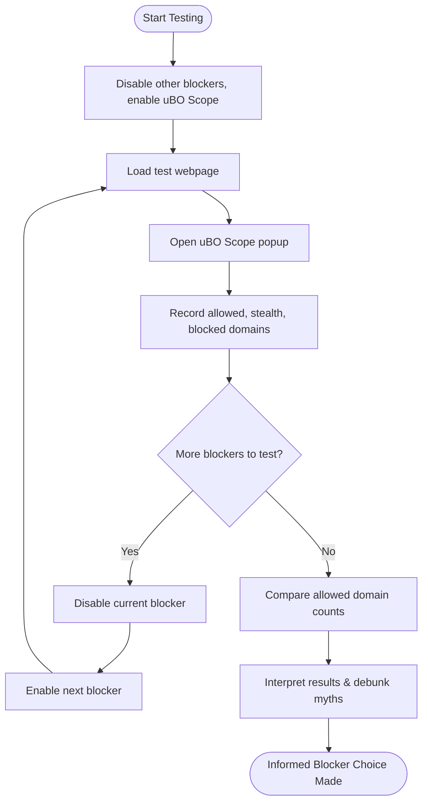

# Comparing Content Blockers with uBO Scope

A practical, scenario-driven guide to evaluate and compare different content blockers beyond their toolbar badge block counts. This guide helps you leverage uBO Scope’s transparent network connection reporting to collect reliable evidence about which third-party networks are actually blocked, allowed, or stealth-blocked by your content blockers. It debunks common misconceptions and equips you to make informed privacy decisions.

---

## 1. Understanding the Problem

Common wisdom among users often equates a higher block count displayed on a content blocker’s toolbar icon with better privacy protection. However, this assumption is misleading. A content blocker showing a high number of blocked requests might actually be allowing more distinct third-party connections overall, meaning less effective blocking.

uBO Scope provides an objective perspective by counting the number of distinct third-party remote servers your browser actually connected to — clearly showing real network activity regardless of block counts reported by extensions.

> **Scenario:**
> You install two content blockers, A and B.
> - Blocker A’s badge shows 150 blocked requests.
> - Blocker B’s badge shows 50 blocked requests.
>
> Naively, you might assume Blocker A blocks more.
> Using uBO Scope, you discover Blocker A allows connections to 30 third-party servers, while Blocker B allows only 10.
> This insight tells you Blocker B may provide stronger actual privacy.

---

## 2. Workflow Overview

### Task Description
Use uBO Scope to compare your content blockers by analyzing the distinct third-party remote servers your browser connects to under different blocker configurations.

### Prerequisites
- Installed uBO Scope extension in your browser.
- At least two content blockers you want to compare (e.g., uBlock Origin, AdGuard, or custom setups).
- Basic familiarity with browser extensions and network blocking behavior.

### Expected Outcome
- Clear, evidence-based understanding of which content blocker effectively limits third-party connections.
- A methodical process to debunk myths and validate blocker effectiveness.

### Time Estimate
15–30 minutes depending on testing scope.

### Difficulty Level
Intermediate user familiar with browser extensions and basic network concepts.

---

## 3. Step-by-Step Instructions

### Step 1: Prepare Your Testing Environment
- Disable all other extensions except one content blocker you want to test plus uBO Scope.
- Open a clean browser window or profile to avoid cached effects.
- Ensure uBO Scope is active and visible in the toolbar with its badge enabled.

### Step 2: Navigate to a Test Webpage
- Pick a representative website you want to evaluate (e.g., a news site or your frequently visited site).
- Load the page and let it fully load.

### Step 3: Open the uBO Scope Popup Panel
- Click uBO Scope’s toolbar icon.
- Observe the badge count and the popup report showing categorized third-party domains:
  - **Not Blocked**: Remote servers allowed by your content blocker.
  - **Stealth-Blocked**: Connections prevented stealthily (e.g., redirects intercepted).
  - **Blocked**: Connections explicitly blocked.

### Step 4: Record the Numbers
- Note the number of distinct domains in each category, focusing especially on the "Not Blocked" (allowed) domains.
- This number reflects the actual third-party servers your browser connected to.

### Step 5: Repeat for Other Content Blockers
- Disable the current blocker and enable the next blocker.
- Repeat Steps 2–4.

### Step 6: Compare the Results
- Analyze which blocker results in the lowest number of distinct third-party domains connected (lowest "Not Blocked" count).
- Consider the distribution of stealth-blocked and blocked domains for extra insight.
- Trust uBO Scope’s data over badge block counts from the blockers themselves.

### Step 7: Advanced Considerations
- Test on multiple webpages to generalize conclusions.
- Use incognito/private mode or separate profiles to isolate session impacts.
- Understand that some legitimate CDNs or required third parties can appear in "Not Blocked" without necessarily harming privacy.

---

## 4. Practical Example

Imagine you want to compare uBlock Origin and AdGuard on a popular news site.

| Content Blocker | Blocker Badge Count | uBO Scope "Not Blocked" Domains | Analysis |
|-----------------|---------------------|---------------------------------|----------|
| uBlock Origin   | 120                  | 12                              | Low allowed domains indicates stronger third-party blocking |
| AdGuard        | 80                   | 25                              | Higher allowed connections despite lower block badge count |

This data reveals that even with fewer blocks shown, AdGuard allows more third-party connections, compromising privacy more than uBlock Origin in this test.

---

## 5. Common Myths Debunked

### Myth 1: "Higher Block Count Means Better Blocking"
- Reality: High block counts can come from many trivial or easily circumvented blocked requests that don't reduce actual third-party connections.
- uBO Scope measures distinct third-party servers actually connected, which is a more meaningful metric.

### Myth 2: "Ad Blocker Test Pages Accurately Measure Blocking"
- Reality: Such pages generate artificial network requests and don’t reflect real-world browsing.
- They fail to detect stealth blocking or real network flows.

uBO Scope’s real browsing measurement approach delivers trustworthy insights.

---

## 6. Tips and Best Practices

- Always interpret the **number of distinct allowed domains** as the main privacy metric.
- Use stealth-blocked counts to understand how blockers attempt to silently cut off certain connections.
- Combine uBO Scope data with manual inspection (e.g., browser dev tools) for critical investigations.
- Remember that some third-party server connections are necessary for site functionality.
- Use profiles or private windows to avoid data contamination from previous sessions.

---

## 7. Troubleshooting

### Issue: uBO Scope Shows No Data or Empty Popup
- Verify uBO Scope is enabled and has proper permissions (see [Prerequisites & System Requirements](/getting-started/installation-setup/prerequisites-requirements)).
- Ensure your browser version supports `webRequest` API fully (consult [Browser Integration & Compatibility](/overview/quick-tour/integration-and-compatibility)).
- Confirm the page you tested actually initiated network requests.

### Issue: Badge Count Does Not Update as Expected
- Switch tabs or reload the tested page to refresh connection data.
- Try restarting your browser if persistent.

### Issue: Misinterpreting Domain Categories in Popup
- See [Interpreting the Popup Panel](/guides/effective-usage/understanding-popup-reports) for detailed explanation of allowed, stealth-blocked, and blocked domains.

---

## 8. Summary Diagram of the User Flow

---

## 9. Next Steps & Related Content

- Consult [Interpreting the Popup Panel: Domains and Outcomes](/guides/effective-usage/understanding-popup-reports) to deepen your understanding of domain categories.
- Review [Getting Started Quick Tour](/overview/quick-tour/getting-started-overview) to solidify initial use.
- Explore [Browser Integration & Compatibility](/overview/quick-tour/integration-and-compatibility) to understand platform-specific constraints.
- Try [Investigating Connections on Your First Webpage](/guides/getting-started/first-connection-investigation) for a hands-on approach to network analysis with uBO Scope.

---

Every privacy-conscious user should empower themselves by going beyond superficial block counts—to what really matters: who your browser connects with, and which of those connections you can truly block. uBO Scope is the definitive tool in this pursuit.