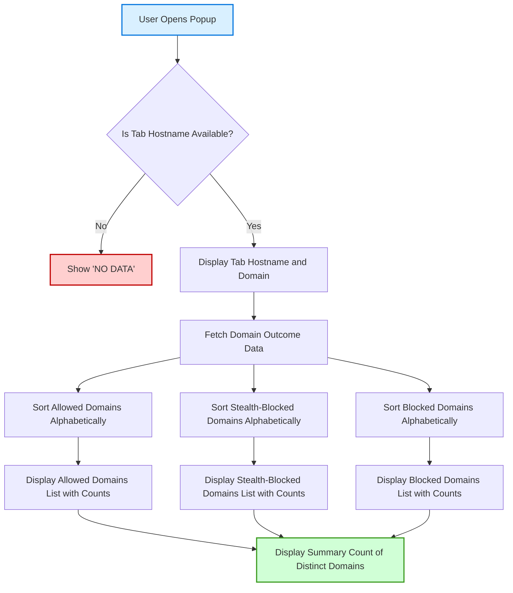

# Interpreting the Popup Panel: Domains and Outcomes

Discover how the uBO Scope popup interface categorizes third-party domains into allowed, blocked, and stealth-blocked, revealing nuanced insights about your browser's network activity. This guide walks you through understanding each category, navigating domain lists efficiently, and using real-world strategies to spot privacy risks and verify content blocker effectiveness with live examples.

---

## 1. What This Guide Helps You Accomplish

- Understand the meaning behind the three domain outcome categories displayed in the popup panel.
- Learn how domain lists are organized and how to interpret domain counting.
- Develop practical skills to quickly assess if tracking or unwanted connections are occurring.
- Gain confidence in using the popup interface to validate the behavior of your content blocker.

## 2. Prerequisites

- uBO Scope extension installed and activated in a supported browser (Chromium, Firefox, Safari).
- Basic familiarity with the uBO Scope popup panel structure (badge count, domain outcome sections).
- Active browser tab with loaded web content that initiates network requests.

## 3. Expected Outcome

By following this guide, you will be able to:

- Clearly distinguish what each domain list (allowed, blocked, stealth-blocked) represents.
- Navigate and interpret the domain counts.
- Use the popup panel's results to detect privacy threats and verify that your content blocker is operating as expected.

## 4. Time Commitment

- Approximately 10–15 minutes to read and practice interpreting the popup with your own browsing.

## 5. Difficulty Level

- Beginner to intermediate users interested in enhanced privacy surveillance and network connection transparency.

---

## Understanding the Popup Panel

### The Panel Structure

When you open the uBO Scope popup, it presents your current tab's remote network connections with the following key components:

- **Tab Hostname Display:** Shows the hostname and domain of the active tab.
- **Summary:** Displays the total count of distinct connected domains.
- **Outcome Sections:** Three distinct sections listing domains categorized by network activity outcomes:
  - **Not Blocked (Allowed)**
  - **Stealth-Blocked**
  - **Blocked**

Each domain entry includes the domain name (converted to Unicode if necessary) and the count of requests made to that domain.

---

## 6. How Domains Are Categorized

Domains shown in the popup fall into three clear outcome categories based on network request results seen by uBO Scope:

### Allowed (Not Blocked)
- These domains represent remote servers your browser successfully connected to and fetched resources from.
- The list includes both first-party and third-party domains.
- The count next to each domain reflects how many requests succeeded.

### Blocked
- Domains that were present in network requests but were blocked by your content blocker or other network blocking mechanisms.
- These connections failed, so resources from these domains did not load.
- Blocked domains indicate the effectiveness of your content blocker's rules.

### Stealth-Blocked
- A special category for domains where connections were silently redirected or hidden by your content blocker.
- These requests do not fully fail nor succeed; instead, they are 'stealthily' protected to avoid breakage or detection by web pages.
- They reveal domains where stealth blocking techniques are in effect.

---

## 7. Navigating Domain Lists

### Domain Sorting and Presentation
- Domains within each outcome section are sorted alphabetically for easy scanning.
- Domains are displayed as registered domains (e.g., example.com), normalized via the Public Suffix List to consolidate subdomain variants.
- The numeric count next to each domain represents the total number of requests made to any hostname under that domain.

### Tab Hostname vs. Domain
- The popup separates the tab hostname (full hostname including subdomains) and its base domain.
- For example, if visiting `news.example.co.uk`, the tab hostname is `news.example.co.uk`, and the domain is `example.co.uk`.

### Understanding Counts
- Counts reflect the frequency of requests, not just unique domain appearance.
- Higher counts can indicate sustained communication or multiple elements loaded from that domain.

---

## 8. Practical User Workflow: Interpreting the Popup

<Steps>
<Step title="Open the Popup Panel">
Click the uBO Scope icon in your browser toolbar while on an active web page.
</Step>
<Step title="Identify the Tab Hostname and Domain">
Look at the header to confirm which tab and domain are being analyzed.
</Step>
<Step title="Review the Summary Count">
Note the total number of distinct domains connected.
 A higher count often means more third-party involvement.
</Step>
<Step title="Explore Allowed Domains">
Review the 'not blocked' list for domains your browser fetched resources from.
 Identify known CDNs or first-party domains and watch for unexpected third parties.
</Step>
<Step title="Inspect Stealth-Blocked Domains">
Focus on this list to spot stealthy tracking or privacy protection actions.
 Domains here are connected with redirection or silent blocking, signaling nuanced blocking.
</Step>
<Step title="Examine Blocked Domains">
Verify the domains that your content blocker successfully prevented from connecting.
 A healthy blocker will show blocked unwanted third-party trackers here.
</Step>
<Step title="Confirm with Live Examples">
Visit test pages or known tracking-heavy sites to verify that stealth or block listings behave as expected.
</Step>
</Steps>

---

## 9. Real-World Examples

### Example 1: Common News Site
- **Allowed:** domains such as `cdn.examplecdn.net`, `fonts.gstatic.com`, and the site’s own domain.
- **Stealth-Blocked:** domains associated with known tracking services that silently redirect.
- **Blocked:** advertising domains explicitly prevented by your content blocker.

### Example 2: Privacy-Focused Blog
- **Allowed:** mostly first-party domains only.
- **Stealth-Blocked:** very few or none.
- **Blocked:** numerous tracking domains, confirming strong blocker effectiveness.

---

## 10. Troubleshooting & Tips

### Common Issues
<AccordionGroup title="Troubleshooting Common Popup Interpretation Issues">
<Accordion title="The popup shows 'NO DATA' or empty lists">
- Ensure the page you are on has loaded network resources.
- Refresh the page and reopen the popup.
- Check that the extension has necessary permissions and is active.
</Accordion>
<Accordion title="Unexpected low or zero counts">
- Visit a page that loads external resources to confirm.
- Verify your content blocker's behavior isn’t overly strict blocking everything.
</Accordion>
<Accordion title="Stealth-blocked list is empty">
- Not all blockers or sites use stealth blocking.
- Try visiting known stealth blocking test pages or trackers.
</Accordion>
</AccordionGroup>

### Best Practices
- **Use the badge count as a quick health indicator:** Lower allowed distinct domains usually indicate better privacy.
- **Regularly check stealth and blocked lists:** They reveal hidden tracking attempts and blocker efficiency.
- **Observe changes when disabling/enabling blockers:** Helps verify which domains are controlled.

### Performance Considerations
- The popup processes domain data upon opening; avoid staying on pages with extremely high request counts unnecessarily to keep performance smooth.

### Alternative Approaches
- Use the detailed network panel in developer tools alongside uBO Scope for deeper insights.
- Compare popup results across different browsers or profiles for comprehensive analysis.

---

## 11. Next Steps & Related Documentation

- Explore [Getting Started Quick Tour](/overview/quick-tour/getting-started-overview) to familiarize with initial usage.
- Read [Effective Usage Patterns: Understanding Popup Reports](/guides/effective-usage/understanding-popup-reports) for broader context.
- Consult [Core Concepts & Terminology](/overview/core-concepts-and-architecture/core-terminology) for definitions.
- Review [How uBO Scope Works (Architecture Overview)](/overview/core-concepts-and-architecture/how-it-works-architecture) for underlying details.
- Visit the [uBO-Scope GitHub repository](https://github.com/gorhill/uBO-Scope) for source and updates.

---

## Appendix: Technical Note About Domain Extraction

The extension uses the Public Suffix List to correctly identify domains from hostnames, ensuring subdomains are aggregated properly (e.g., `ads.news.example.co.uk` groups under `example.co.uk`). This ensures accurate counting and visibility of domains in the interface.

---

## Visual Summary Diagram

---

<Tip>
Interpreting the popup panel empowers you to go beyond just blocking ads and trackers — it shines light on who your browser talks to, allowing you to make informed privacy choices.
</Tip>

<Note>
If you don’t see expected domains in the stealth or blocked lists, it may be due to browser API limitations or the specific content blocker’s stealth approach.
</Note>