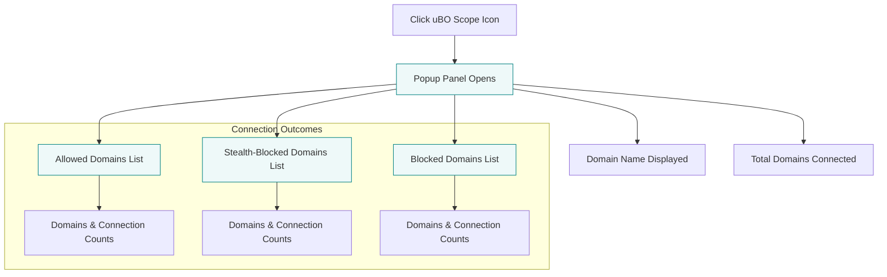

# Exploring the uBO Scope Popup Panel

## Overview

The uBO Scope popup panel offers an immediate, detailed view of network connections initiated by the active browser tab. It categorizes all domains encountered during browsing into **allowed**, **blocked**, and **stealth-blocked** groups, helping you understand which third-party servers your browser communicated with, and the nature of that communication.

This guide will walk you through how to open and interpret the popup panel, explaining each section's meaning, and how to use this insight to visualize your browser's connectivity in real time.

---

## What You'll Achieve

- Understand how to access the uBO Scope popup panel
- Learn the breakdown of connection outcomes shown: allowed, stealth-blocked, and blocked domains
- Interpret the domains list and the counts associated with each
- Apply practical knowledge to assess network connectivity on any webpage

## Prerequisites

- uBO Scope installed and active in a supported browser (Chromium, Firefox, Safari)
- You have an active browsing tab open with some network activity

## Time Estimate

5 minutes — enough to open the popup panel and explore its layout and contents on a live webpage

---

## Step-by-Step Guide

<Steps>
<Step title="Open the uBO Scope Popup Panel">
To open the popup panel, click the uBO Scope extension icon in your browser’s toolbar. This launches the popup overlay tied to the active tab's network data.

**Expected:**
The popup immediately displays the hostname of the current tab at the top.
</Step>

<Step title="Identify the Tab Hostname and Domain">
At the top, you’ll see the current page's hostname displayed prominently:

- The left span shows any subdomain prefix (if present).
- The right span shows the main domain in Unicode format.

This confirms you are viewing the network connections relevant to this tab.

**Example:**
For `news.example.com`, the left span shows `news` and the right span shows `example.com`.
</Step>

<Step title="Review the Summary of Domains Connected">
Under the hostname heading, the **domains connected** section shows the total number of distinct domains your browser connected to or tried to connect to from the active tab.

This includes all allowed, blocked, and stealth-blocked domains aggregated.

**Tip:**
A lower number indicates fewer third-party connections, often implying stronger privacy or blocking settings.
</Step>

<Step title="Explore the Allowed Domains Section">
In the "not blocked" section, you see a list of domains your browser successfully connected to.

- Each domain is shown on the right, and the count badge on the left indicates the number of connection attempts logged.
- This section shows servers that were reachable and not blocked by uBO Scope or your content blockers.

**Use Case:**
Identify which external servers are actively serving content for the webpage.
</Step>

<Step title="Examine the Stealth-Blocked Domains Section">
The "stealth-blocked" section lists domains where network requests were redirected or modified quietly by the blocking filters.

- These domains represent connections that were stealthily blocked without breaking page functionality.
- Counts represent detected connection attempts affected stealthily.

**Note:**
This highlights sophisticated blocking techniques that avoid user disruption.
</Step>

<Step title="Check the Blocked Domains Section">
The "blocked" area displays domains that had connection attempts explicitly blocked resulting in errors or failures.

- Domains are paired with counts showing how many blocked requests originated from each.

**Benefit:**
Quickly spot problematic or banned domains from the current tab.
</Step>

<Step title="Interpret Domain Counts and Totals">
Each domain's count represents the distinct number of connection attempts logged during the current browser session or tab lifetime.

At the bottom summary, the total count is the **number of unique domains connected** across all categories.

**Pro Tip:**
Use these metrics to compare the effect of different content blocker configurations on network traffic.
</Step>
</Steps>

---

## Practical Example

Imagine you are browsing an online news site:

- You open the uBO Scope popup panel.
- At the top, you see "news.example.com"
- The summary shows "domains connected: 12"
- Under "not blocked," you spot domains like `cdn.example.com` with counts indicating multiple asset loads.
- Under "stealth-blocked," you see `tracker.adsite.com`, showing that trackers are silently being blocked without page errors.
- Under "blocked," some suspicious domains have zero counts indicating no requests were made, or you see domains that were outright blocked due to strict filtering.

This snapshot helps you understand exactly which remote servers your browser is accessing, and the outcomes of those requests.

---

## Best Practices

- **Reload the tab for fresh data**: The popup reflects current tab data accumulated during your browsing session.
- **Use this popup alongside the toolbar badge**: The badge offers at-a-glance connection counts, and the popup breaks down specifics.
- **Interpret domain Unicode properly**: The popup converts punycode domains to Unicode for easier reading.
- **Monitor stealth-blocked entries**: Understanding which domains are stealth-blocked can inform you about how subtle blocking is affecting your browsing.

---

## Troubleshooting

<AccordionGroup title="Common Issues and Solutions">
<Accordion title="Popup Shows ‘NO DATA’ When Opened">
- Ensure uBO Scope is installed correctly and enabled.
- Verify you have an active tab open with some network activity.
- Some sites may not have generated network requests yet.
- Try navigating to another page and reopen the popup.
</Accordion>

<Accordion title="Domain Lists are Empty Despite Active Browsing">
- Confirm that your browser supports the required `webRequest` permissions.
- Check that conflicting extensions are not blocking `webRequest` events.
- Refresh the tab to trigger new network events.
- Disable and re-enable uBO Scope to restart tracking.
</Accordion>

<Accordion title="Counts Seem Incorrect or Delayed">
- Data updates may be batched with a small delay to optimize performance.
- Reload the tab and reopen the popup for fresh data.
- Remember the counts are cumulative since tab creation or last navigation.
</Accordion>
</AccordionGroup>

---

## Summary

The uBO Scope popup panel is your go-to interface for transparent, real-time insight into all network connections your browser tab makes — allowed, stealth-blocked, or blocked. By navigating through its clear sections and understanding the significance of each domain and count, you gain unparalleled visibility into the websites your browser communicates with, empowering you to make informed decisions about privacy and content blocking.

---

## Next Steps & Related Documentation

- [Understanding the Toolbar Badge](/guides/essential-workflows/understanding-the-badge) — Learn how the numeric badge correlates with tab connections.
- [Analyzing Remote Connections on Any Site](/guides/real-world-use-cases/analyzing-remote-connections) — Apply uBO Scope insights for deeper real-world investigations.
- [Troubleshooting Common Issues](/getting-started/first-use-validation/troubleshooting-common-issues) — Solutions for popup or badge data not displaying correctly.
- [What is uBO Scope?](/overview/intro-core-value/what-is-uboscope) — For foundational understanding of how uBO Scope functions.

---

## Additional Resources

- GitHub repository: [https://github.com/gorhill/uBO-Scope](https://github.com/gorhill/uBO-Scope)
- Release notes and updates available on the official project page.

---

### Visual Overview

This diagram captures your flow from activating the popup to exploring each categorized section of connections.

---